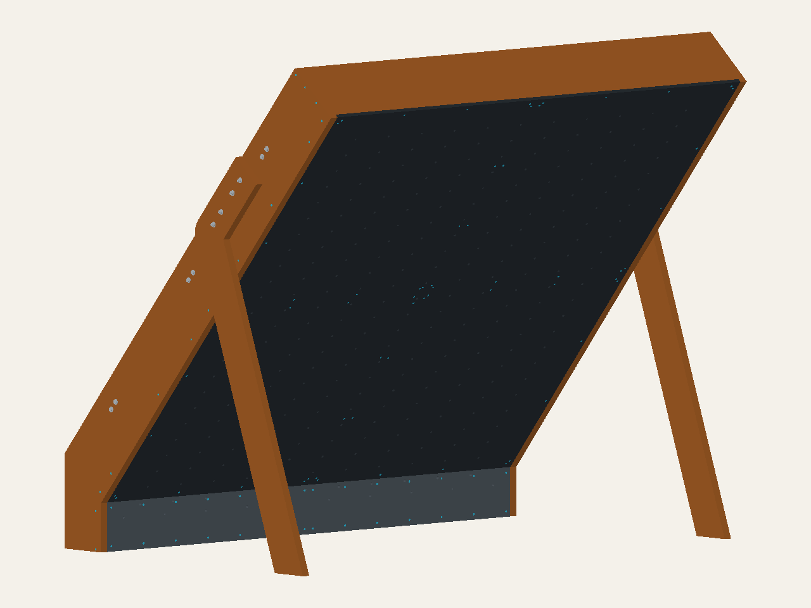

# Independent DIY frame plans for the Mini MoonBoard

Source-backed requirements and parametric CadQuery models for a freestanding
Mini MoonBoard.

This is an independent project, not affiliated with or endorsed by Moon Climbing.

[Open the interactive 3D viewer](https://mckayreedmoore.github.io/mini-moonboard/)
· [Support this project on Ko-fi](https://ko-fi.com/mckayreedmoore)

## Status

This repository currently models the official Mini MoonBoard panel envelope.
It contains a provisional v1 climbing-surface and freestanding-leg concept.
It includes a provisional, pre-audit frame, BOM, cut list, and assembly draft.
It does **not** contain a structurally approved or build-ready design.
Structural connections, actual material, floor interface, and stability still
require human review.

The eventual design target is an indoor, freestanding plywood A-frame inspired
by the reference photo and Moon Climbing video. The climbing panels will be
fabricated from birch plywood rather than purchased pre-drilled.

The v1 renders are review artifacts, not approval evidence. The official
reference-envelope exports remain separate from the v1 frame artifacts.

## Reference dimensions

Latest candidate: [2×8 with physically extended feet: comparison and results](docs/physical-footprint-results.md).

Current [design decision status](docs/design-decision-status.md) separates numerical
verification from material and connection selection. Two additional
[side-tied base envelopes](docs/base-restraint-options.md) preserve that candidate;
their new connections remain unresolved. See the
[material-selection recommendation](docs/material-selection-recommendation.md)
before treating any candidate as a purchasing or building plan.
The [matched side-tie comparison](docs/tied-base-comparison.md) retains the
untied baseline: the rails change support reactions but provide little
fixed-floor stiffness improvement and do not cure the exploratory tipping cases.

Next analysis: [joint/contact load basis and outstanding material evidence](docs/load-contact-basis.md).
The [rib/batten detail screen](docs/rib-batten-detail.md) checks the actual
extended-foot backing and explains why changing grain direction alone does not
finish the connection design.

Contact studies: [four-pin/leg-bore coupon](docs/joint-contact-study.md) and
[unpinned whole-frame floor-contact prototype](docs/floor-contact-study.md).
These are limited numerical studies, not joint-capacity or construction approval.

Convergence diagnosis: [the actual leg/foot coupon](docs/foot-contact-diagnosis.md)
completes gravity and downward loading with an explicit upper guide. It does
not establish equilibrium of the unanchored whole frame.
The [full-frame recovery-control trial](docs/floor-contact-recovery.md) remains
numerically unresolved; it is not evidence of physical failure.
The [preload-and-release continuation study](docs/floor-contact-continuation.md)
completed gravity and 1.2 kN loading at an assumed friction coefficient of 0.5,
but still fails the independent contact moment-transfer audit. This is not
a validated load rating or construction approval.
Smaller release/load increments now pass the gravity balance check, but the
loaded moment residual remains 96 N·mm against the unchanged 1 N·mm limit.
Separate [sliding-cube](docs/contact-shear-coupon.md) and
[actual-leg](docs/leg-shear-coupon.md) comparisons support further MORTAR
qualification; their global balance checks are not full-frame approval.
The [unguided whole-frame comparison](docs/full-frame-mortar.md) now retains a
completed MORTAR run: gravity passes, but the loaded moment residual is 204 N·mm
and fails the unchanged diagnostic limit. Its matched penalty run times out
before full gravity. Neither is an accepted loaded-frame solution.
The subsequent [matched increment refinement](docs/full-frame-increment-refinement.md)
passes both global endpoint checks at increment 0.0625: the largest loaded
moment-residual component is 0.0714 N·mm. The last two refinements differ by
0.0000053 mm in maximum loaded-node displacement. This establishes a better
numerical baseline, not local contact validation, material/joint capacity,
mesh convergence, or construction approval; the earlier failures remain recorded.
The [numerical acceptance basis](docs/numerical-acceptance-basis.md) distinguishes
our strict diagnostic limits from structural requirements; no historical result
is reclassified. The [mortar local-audit basis](docs/mortar-local-audit-basis.md)
explains why plotted contact fields alone cannot validate that formulation.
Before extracting joint demands, the [native section-force benchmark](docs/section-force-extraction.md)
records significant mesh-dependent bending error; that method is not yet qualified
for the frame.
The [follow-up straight-C3D10 benchmark](docs/section-force-tet-coupon.md) matches
the known bending moment within 0.001% after fixing a load-field formatting bug.
Curved frame sections and joint interfaces still require separate checks.

Previous candidate: [rotated-rear 2×8 CAD, plywood comparison and results](docs/shallow-frame-results.md).

Earlier investigation: [250/300 lb load envelope](docs/user-load-envelope.md) and
[2×8 feasibility and matched FEA](docs/2x8-feasibility.md).
Earlier stage: [2×12 footprint comparison, load basis and joint plan](docs/hybrid-footprint-study.md).

Separate development work: [complete 2×10 and 2×12 hybrid candidates](docs/hybrid-full-candidates.md),
with selectable viewer models, backing and nominal connections. These unvalidated
candidates do not replace the V1 reference or its structural studies.

| Property | Metric | Imperial |
| --- | ---: | ---: |
| Main climbing surface | 2440 x 2440 mm | 8 ft x 8 ft nominal |
| Official kicker | 150 mm | 5.9 in |
| Angle from vertical | 40 degrees | 40 degrees |
| Official overall envelope | 2440 x 1569 x 2020 mm | 8.01 x 5.15 x 6.63 ft |
| Main panel thickness | 18 mm | 0.71 in |

V1 uses a 225 mm total kicker: the official 150 mm active zone plus a 75 mm
blank extension below it. The crash pad is a separate, excluded element.

## V1 concept render



This raster view is tessellated directly from the V1 CadQuery assembly and
looks upward at the underside—the climbing face. Holds are intentionally not
modelled as arbitrary solids: their 142 exact through-bore provisions are in
the CAD. The 132 LED bores are likewise modelled, while the received LED kit's
controller/cable route remains an installation-audit item until its supplied
guide and installed wire lengths are verified. The frame now uses 12-inch-deep
side walls, a top closure, and exterior legs made from two glued 3/4-inch layers.

[Open the interactive V1 3D model](https://mckayreedmoore.github.io/mini-moonboard/) to rotate, pan, zoom, and select a part for bilingual cut-list dimensions.
The viewer shows the modelled bolts and screws as selectable connection geometry,
including 48 main-panel screws (four per edge with shared corners) and
16 kicker-panel screws (four per long edge with shared end corners). Hardware
clearance is checked against wood and other fasteners. These checks do not
establish connection strength.
Use its panel-overlay selector for no labels, amber grid labels, or
high-contrast grid labels. The letters A–K and rows 1–12 follow the canonical
panel datums. Moon-branded artwork is deliberately not bundled until there is
written permission to rehost it publicly; see the official [artwork archive](https://moonclimbing.com/media/moonboard-pdf/Final_Artwork.zip)
and the project [artwork policy](docs/panel-artwork.md).
Its independent overall-dimensions switch draws the provisional complete V1
assembly extents directly from CAD, excluding the separate crash pad.
The viewer also includes a selectable 5 ft 8 in / 1727.2 mm reference person
for scale. The person is display-only and deliberately excluded from the CAD
assembly, cut lists, stability screen, and FEA.

The [side profile](exports/mini_moonboard_v1_concept_side.svg),
[support-side elevation](exports/mini_moonboard_v1_rear.svg), and
[isometric support view](exports/mini_moonboard_v1_isometric.svg) remain
available as audit drawings. They are intentionally links rather than competing
hero images: the CAD-derived climbing-face render above is the clearest visual
summary of the assembly.

The current design and build sequence are described in the
[box-frame revision](docs/box-frame-revision.md). Generated cut and connection
schedules describe this revision; older rail/spacer documents are historical.
The [relocation proposal](docs/relocation-design.md) identifies reusable-joint
improvements for occasional moves. The [LED guide](docs/v1-led-installation.md)
assumes removing the continuous strips before separating panels and reinstalling
them afterward; structural relocation changes are not implemented yet.
The [unanchored stability screen](exports/mini_moonboard_v1_stability_screen.md)
uses current CAD geometry. The [clearance screen](exports/mini_moonboard_v1_fastener_clearance_screen.md)
checks the current fastener arrangement. The [earlier beam FEA](docs/v1-fixed-foot-fea-screen.md)
is a historical baseline and does not validate the new box frame.
The new [bulk-frame FEA results](docs/box-frame-fea.md) include three mesh
sizes and a stiffness sensitivity run. They describe ideal bonded joints
and fixed floor contacts. The [load-basis audit](exports/mini_moonboard_v1_stability_screen.md)
separates downward loading from exploratory directional failures; dynamic
stability and actual joint strength remain unresolved.
The [bolted-joint bearing FEA](docs/joint-bearing-fea.md) adds 24 local timber
solves with mesh comparisons. These are unit-load bearing screens, not
assembled-joint, screw-withdrawal, or adhesive-strength validation.
The [updated-board FEA](docs/updated-board-fea.md) reruns the global frame at
row-12 load locations and screens drilled panels with the reduced 12/8-screw
patterns. Its ideal screw-head constraints do not establish connection strength.
The [C10 connection comparison](docs/panel-connection-comparison.md) adds
finite-stiffness tensile attachments and compression-only backing contact,
comparing stiffer attachments with closer passive backing. Assumed connection
properties are sensitivity inputs, not hardware ratings.

## SketchUp reference geometry

The supplied reference model can be extracted for inspection without making it
part of the V1 design: `uv run python scripts/import_sketchup.py INPUT.skp
OUTPUT.obj --summary OUTPUT.json`. The OBJ is in millimetres and retains named
hierarchy groups; the optional JSON reports each group's transformed bounds and
face count. Both open or inspect in FreeCAD, Blender, or an online OBJ viewer.
They are comparison-only: do not copy their dimensions or connections into V1
without an explicit audit.

## Development

```bash
uv sync
uv run ruff check .
uv run pytest
uv run python -m mini_moonboard.export
```

`site_inputs` is a separate, deferred site-and-pad worksheet validator; it is
not a V1 build-package gate.

See [CONTRIBUTING.md](CONTRIBUTING.md) for the full setup and workflow.

## Repository map

- [`docs/requirements.md`](docs/requirements.md): official dimensions, unit
  conversions, source conflicts, and design constraints.
- [`docs/reference-analysis.md`](docs/reference-analysis.md): observations from
  the supplied photo and reference video.
- [`docs/design-basis.md`](docs/design-basis.md): resolved inputs, open design
  decisions, applicable-review references, and build-readiness gates.
- [`docs/orientation.md`](docs/orientation.md): front/back and climber-left/
  climber-right convention for the rendered assembly.
- [`docs/panel-grid.md`](docs/panel-grid.md): source-backed main T-nut and LED
  center coordinates plus unresolved drilling inputs.
- `exports/mini_moonboard_metric_template_datums.{csv,svg}`: reproducible
  dual-unit center-data table and visual verification drawing.
- `exports/mini_moonboard_reference_panel_cut_list.csv`: generated panel-only
  cut list; it intentionally excludes the unresolved frame BOM.
- [`docs/site-survey.md`](docs/site-survey.md): deferred human-audit worksheet;
  its crash-pad, room, and egress sections are outside v1 scope.
- [`design-inputs.example.toml`](design-inputs.example.toml): validated,
  machine-readable companion to the site-survey worksheet.
- [`docs/change-control.md`](docs/change-control.md): controlled-release,
  reviewer-record, and field-deviation process.
- [`docs/inspection-maintenance.md`](docs/inspection-maintenance.md):
  commissioning and inspection-record framework pending reviewer approval.
- [`docs/materials.md`](docs/materials.md): confirmed and provisional material
  requirements.
- `mini_moonboard/`: CadQuery source and export command.
- `exports/`: committed STEP and dimensioned SVG outputs.
- `.github/workflows/ci.yml`: lint, test, CadQuery smoke, and stale-export
  checks on every push and pull request.

## Safety

A climbing wall is a life-safety structure subject to dynamic loads. Moon
Climbing instructs builders to seek professional advice if they have any doubt
about construction. Have the completed frame design, connections, substrate,
and installation reviewed by a qualified carpenter, climbing-wall builder, or
structural engineer before producing a build guide or beginning construction.
