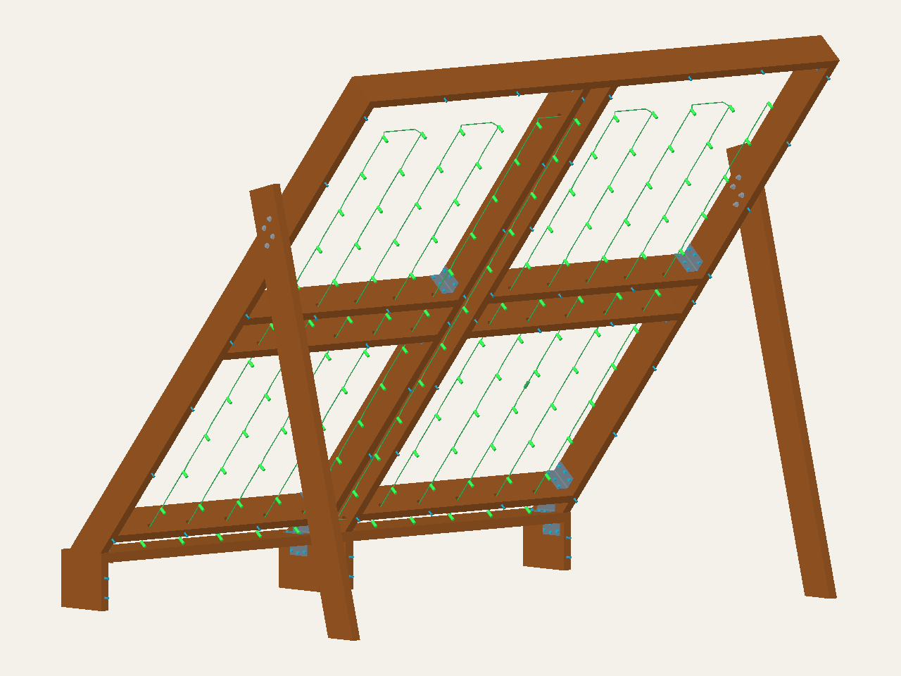

# Independent DIY frame plans for the Mini MoonBoard

Explore a freestanding Mini MoonBoard frame through an interactive 3D model,
material schedules, drilling drawings and documented engineering studies.
This is an independent project, not affiliated with or endorsed by Moon Climbing.

**Development project — not released for construction or climbing.** The current
development candidate is `round-insert-development`. Its geometry and numerical
checks do not establish connection strength, actual cable fit or a load rating.

**[Open the 3D model](https://mckayreedmoore.github.io/mini-moonboard/?model=round-insert-development&view=rear)** ·
**[Read the build-plan draft](docs/round-insert-build-plan.md)** ·
**[Open the drilling PDF](docs/round-insert-drilling/drilling.pdf)**



## Start here — no software installation needed

Click the links below to read the plans in your browser. You do not need a
GitHub account, Git, Python or a copy of this repository to inspect the design.

| What you want to do | Open this |
| --- | --- |
| Understand the layout and proposed assembly | [Build-plan draft and purchasing list](docs/round-insert-build-plan.md) |
| Plan tools and equipment | [Complete tools and equipment checklist](docs/round-insert-build-plan.md#tools-and-equipment) |
| Rotate the frame and inspect a member | [Interactive 3D viewer](https://mckayreedmoore.github.io/mini-moonboard/?model=round-insert-development&view=rear) |
| Read hole dimensions and measuring directions | [Passage schedule](docs/round-insert-drilling/drilling.json) and [drilling PDF](docs/round-insert-drilling/drilling.pdf) |
| Check lumber and hardware quantities | [Wood schedule](exports/round-insert-development/wood-parts.csv) and [connection schedule](exports/round-insert-development/connections.csv) |
| Estimate material costs | [Dated partial price list, exclusions and pending items](docs/material-costs.md) |
| Review panel screw alignment | [Front-view placement diagram](docs/round-panel-screw-layout.svg) — mirrored rows and columns |
| Understand the proposed lighting route | [LED hookup schematic](docs/horizontal-service-wiring.svg) and [kit/reference notes](docs/led-wiring-reference.md) |
| Check material assumptions and what was purchased | [Purchased plywood](docs/purchased-materials.md) and [provisional design assumptions](docs/provisional-design-assumptions.md) |
| Plan panel removal or a move | [Panel removal and temporary-support requirements](docs/round-insert-build-plan.md#removal-maintenance-and-repairs) |
| Assess a worn panel-screw hole | [Threaded-insert repair guide and replacement limits](docs/threaded-insert-repair-guide.md) |
| See remaining engineering work | [Insert-candidate analysis](docs/round-insert-analysis.md) and [remaining release gates](docs/round-insert-build-plan.md#receiving-and-qualification-checks) |
| Open the model in CAD software | [STEP assembly](exports/round-insert-development/round-insert-development.step) |

The viewer lets you rotate, pan and zoom, select individual parts, change units
and hide categories. Use **Inspect connection** to view representative leg
connections with their heads, washers and nuts; individual parts remain selectable.
Use **Design** to compare older candidates; each has its own geometry and limits.
The [prototype weight comparison](docs/prototype-weights.md) explains the displayed
estimates.

PDF links open drawings; CSV links open tables. On GitHub's file page, use the
download control to save a copy. STEP is a CAD exchange file, not a picture;
use the browser viewer if you only want to look around. Drawings are dimensioned
references, not full-size drill templates.

## What the current candidate contains

Four horizontal single-2×6 rails replace the preceding intermediate principals
and posts. The separated center principals, outer rims and direct base angles
remain. Panel/kicker attachments now model 56 threaded inserts with machine screws.
Commercial bracket screws and complete through-bolt stacks remain. Modeled
inserts are not verified installed hardware or qualified connections.

Its lighting detail uses **enclosed round timber passages**, with intact factory
strands installed after frame and panel assembly. The mirrored development
pattern uses twelve insert/machine-screw connections per main panel and four
per kicker: 56 in total.
The [screw-pattern review](docs/panel-screw-reference-review.md) and
[historical 87/75-screw comparison](docs/panel-screw-sensitivity.md) explain the
investigation; they do not qualify the new count or load path. Keep the owned
Roseburg plywood; Structural I remains an optional reference alternative.
Do not combine one candidate's cut list or analysis with another's drawings.

The project retains the one-climber 250 lb design request and a 300 lb sensitivity
case. These are analysis inputs, not approved user weight limits. Actual materials,
panel behavior, screw/bolt/bracket resistance and the floor interface still need
resolution. See the [assumptions and remaining checks](docs/provisional-design-assumptions.md)
before treating a result as applicable to a physical build.

## Earlier designs and engineering evidence

Older models remain available so changes and failed checks can be reviewed.
They are development history, not alternate approved construction packages.

<details>
<summary>Open the design and analysis index</summary>

| Study or predecessor | Notes and artifacts |
| --- | --- |
| Single-member all-2×6 baseline | [Layout and known failures](docs/single-2x6-layout.md) |
| Selective member enlargement | [Single 3×6 receivers and 2×10 header](docs/selective-2x6-layout.md) |
| Paired horizontal rails | [Separate rail connections and center-base attachment](docs/paired-rail-base.md) |
| Additional vertical principals | [Layout and independent-panel comparison](docs/vertical-principal-development.md) |
| Separated center principals | [Service corridor, bolt inspection and floor/panel screens](docs/split-center-development.md) |
| Denser panel screw rows | [Infill candidate and connection diagnostics](docs/infill-panel-development.md) |
| Round passages with wood panel screws | [Preserved screw-candidate analysis](docs/round-service-analysis.md), [build draft](docs/round-service-build-plan.md) |
| Grooved horizontal service rails | [Previous build draft](docs/horizontal-service-build-plan.md), [archived viewer](https://mckayreedmoore.github.io/mini-moonboard/?model=horizontal-service-development&view=rear) |
| Direct base angles | [Gusset replacement candidate](docs/angle-base-development.md) |
| Wider supports and panel inserts | [Wide-principal package](docs/wide-principal-development.md), [machining references](docs/wide-machining.md), [insert development](docs/panel-insert-development.md) |
| Lumber leg alternatives | [Stock comparison](docs/leg-stock-comparison.md), [lumber response](docs/lumber-leg-response.md), [spread-bolt revision](docs/spread-leg-response.md) |
| Joint and connection studies | [Coupled leg/rim study](docs/coupled-leg-release.md), [qualification ledger](docs/connection-qualification-ledger.md), [connection checkpoint](docs/mvp-connection-checkpoint.md) |
| Contact and numerical checks | [Numerical acceptance basis](docs/numerical-acceptance-basis.md), [floor-contact history](docs/floor-contact-study.md), [increment refinement](docs/full-frame-increment-refinement.md) |
| Original V1 concept | [Box-frame revision](docs/box-frame-revision.md), [V1 render](exports/mini_moonboard_v1_cad_front_render.png), [V1 viewer](https://mckayreedmoore.github.io/mini-moonboard/?model=plywood) |
| Official geometry and conventions | [Requirements](docs/requirements.md), [orientation](docs/orientation.md), [panel-grid notes](docs/panel-grid.md), [artwork policy](docs/panel-artwork.md) |

The [documentation folder](docs/) contains the remaining investigations.
[Archived results](fea/results/) retain their source snapshots and numerical
limits. Early V1 hole layouts and assembly instructions are historical; they
do not replace the current panel datums or hardware schedule.

</details>

## Working on the models or analysis

For code changes, use Python 3.12 and [uv](https://docs.astral.sh/uv/).
See [CONTRIBUTING.md](CONTRIBUTING.md) for setup and CAD-viewer instructions.
From a local checkout:

```sh
uv sync --locked
uv run ruff check .
uv run pytest
uv run scripts/smoke_test.py
```

The complete test suite includes CAD and evidence checks and can take time.
Running tests is separate from launching new finite-element solves. Individual
study documents describe their solver commands and assumptions.

The current candidate's Python module exposes `wood_parts()`, `parts()`
and `connections()`: raw timber, machined/model parts, and connection records.
CadQuery dimensions are in millimetres. The exporter needs the matching current
audit and refuses to overwrite an existing output directory:

```sh
uv run python -m mini_moonboard.round_service_exports --help
```

Regenerate drilling references into a new directory, then print the authenticated
SVG pages to PDF without a browser. Run from the repository root; replace
`NEW_DRAWING_DIRECTORY` with a path that does not exist yet:

```sh
uv run python -m mini_moonboard.round_service_drilling --output NEW_DRAWING_DIRECTORY
uv run --with pymupdf python scripts/print_drilling_svg.py NEW_DRAWING_DIRECTORY
```

The generator refuses to overwrite a directory. The PDF printer verifies the
source and drawing hashes, refuses to replace an existing `drilling.pdf`, and
records the PDF hash and renderer in the manifest. It does not establish
machining tolerances or structural adequacy.

The older `uv run python -m mini_moonboard.export` command regenerates the
reference/V1 artifacts checked by CI; it does not regenerate every development
variant. Check [.github/workflows/ci.yml](.github/workflows/ci.yml) for the actual
lint, test, smoke and export checks. A passing workflow is not structural approval.

| Folder | Purpose |
| --- | --- |
| [`mini_moonboard/`](mini_moonboard/) | Parametric CadQuery models, hardware and exporters |
| [`docs/`](docs/) | Plans, assumptions, source references and study explanations |
| [`exports/`](exports/) | Candidate-specific STEP files, renders and schedules |
| [`fea/`](fea/) | Geometry audits and structural/numerical diagnostics |
| [`fea/results/`](fea/results/) | Saved evidence and source-bound reports |
| [`site/`](site/) | Browser viewer and selectable model meshes |
| [`tests/`](tests/) | Geometry, behavior and evidence-replay checks |

For a supplied SketchUp reference, `scripts/import_sketchup.py` can extract OBJ
geometry and a JSON summary; see its `--help`. Imported geometry is a comparison
input and does not become an approved frame automatically.

## Questions and project support

Use [GitHub issues](https://github.com/mckayreedmoore/mini-moonboard/issues) for
questions or reproducible problems. Include the viewer's design name and the
relevant drawing or report link so the discussion stays tied to one revision.
Maintained by [McKay Reed Moore](https://github.com/mckayreedmoore).
[Support the project on Ko-fi](https://ko-fi.com/mckayreedmoore).
