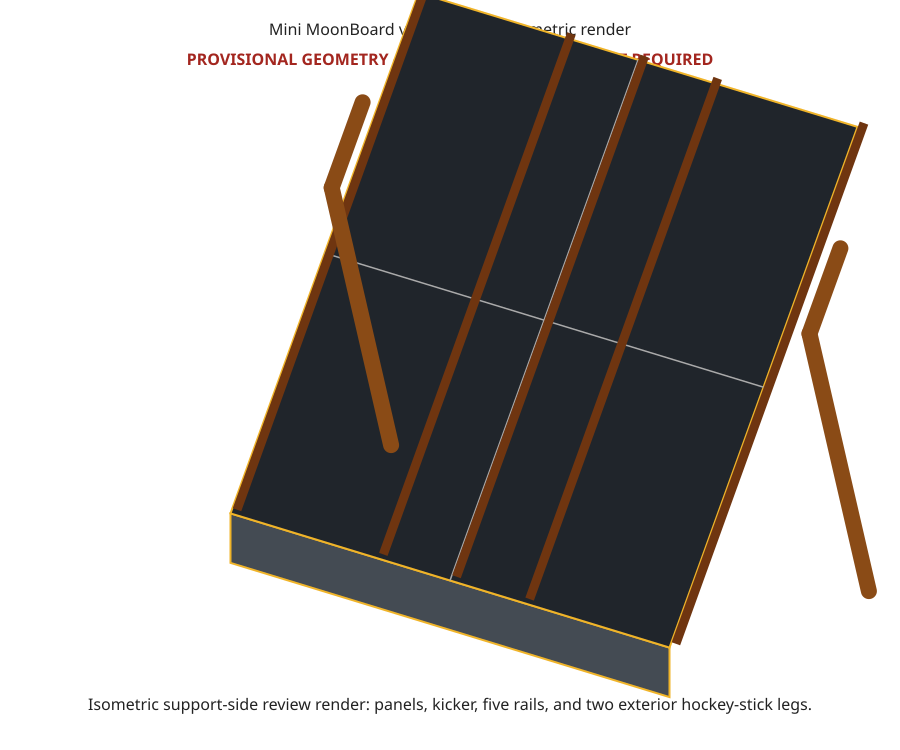

# Mini MoonBoard

Source-backed requirements and parametric CadQuery models for a freestanding
Mini MoonBoard.

## Status

This repository currently models the official Mini MoonBoard panel envelope.
It contains a provisional v1 climbing-surface and freestanding-leg concept.
It does **not** contain a structurally approved frame, bill of materials, cut
list, or construction guide. Structural connections, actual material, floor
interface, and stability still require human review.

The eventual design target is an indoor, freestanding plywood A-frame inspired
by the reference photo and Moon Climbing video. The climbing panels will be
fabricated from birch plywood rather than purchased pre-drilled.

Reviewed renders of the completed assembly will be added here only with the
build-ready release, after the frame and custom kicker are designed and
accepted. The current reference-envelope exports are not frame renders.

## Reference dimensions

| Property | Metric | Imperial |
| --- | ---: | ---: |
| Main climbing surface | 2440 x 2440 mm | 8 ft x 8 ft nominal |
| Official kicker | 150 mm | 5.9 in |
| Angle from vertical | 40 degrees | 40 degrees |
| Official overall envelope | 2440 x 1569 x 2020 mm | 8.01 x 5.15 x 6.63 ft |
| Main panel thickness | 18 mm | 0.71 in |

V1 uses a 225 mm total kicker: the official 150 mm active zone plus a 75 mm
blank extension below it. The crash pad is a separate, excluded element.

## V1 concept render




This generated render shows one side profile; the two exterior legs overlap in
this view. It is a geometry prototype pending the human audit documented in
[`docs/design-basis.md`](docs/design-basis.md), not a construction drawing.

The complete pre-audit package—3D model, front/rear/side plans, cut list,
drilling schedule, purchasing estimate, and build sequence—is in
[`docs/v1-build-package.md`](docs/v1-build-package.md).

## Development

```bash
uv sync
uv run ruff check .
uv run pytest
uv run python -m mini_moonboard.export
uv run python -m mini_moonboard.site_inputs design_inputs.toml
```

See [CONTRIBUTING.md](CONTRIBUTING.md) for the full setup and workflow.

## Repository map

- [`docs/requirements.md`](docs/requirements.md): official dimensions, unit
  conversions, source conflicts, and design constraints.
- [`docs/reference-analysis.md`](docs/reference-analysis.md): observations from
  the supplied photo and reference video.
- [`docs/design-basis.md`](docs/design-basis.md): resolved inputs, open design
  decisions, applicable-review references, and build-readiness gates.
- [`docs/panel-grid.md`](docs/panel-grid.md): source-backed main T-nut and LED
  center coordinates plus unresolved drilling inputs.
- `exports/mini_moonboard_metric_template_datums.{csv,svg}`: reproducible
  dual-unit center-data table and visual verification drawing.
- `exports/mini_moonboard_reference_panel_cut_list.csv`: generated panel-only
  cut list; it intentionally excludes the unresolved frame BOM.
- [`docs/site-survey.md`](docs/site-survey.md): deferred human-audit worksheet;
  its crash-pad, room, and egress sections are outside v1 scope.
- [`design-inputs.example.toml`](design-inputs.example.toml): validated,
  machine-readable companion to the site-survey worksheet.
- [`docs/change-control.md`](docs/change-control.md): controlled-release,
  reviewer-record, and field-deviation process.
- [`docs/inspection-maintenance.md`](docs/inspection-maintenance.md):
  commissioning and inspection-record framework pending reviewer approval.
- [`docs/materials.md`](docs/materials.md): confirmed and provisional material
  requirements.
- `mini_moonboard/`: CadQuery source and export command.
- `exports/`: committed STEP and dimensioned SVG outputs.
- `.github/workflows/ci.yml`: lint, test, CadQuery smoke, and stale-export
  checks on every push and pull request.

## Safety

A climbing wall is a life-safety structure subject to dynamic loads. Moon
Climbing instructs builders to seek professional advice if they have any doubt
about construction. Have the completed frame design, connections, substrate,
and installation reviewed by a qualified carpenter, climbing-wall builder, or
structural engineer before producing a build guide or beginning construction.
