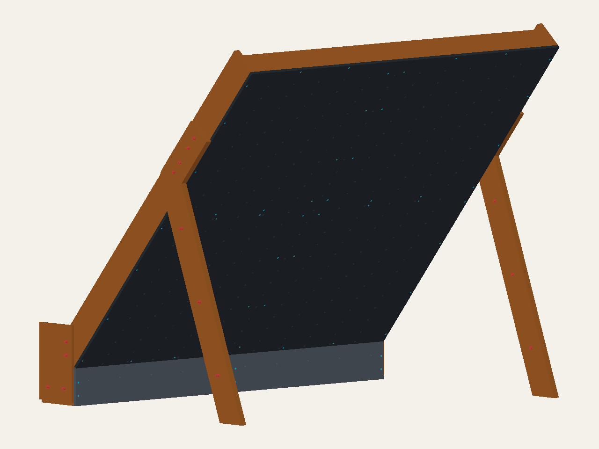
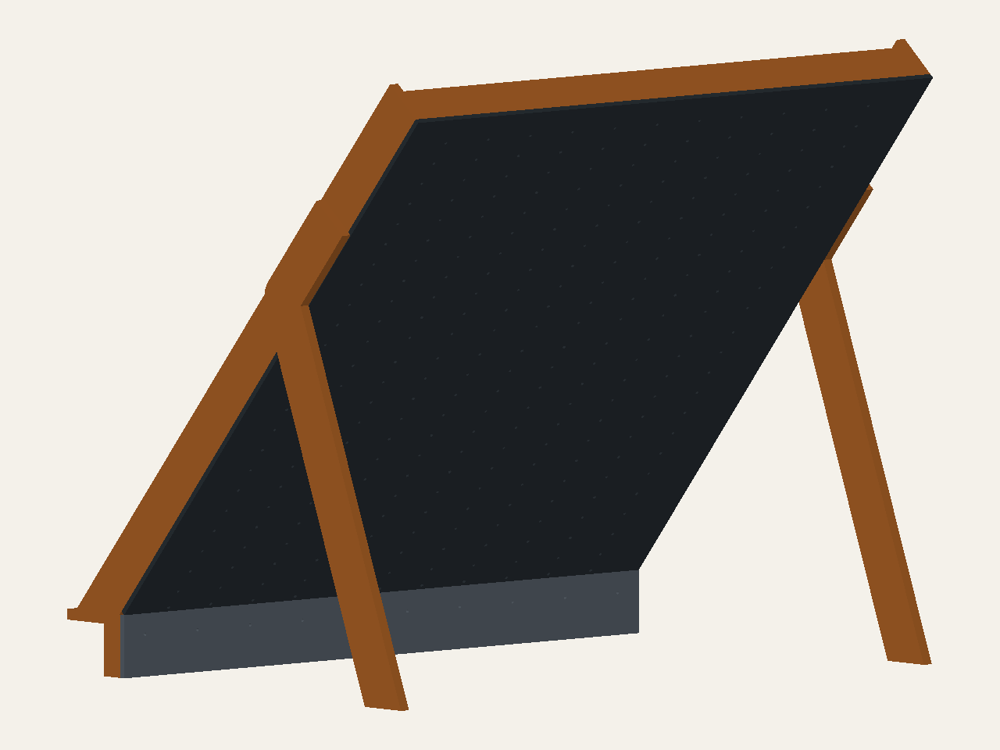

# Independent DIY frame plans for the Mini MoonBoard

Source-backed requirements and parametric CadQuery models for a freestanding
Mini MoonBoard.

This is an independent project, not affiliated with or endorsed by Moon Climbing.

[Open the current candidate in the interactive 3D viewer](https://mckayreedmoore.github.io/mini-moonboard/?model=wide-principal-development)

**Current audit candidate: wider central supports and removable panels.**
[Inspect the wider-support revision](https://mckayreedmoore.github.io/mini-moonboard/?model=wide-principal-development).
Two nominal 4×6 central supports replace the narrow 2×6 receivers, providing
44.45 mm backing-bolt edge distance. Matching base blocks come from the same
stock. Panel inserts and purchased brackets remain; **joint resistance and
physical validation are still unqualified.** [Cuts, assembly and audit limits](docs/wide-principal-development.md).
[Part-local dimensions and profile references](docs/wide-machining.md) now cover
all 29 wooden parts, with metric/imperial schedules and explicit machining limits.

**Start here: [current review guide and release gates](docs/current-review-guide.md).**
It links the matching viewer, assembly sequence, machining schedules and hardware
BOM, and separates the remaining engineering work from supplier/user inputs.

[Earlier bonded-frame diagnostics](docs/wide-structural-results.md): 1.76 mm loaded-point
deflection at 2.4 kN in the ideal-bonded model, with approximately 23.68 kg added
modeled mass. This does not establish that the heavier supports are necessary.
[Remaining joint qualification](docs/connection-qualification-ledger.md) is explicit.

[Later coupled leg/rim and gusset diagnostics](docs/coupled-leg-release.md)
release several artificial bonds. Peak loaded-hold displacement ranges from
7.81 to 2.78 mm across three assumed connector stiffnesses. These are conditional
results, not real stiffness bounds. The [leg-bolt comparison](docs/leg-bolt-resistance.md)
separates the requested 250 lb maximum from the 300 lb sensitivity; neither is
qualified. [Current floor-equilibrium screening](docs/wide-floor-screen.md)
does not establish actual friction or replace compliant unanchored validation.

Preserved predecessor diagnostics: [aggregate base actions](docs/timber-base-demand.md),
[panel-edge bond sensitivity](docs/timber-release-results.md), and
[conditional washer/wood bearing](docs/backing-bearing-envelope.md). These do not
establish individual bolt capacity or qualify the wider variant's real joints.



<details>
<summary>Preserved earlier candidates and investigations</summary>


**Preserved connection candidate: removable panels with threaded inserts.**
[Inspect the panel-insert revision](https://mckayreedmoore.github.io/mini-moonboard/?model=panel-insert-development).
56 panel wood screws become machine screws and flush receiver inserts; existing
through-bolts and commercial-bracket screws stay unchanged. **Geometry candidate
only; insert engagement, joint strength and the lower-backing detail remain
unqualified.** [Hardware, drilling reservations, assembly and audit gates](docs/panel-insert-development.md).

**Preserved development: lumber rims, service clearance and removable connections.**
[Inspect the lumber-base revision](https://mckayreedmoore.github.io/mini-moonboard/?model=timber-base-development&view=rear).
Full-width 2×8×10 ft side rims replace long plywood strips. A continuous lower
backing rail, LED service pockets, full-depth base posts and nominal purchased
hardware are modeled. **Fit development only; joint resistance remains
unqualified.** [Stock, assembly, hardware and analysis limits](docs/timber-base-development.md).
[Updated diagnostics](docs/timber-structural-results.md): about 2.08 mm at the
most displaced loaded point under 2.4 kN downward force in the optimistic
40 mm bulk model; real joint resistance is not established.
[Threaded-insert and retained-nut options](docs/threaded-insert-options.md)
compare easier disassembly without treating inserts as a proven structural upgrade.
[Asymmetric floor-equilibrium screen](docs/timber-floor-screen.md): all 1,296
selected cases have admissible reactions at assumed friction 0.20; low-friction
cases expose limits. Actual floor friction and joint resistance remain unqualified.

**Preserved layout comparison: panels over side framing and a horizontal base.**
[Inspect the base-bearing concept](https://mckayreedmoore.github.io/mini-moonboard/?model=base-bearing-concept&view=rear).
This separately selectable model uses corrected panel-edge hole datums and
level bearing cuts. **Geometry only: connections are omitted.** Known LED
obstructions, missing bottom-edge backing and long-stock requirements are
listed in the [design notes and remaining work](docs/base-bearing-concept.md).



**Preserved predecessor: lower bearing and purchased ledge angles.**
**Known datum error:** the preserved models below use an incorrect main-panel
hole layout. Do not use their drilling schedules. A panel-edge-referenced
correction and revised kicker/base are in development; historical FEA does not
validate that redesign.
[Inspect the revised lower connection](https://mckayreedmoore.github.io/mini-moonboard/?model=bearing-lean-frame&view=rear).
Full-width top and bottom rails remain. The lower rail now meets the central
uprights; four purchased angle proxies replace four lower-ledge screws that
failed the available product edge-distance screen. Two lower edge infills
are shortened 1.6 mm to clear the relocated clips. No additional timber pieces.
[Changes, assembly and remaining qualification gates](docs/bearing-frame.md).
**Actual connector fit and joint resistance remain unqualified; not build-ready.**

[Historical structural diagnostics and next design gates](docs/bearing-structural-results.md):
valid ideal-bonded stiffness diagnostics now run, but actual connector geometry,
lower-ledge load direction and panel attachments remain unresolved.

**Preserved predecessor: continuous top and bottom crossmembers.**
[Inspect the full-width rails from behind](https://mckayreedmoore.github.io/mini-moonboard/?model=continuous-lean-frame&view=rear).
Both rails are unspliced 8-ft 2×6 members. Central uprights stop beneath the top
rail, preserving the full cross-board connection without overlapping members.
[Updated cuts, connections and limitations](docs/continuous-frame.md).
**Joint resistance remains unqualified; this is not build approval.**

**Preserved split-beam predecessor: 1½-in stock with one main framing layer.**
[Inspect the lean frame from the rear](https://mckayreedmoore.github.io/mini-moonboard/?model=lean-38mm-frame&view=rear).
This replaces duplicated main ledges and wide uprights with thin on-edge
members. Paired seam rails preserve separate panel-edge receivers; the lower
kicker transition remains an explicit exception. **Not structurally qualified.**
[Stock, assembly, tradeoffs and downloads](docs/lean-frame.md).

**Preserved heavier comparison: wider framing and recessed through-bolts.**
Inspect [A: purchased clips](https://mckayreedmoore.github.io/mini-moonboard/?model=bolted-clip-frame)
and [B: bolted wood blocks](https://mckayreedmoore.github.io/mini-moonboard/?model=bolted-block-frame).
These address the predecessor's short backing-screw engagement and block-edge
geometry. They trade heavier framing and additional drilling for more direct,
inspectable connections. **Not build-ready or structurally qualified.**
[Comparison, hardware, cutting and assembly guidance](docs/bolted-redesign.md).

**Preserved earlier square-cut comparison:**
Inspect [A: square-cut purchased connectors](https://mckayreedmoore.github.io/mini-moonboard/?model=square-cut-bracket)
and [B: square-cut bolted wood blocks](https://mckayreedmoore.github.io/mini-moonboard/?model=square-cut-wood-blocks).
Both use eight repeated infills and shorter front-installed backing screws;
the existing shaped legs and kicker remain. **Not build-ready:** these are
inspection concepts, not structural approval.
[Comparison, assembly guidance, STEP and metric/imperial workshop schedules](docs/square-cut-comparison.md).

[Structural screening results](docs/square-cut-structural-review.md): both pass
the selected rigid-body moment screen, but **B fails a block-bolt edge-distance
screen and neither design is structurally qualified**. Small ideal-bonded FEA
deflections do not approve the actual joints or unanchored use.

The earlier [wood-first and bracket MVPs](docs/redesign-mvp.md) remain available
for comparison, with their original geometry and evidence preserved.

The [earlier custom-steel top-joint candidate](https://mckayreedmoore.github.io/mini-moonboard/?model=top-joint-development)
and its [audit packet](docs/candidate-review-packet.md) remain historical evidence,
not the recommended fabrication route under the no-custom-steel constraint.
The [selected-product predecessor](https://mckayreedmoore.github.io/mini-moonboard/?model=selected-hardware-development)
and its [geometry/access audit](docs/product-frame-integration.md) remain available.
· [Support this project on Ko-fi](https://ko-fi.com/mckayreedmoore)

</details>

## Status

The current review candidate is `wide-principal-development`, with matching
CAD, hardware, machining and assembly documents linked in the
[current review guide](docs/current-review-guide.md).
It does **not** contain a structurally approved or build-ready design.
Structural connections, actual material, floor interface, and stability still
require human review.

<details>
<summary>Historical development decisions and diagnostics — not current instructions</summary>

[Design recommendation and next five steps](docs/design-recommendation.md):
develop the untied 2×8-foot100 baseline, resolve leg composite action and the
backing joints, and use explicit load/contact findings to decide whether to
change the support arrangement. This is a development decision, not approval
of the current build plans.

New separately selectable [backing-joint development model](https://mckayreedmoore.github.io/mini-moonboard/?model=joint-development):
use the viewer's **Design** selector to compare it with the preserved references.
It adds wider seam battens, enlarged side-grain ribs, wire chases and relocated
rear angles/bolts. [Changes and remaining checks](docs/backing-joint-development.md)
are explicit; this candidate has not yet undergone FEA or product qualification.

The separate [independent-leg inspection model](https://mckayreedmoore.github.io/mini-moonboard/?model=independent-leg-development)
adds four individually selectable plywood plies and six provisional stitch bolts.
[Geometry, exports and remaining gates](docs/independent-leg-development.md)
are documented; no glue, interface-friction or external-bracing credit is assumed.

The [revised screw-spacing model](https://mckayreedmoore.github.io/mini-moonboard/?model=screw-spacing-development)
retains those separate plies while moving the close rib/panel screw groups apart.
[Its changes and remaining product checks](docs/screw-spacing-development.md)
are documented separately; geometry screening is not structural approval.

The new [mid-batten clip variation](https://mckayreedmoore.github.io/mini-moonboard/?model=mid-batten-clip-development)
replaces eight end screws with eight clip outlines and 32 **unselected** fastener
envelopes. [Inspection results, STEP and metric/imperial schedules](docs/mid-batten-clip-study.md#viewer-and-inspection-artifacts)
are available; this is not a catalog-approved connection or an FEA-qualified design.

The separate [perimeter-transition variation](https://mckayreedmoore.github.io/mini-moonboard/?model=lower-transition-development)
replaces twelve more end screws with ten custom angles and 40 **unselected**
fasteners. [Changes, inspection exports and tight-clearance limits](docs/transition-development.md)
remain explicit; the previous designs are preserved and this variation is not build-ready.
Two [native leg-section runs](docs/leg-section-response.md) completed but failed
section-force recovery checks; this is not a physical board failure or new-candidate FEA.

The [updated candidate moment screen](docs/candidate-stability-screen.md) retains
all 96 downward/horizontal cases and both adverse normal-force uplift cases.
The [completed baseline contact-observer audit](docs/mortar-frame-observer.md)
retains its rejected qualification; neither report approves the new joints.

The latest [local hardware diagnostic](docs/moving-hardware-diagnostic.md) found
no additional momentum/mass/kinetic-energy threshold failures in the saved
200-step run. The original contact audit remains failed, and a
[native reader probe](docs/contact-energy-output-investigation.md) reproduced
the contact-energy output-indexing concern. Neither result qualifies the frame.

The eventual design target is an indoor, freestanding plywood A-frame inspired
by the reference photo and Moon Climbing video. The purchased climbing-face stock
is Roseburg AC Douglas-fir 23/32 CAT plywood, not the earlier birch shopping
reference; see [material identification](docs/purchased-materials.md).

The v1 renders are review artifacts, not approval evidence. The official
reference-envelope exports remain separate from the v1 frame artifacts.

</details>

## Reference dimensions

<details>
<summary>Earlier footprint, contact and lumber comparisons</summary>

Earlier candidate: [2×8 with physically extended feet: comparison and results](docs/physical-footprint-results.md).

Current [design decision status](docs/design-decision-status.md) separates numerical
verification from material and connection selection. Two additional
[side-tied base envelopes](docs/base-restraint-options.md) preserve that candidate;
their new connections remain unresolved. See the
[material-selection recommendation](docs/material-selection-recommendation.md)
before treating any candidate as a purchasing or building plan.
The [matched side-tie comparison](docs/tied-base-comparison.md) retains the
untied baseline: the rails change support reactions but provide little
fixed-floor stiffness improvement and do not cure the exploratory tipping cases.

Next analysis: [joint/contact load basis and outstanding material evidence](docs/load-contact-basis.md).
The [independent-ply leg study](fea/results/independent_leg_response/README.md)
now verifies a roughly 3.92× out-of-plane compliance increase without composite
action under its idealized fixtures. Resolve leg lamination, connectors and
lateral stability before selecting deeper rims; this is not a load rating.
The [rib/batten detail screen](docs/rib-batten-detail.md) checks the actual
extended-foot backing and explains why changing grain direction alone does not
finish the connection design.

Contact studies: [four-pin/leg-bore coupon](docs/joint-contact-study.md) and
[unpinned whole-frame floor-contact prototype](docs/floor-contact-study.md).
These are limited numerical studies, not joint-capacity or construction approval.

Convergence diagnosis: [the actual leg/foot coupon](docs/foot-contact-diagnosis.md)
completes gravity and downward loading with an explicit upper guide. It does
not establish equilibrium of the unanchored whole frame.
The [full-frame recovery-control trial](docs/floor-contact-recovery.md) remains
numerically unresolved; it is not evidence of physical failure.
The [preload-and-release continuation study](docs/floor-contact-continuation.md)
completed gravity and 1.2 kN loading at an assumed friction coefficient of 0.5,
but still fails the independent contact moment-transfer audit. This is not
a validated load rating or construction approval.
Smaller release/load increments now pass the gravity balance check, but the
loaded moment residual remains 96 N·mm against the unchanged 1 N·mm limit.
Separate [sliding-cube](docs/contact-shear-coupon.md) and
[actual-leg](docs/leg-shear-coupon.md) comparisons support further MORTAR
qualification; their global balance checks are not full-frame approval.
The [unguided whole-frame comparison](docs/full-frame-mortar.md) now retains a
completed MORTAR run: gravity passes, but the loaded moment residual is 204 N·mm
and fails the unchanged diagnostic limit. Its matched penalty run times out
before full gravity. Neither is an accepted loaded-frame solution.
The subsequent [matched increment refinement](docs/full-frame-increment-refinement.md)
passes both global endpoint checks at increment 0.0625: the largest loaded
moment-residual component is 0.0714 N·mm. The last two refinements differ by
0.0000053 mm in maximum loaded-node displacement. This establishes a better
numerical baseline, not local contact validation, material/joint capacity,
mesh convergence, or construction approval; the earlier failures remain recorded.
The [numerical acceptance basis](docs/numerical-acceptance-basis.md) distinguishes
our strict diagnostic limits from structural requirements; no historical result
is reclassified. The [mortar local-audit basis](docs/mortar-local-audit-basis.md)
explains why plotted contact fields alone cannot validate that formulation.
Before extracting joint demands, the [native section-force benchmark](docs/section-force-extraction.md)
records significant mesh-dependent bending error; that method is not yet qualified
for the frame.
The [follow-up straight-C3D10 benchmark](docs/section-force-tet-coupon.md) matches
the known bending moment within 0.001% after fixing a load-field formatting bug.
Curved frame sections and joint interfaces still require separate checks.

Previous candidate: [rotated-rear 2×8 CAD, plywood comparison and results](docs/shallow-frame-results.md).

Earlier investigation: [250/300 lb load envelope](docs/user-load-envelope.md) and
[2×8 feasibility and matched FEA](docs/2x8-feasibility.md).
Earlier stage: [2×12 footprint comparison, load basis and joint plan](docs/hybrid-footprint-study.md).

Separate development work: [complete 2×10 and 2×12 hybrid candidates](docs/hybrid-full-candidates.md),
with selectable viewer models, backing and nominal connections. These unvalidated
candidates do not replace the V1 reference or its structural studies.

</details>

The table below describes the official reference, not the complete custom-frame
envelope or the purchased face-sheet thickness. Use the current candidate's
dimensioned viewer and schedules for its geometry.

| Property | Metric | Imperial |
| --- | ---: | ---: |
| Main climbing surface | 2440 x 2440 mm | 8 ft x 8 ft nominal |
| Official kicker | 150 mm | 5.9 in |
| Angle from vertical | 40 degrees | 40 degrees |
| Official overall envelope | 2440 x 1569 x 2020 mm | 8.01 x 5.15 x 6.63 ft |
| Main panel thickness | 18 mm | 0.71 in |

V1 uses a 225 mm total kicker: the official 150 mm active zone plus a 75 mm
blank extension below it. The crash pad is a separate, excluded element.

## V1 concept render

Historical V1 reference, not the current wide-support candidate shown above.


This raster view is tessellated directly from the V1 CadQuery assembly and
looks upward at the underside—the climbing face. Holds are intentionally not
modelled as arbitrary solids: their 142 exact through-bore provisions are in
the CAD. The 132 LED bores are likewise modelled, while the received LED kit's
controller/cable route remains an installation-audit item until its supplied
guide and installed wire lengths are verified. The frame now uses 12-inch-deep
side walls, a top closure, and exterior legs made from two glued 3/4-inch layers.

[Open the interactive V1 3D model](https://mckayreedmoore.github.io/mini-moonboard/) to rotate, pan, zoom, and select a part for bilingual cut-list dimensions.
The viewer shows the modelled bolts and screws as selectable connection geometry,
including 48 main-panel screws (four per edge with shared corners) and
16 kicker-panel screws (four per long edge with shared end corners). Hardware
clearance is checked against wood and other fasteners. These checks do not
establish connection strength.
Use its panel-overlay selector for no labels, amber grid labels, or
high-contrast grid labels. The letters A–K and rows 1–12 follow the canonical
panel datums. Moon-branded artwork is deliberately not bundled until there is
written permission to rehost it publicly; see the official [artwork archive](https://moonclimbing.com/media/moonboard-pdf/Final_Artwork.zip)
and the project [artwork policy](docs/panel-artwork.md).
Its independent overall-dimensions switch draws the provisional complete V1
assembly extents directly from CAD, excluding the separate crash pad.
The viewer also includes a selectable 5 ft 8 in / 1727.2 mm reference person
for scale. The person is display-only and deliberately excluded from the CAD
assembly, cut lists, stability screen, and FEA.

The [side profile](exports/mini_moonboard_v1_concept_side.svg),
[support-side elevation](exports/mini_moonboard_v1_rear.svg), and
[isometric support view](exports/mini_moonboard_v1_isometric.svg) remain
available as audit drawings. They are intentionally links rather than competing
hero images: the CAD-derived climbing-face render above is the clearest visual
summary of the assembly.

The historical V1 design and build sequence are described in the
[box-frame revision](docs/box-frame-revision.md). The V1 cut and connection
schedules describe that predecessor, not the current wider-principal candidate.
Use the [current assembly and hardware package](docs/wide-principal-development.md)
for the present audit; do not transfer the V1 panel-screw drilling instructions.
The [relocation proposal](docs/relocation-design.md) identifies reusable-joint
improvements for occasional moves. The [LED guide](docs/v1-led-installation.md)
assumes removing the continuous strips before separating panels and reinstalling
them afterward; structural relocation changes are not implemented yet.
The historical [unanchored stability screen](exports/mini_moonboard_v1_stability_screen.md)
uses V1 CAD geometry. The [V1 clearance screen](exports/mini_moonboard_v1_fastener_clearance_screen.md)
checks that predecessor's fastener arrangement. The [earlier beam FEA](docs/v1-fixed-foot-fea-screen.md)
is a historical baseline and does not validate the new box frame.
The historical [bulk-frame FEA results](docs/box-frame-fea.md) include three mesh
sizes and a stiffness sensitivity run. They describe ideal bonded joints
and fixed floor contacts. The [load-basis audit](exports/mini_moonboard_v1_stability_screen.md)
separates downward loading from exploratory directional failures; dynamic
stability and actual joint strength remain unresolved.
The [bolted-joint bearing FEA](docs/joint-bearing-fea.md) adds 24 local timber
solves with mesh comparisons. These are unit-load bearing screens, not
assembled-joint, screw-withdrawal, or adhesive-strength validation.
The [updated-board FEA](docs/updated-board-fea.md) reruns the global frame at
row-12 load locations and screens drilled panels with the reduced 12/8-screw
patterns. Its ideal screw-head constraints do not establish connection strength.
The [C10 connection comparison](docs/panel-connection-comparison.md) adds
finite-stiffness tensile attachments and compression-only backing contact,
comparing stiffer attachments with closer passive backing. Assumed connection
properties are sensitivity inputs, not hardware ratings.

## SketchUp reference geometry

The supplied reference model can be extracted for inspection without making it
part of the V1 design: `uv run python scripts/import_sketchup.py INPUT.skp
OUTPUT.obj --summary OUTPUT.json`. The OBJ is in millimetres and retains named
hierarchy groups; the optional JSON reports each group's transformed bounds and
face count. Both open or inspect in FreeCAD, Blender, or an online OBJ viewer.
They are comparison-only: do not copy their dimensions or connections into V1
without an explicit audit.

## Development

```bash
uv sync
uv run ruff check .
uv run pytest
uv run python -m mini_moonboard.export
```

`site_inputs` is a separate, deferred site-and-pad worksheet validator; it is
not a V1 build-package gate.

See [CONTRIBUTING.md](CONTRIBUTING.md) for the full setup and workflow.

## Repository map

- [`docs/requirements.md`](docs/requirements.md): official dimensions, unit
  conversions, source conflicts, and design constraints.
- [`docs/reference-analysis.md`](docs/reference-analysis.md): observations from
  the supplied photo and reference video.
- [`docs/design-basis.md`](docs/design-basis.md): resolved inputs, open design
  decisions, applicable-review references, and build-readiness gates.
- [`docs/orientation.md`](docs/orientation.md): front/back and climber-left/
  climber-right convention for the rendered assembly.
- [`docs/panel-grid.md`](docs/panel-grid.md): source-backed main T-nut and LED
  center coordinates plus unresolved drilling inputs.
- `exports/mini_moonboard_metric_template_datums.{csv,svg}`: reproducible
  dual-unit center-data table and visual verification drawing.
- `exports/mini_moonboard_reference_panel_cut_list.csv`: generated panel-only
  cut list; it intentionally excludes the unresolved frame BOM.
- [`docs/site-survey.md`](docs/site-survey.md): deferred human-audit worksheet;
  its crash-pad, room, and egress sections are outside v1 scope.
- [`design-inputs.example.toml`](design-inputs.example.toml): validated,
  machine-readable companion to the site-survey worksheet.
- [`docs/change-control.md`](docs/change-control.md): controlled-release,
  reviewer-record, and field-deviation process.
- [`docs/inspection-maintenance.md`](docs/inspection-maintenance.md):
  commissioning and inspection-record framework pending reviewer approval.
- [`docs/materials.md`](docs/materials.md): confirmed and provisional material
  requirements.
- `mini_moonboard/`: CadQuery source and export command.
- `exports/`: committed STEP and dimensioned SVG outputs.
- `.github/workflows/ci.yml`: lint, test, CadQuery smoke, and stale-export
  checks on every push and pull request.

## Safety

A climbing wall is a life-safety structure subject to dynamic loads. Moon
Climbing instructs builders to seek professional advice if they have any doubt
about construction. Have the completed frame design, connections, substrate,
and installation reviewed by a qualified carpenter, climbing-wall builder, or
structural engineer before producing a build guide or beginning construction.
