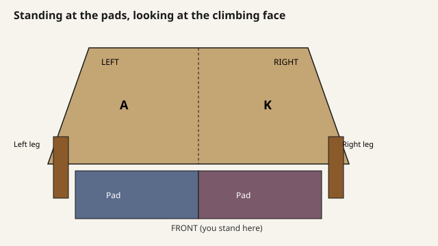

# Build docs

If you are building the wall, stay on this page and the links below.
Older studies live in [history/](history/).

## 1. Choose plywood

| You have | Open |
| --- | --- |
| Bought **4×4** sheets (or Mini kit panels) | [https://mckayreedmoore.github.io/mini-moonboard/](https://mckayreedmoore.github.io/mini-moonboard/) · [cut sheets](https://github.com/mckayreedmoore/mini-moonboard/tree/master/docs/floor-flush-construction) |
| **Cut 4×8** sheets | [https://mckayreedmoore.github.io/mini-moonboard/?model=compact-floor-flush-kerf-right](https://mckayreedmoore.github.io/mini-moonboard/?model=compact-floor-flush-kerf-right) · [cut sheets](https://github.com/mckayreedmoore/mini-moonboard/tree/master/docs/floor-flush-construction-kerf-right) |

Or open the first 3D link and pick the matching line under **Design**.
Details: [Which plywood packet](floor-flush-width-option.md).

## 2. Cut, drill, assemble

1. [Shop checklist](floor-flush-shop-checklist.md)
2. [Assembly guide](floor-flush-assembly-guide.md)
3. The cut-sheet folder from step 1

Also useful while building: [orientation](orientation.md) (left is A, right is K),
[hold hardware](moonboard-hold-hardware.md), [LED routing](led-wiring-reference.md),
[panel screws](current-panel-screw-purchase.md), [pads](current-crash-pad-construction.md),
[later insert option](screw-repair-inserts.md).

## 3. If you want the numbers

[Build package](floor-flush-build-package.md) ·
[Master plan](floor-runner-mvp-master-plan.md) ·
[Completion ledger](floor-runner-mvp-completion-ledger.md)

## Lost?

You want a **4×4** or **4×8** folder, the **checklist**, and the **assembly guide**.
Everything else in [history/](history/) is an older idea, not this build.
