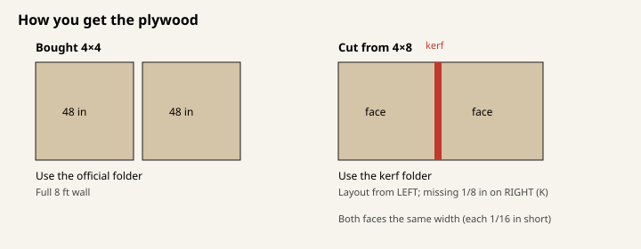
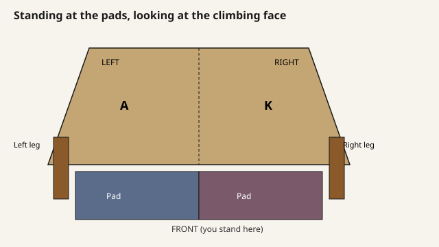

# Selected baseline reference packet

For ongoing Eoere engineering and builder-support work, start at the
**[main development summary and revision map](wood-joints-mvp/README.md)**.
Its [active builder reading path](wood-joints-mvp/README.md#active-builder-reading-path)
identifies current extended-cleat geometry, matching nominal shop records,
held stations and source-bound current numerical evidence. Historical results
retain their own revision limits.

The instructions below belong to the selected screw-and-bracket baseline,
`compact-floor-flush-development`, governed by
[current-candidate.json](../current-candidate.json). They preserve that baseline's
conditional shop packet and evidence. Earlier models and results remain in the
[design-history catalog](history/design-history.md).

## 1. Baseline plywood variants

| You have | Open |
| --- | --- |
| Bought **4×4** sheets (or Mini kit panels) | [https://mckayreedmoore.github.io/mini-moonboard/](https://mckayreedmoore.github.io/mini-moonboard/) · [cut sheets](https://github.com/mckayreedmoore/mini-moonboard/tree/master/docs/floor-flush-construction) |
| **Cut 4×8** sheets | [https://mckayreedmoore.github.io/mini-moonboard/?model=compact-floor-flush-kerf-right](https://mckayreedmoore.github.io/mini-moonboard/?model=compact-floor-flush-kerf-right) · [cut sheets](https://github.com/mckayreedmoore/mini-moonboard/tree/master/docs/floor-flush-construction-kerf-right) |

Or open the first 3D link and pick the matching line under **Design**.
Details: [Which plywood packet](floor-flush-width-option.md).

## 2. Baseline cut, drill and assembly records

1. [Shop checklist](floor-flush-shop-checklist.md)
2. [Assembly guide](floor-flush-assembly-guide.md)
3. The cut-sheet folder from step 1

Supporting baseline references: [orientation](orientation.md) (left is A, right is K),
[hold hardware](moonboard-hold-hardware.md), [LED routing](led-wiring-reference.md),
[panel screws](current-panel-screw-purchase.md), [pads](current-crash-pad-construction.md),
[later insert option](screw-repair-inserts.md).

## 3. Baseline calculations and conditions

[Build package](floor-flush-build-package.md) ·
[Master plan](floor-runner-mvp-master-plan.md) ·
[Completion ledger](floor-runner-mvp-completion-ledger.md)

## Reading paths

For baseline shop records, use the matching **4×4** or **4×8** folder, the
**checklist** and the **assembly guide** together. Read their recorded conditions.
For the active development lane, return to the [eoere summary](wood-joints-mvp/README.md).
For earlier ideas and the writeup, use [history/](history/).
