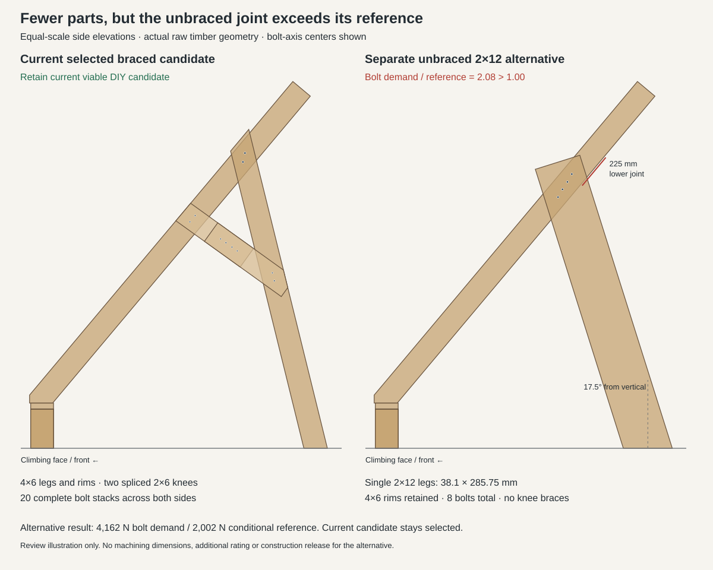

# Unbraced single-2x12 leg trial

The tested 2x12 alternative does not replace the selected braced design. A fresh
assembled-frame calculation converges, but the corrected four-bolt joint reaches
**2.079 demand/reference**, above the retained 1.00 limit. Keep the current
`compact-spliced-knee-development` build package and viewer default. This is a
bounded comparison of two layouts, not proof that every possible unbraced
2x12 arrangement is impossible.

## What changed

Both trial models retain the solid 4x6 outer rims, compact 2x6 base, main panels,
277 mm kicker and existing non-bolt connections. Each rear leg becomes one
38.1 × 285.75 mm member. Removing the four knee pieces and their hardware reduces
complete bolt stacks from 20 to eight: four half-inch bolts per leg, with heads
inward and nuts/tips outward. No doubled vertical stock or custom steel is added.

The leg leans rearward 17.5 degrees from vertical. Its joint center moves 225 mm
down the inclined rim; the foot center moves 76.1 mm toward the climbing face.
This keeps a useful rear footprint while limiting the full stock length to
1881.8 mm and the thin-axis length/thickness ratio to 49.39. Keeping the old
joint height exceeded the retained slenderness limit. This is a reasoned,
bounded placement choice, not a global angle optimization.

The first trial used a 195 mm-long bolt row along the rim. It fits the wood but
spans 164.46 mm across leg grain, exceeding the retained 127 mm shrinkage layout
limit. The corrected candidate staggers the bolt centers within the rim and
reduces that spread to 122.66 mm. Both component spacing checks and all 16 actual
receiver checks pass. See [placement and hardware details](compact-2x12-layout-screen.md).



The illustration shows actual raw timber outlines and bolt centers. It is not a
drilling drawing. Regenerate with `uv run python -m scripts.compact_2x12_diagram`.

## Fresh response and resistance

Each alternative receives its own native assembled solve: A12 loading with
250 lb × 2 downward force (about 2.224 kN) plus 300 N rearward horizontal force.
Both reach accepted equilibrium and contact closure after 12 contact cycles.
No braced-design joint forces are reused. The actual machined receivers, service
openings and eight bolt stacks feed the local checks; nominal geometry alone
does not establish resistance.

| Design | Worst checked bolt demand/reference | Other decision |
| --- | ---: | --- |
| Selected braced 4x6 design | 0.674 over its six saved cases | Selected conditional build package; exterior trim assessment remains separate |
| Unbraced 2x12, centered row | 1.949 | Cross-grain layout also fails |
| Unbraced 2x12, corrected stagger | 2.079 | Listed layout, receiver, member, base and hardware checks pass; bolt lateral check fails |

For the corrected candidate, `lumber_leg_bolt_left_4` carries **4161.71 N** of
lateral demand against **2001.81 N** of single-fastener conditional reference:
4161.71 / 2001.81 = 2.07897. The force acts about 88.90 degrees to rim grain and
31.40 degrees to leg grain. All six wood-connection yield modes are compared
using the actual 88.9 mm rim and 38.1 mm leg bearing lengths. Mode II governs:
wood bearing with bolt rotation, rather than a steel-strength-only limit.
Increasing bolt steel strength alone therefore does not remove this shortfall.

The retained resistance inputs include specific gravity 0.5, specified 90 ksi
bolt bending yield, actual load-to-grain reduction and duration factor Cd = 1.0.
Even the unadopted Cd = 1.6 sensitivity gives 1.299, still above one. Additional
bolt-group reductions cannot rescue a single-fastener failure; no group-capacity
or complete qualification claim is made by this screen.

The corrected candidate's other peak listed ratios are 0.787 local parallel
wood, 0.794 supplemental splitting, 0.572 sampled net-member resistance and
0.735 header full-length resistance. Its sampled full-length member stability
sensitivity passes. The weakest adjusted edge/end reserve is 3.05 mm. Maximum
panel displacement is 22.09 mm and timber displacement is 13.79 mm; these are
response outputs, not new serviceability acceptance limits.

## Design decision

The wider leg provides more room for holes, but replacing a 4x6 with a 2x12 also
reduces through-bolt bearing thickness from 88.9 to 38.1 mm. The 4x6 rim and
cross-grain spacing limit restrict how far the bolt group can spread. Removing
the knees returns substantial moment to this upper joint. Correcting the row's
layout shortcoming shortens its effective bolt lever arm and does not improve
the capacity result.

Keep the selected braces and hardware. Stop this particular alternative after
the first fresh load case fails substantially; additional passing load cases
could not reverse that failure. Do not buy or drill the exploratory 2x12 legs
from these files. The existing load, material, accepted-panel and no-slip-floor
assumptions remain explicit; this comparison does not change those assumptions
to obtain a pass.

Kicker screw placement remains suitable for the retained layout: keep nine per
half. The upper post screws need accurate placement because their nominal end
reserve is only 2.45 mm. The [separate kicker review](kicker-screw-placement-review.md)
records coordinates, catalog references, embedment and interference checks.

## Reproduction and preserved evidence

Models: `mini_moonboard/compact_2x12_leg_frame.py` and
`mini_moonboard/compact_2x12_staggered_frame.py`. The matching archives under
`fea/results/compact-2x12-study/row-a12-rear` and `staggered-a12-rear` contain the
native report, actual geometry, frozen source snapshots and checksum manifest.
`checks.json` is the original fixed-angle first-stage comparison;
`assessment.json` contains the actual-angle and local-member decision above.

```sh
uv run python -m scripts.compact_2x12_layout
uv run python -m scripts.compact_2x12_study --staggered --output fea/generated/compact-2x12-staggered-a12-rear
uv run python -m scripts.compact_2x12_results --archive fea/results/compact-2x12-study/row-a12-rear
uv run python -m scripts.compact_2x12_results --archive fea/results/compact-2x12-study/staggered-a12-rear
```

Omit `--staggered` to run the original row under a separate output directory.
The geometry uses `scripts.compact_thick_geometry.build(candidate)` with each
candidate's bolt hardware and the specified 90 ksi yield input. Archive with
`scripts.compact_two_results`, supplying the exact candidate key and model source.
A model edit requires fresh response and geometry before drawing a new conclusion.

Validation: all 450 collected current/shared and new-trial tests passed, with
15 older checks deselected; repository Ruff checks passed. The five new checks
were then classified as historical because both alternatives are rejected;
default collection remains 445 tests. To rerun just the preserved trials:

```sh
uv run pytest -q --include-historical tests/test_compact_2x12_leg_frame.py tests/test_compact_2x12_staggered_frame.py
```
