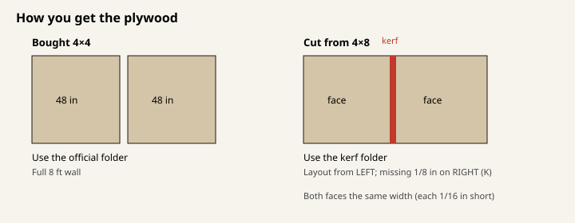

# Which plywood packet to use

The frame is the same design either way. The only difference is how you get
the climbing faces.

## Buy 4×4 plywood (or Mini kit panels)

If the faces arrive as **true 4×4 sheets** (48 in × 48 in), use the official
packet.

- 3D model: [https://mckayreedmoore.github.io/mini-moonboard/](https://mckayreedmoore.github.io/mini-moonboard/)
- Cut and drill sheets: [https://github.com/mckayreedmoore/mini-moonboard/tree/master/docs/floor-flush-construction](https://github.com/mckayreedmoore/mini-moonboard/tree/master/docs/floor-flush-construction)

On the 3D page, **Design** should read **Bought 4×4 plywood · official Mini faces**.
That is the geometry the six 250 lb calculations were run on.

## Cut 4×8 plywood

If you rip **4×8 sheets** into two faces, the saw takes about **1/8 in** out of
the middle. Each face is then **1/16 in** narrower than 48 in, and both faces
are the same width.

- 3D model: [https://mckayreedmoore.github.io/mini-moonboard/?model=compact-floor-flush-kerf-right](https://mckayreedmoore.github.io/mini-moonboard/?model=compact-floor-flush-kerf-right)
- Cut and drill sheets: [https://github.com/mckayreedmoore/mini-moonboard/tree/master/docs/floor-flush-construction-kerf-right](https://github.com/mckayreedmoore/mini-moonboard/tree/master/docs/floor-flush-construction-kerf-right)

You can skip the long address: open
[https://mckayreedmoore.github.io/mini-moonboard/](https://mckayreedmoore.github.io/mini-moonboard/)
and under **Design** pick **Cut from 4×8 · kerf on the right**.

Moon hold, LED and screw layout still starts from the **left** of the wall
(column A), the same way the Mini drawings do. Because the wall is 1/8 in
narrower, that missing width shows up on the **right** (K), next to the right
leg. The left edge stays put. The 4×6 and 2×6 lumber sizes do not change; the
right-hand frame members move in so they stay flush with the slightly narrower
plywood.

## Do not mix the two

Pick one plywood source and stay on that folder. The 250 lb cases were run on
full 4×4 faces; the 4×8 folder is the matching cut layout for the saw kerf.

Stand at the pads, looking at the climbing face: left is A, right is K.
