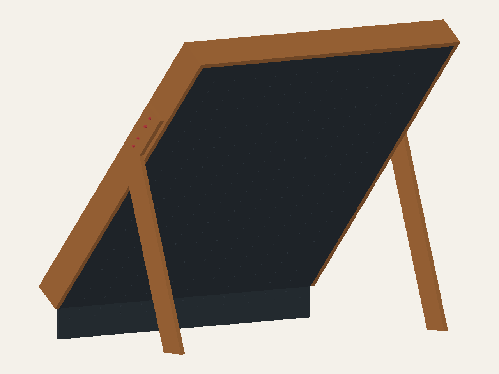
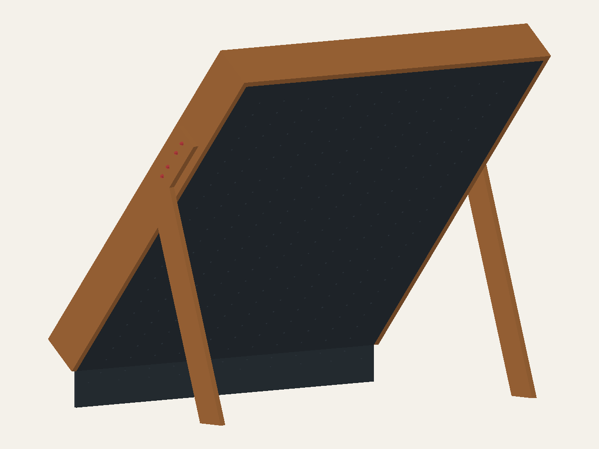

# Hybrid rim and leg study

**Incomplete layout candidates, not construction plans or FEA models.**
The default plywood frame and its viewer remain unchanged. This first step
resolves the candidate rim envelope and upper leg position before introducing
new backing and detachable joints. Neither candidate is selected for strength.

## Compare the candidates

| Candidate | Actual rim section | Total rim depth, face to rear |
| --- | --- | --- |
| 2×10 | 38.1 × 234.95 mm / 1½ × 9¼ in | 234.95 mm / 9¼ in |
| 2×12 | 38.1 × 285.75 mm / 1½ × 11¼ in | 285.75 mm / 11¼ in |

These are dry dressed dimensions from [SFPA standard sizing](https://www.southernpine.com/resources/specifying-southern-pine-lumber/standard-sizing/),
converted from inches. Actual species, grade, moisture, dimensions and design
properties remain unselected. Rounded stock edges and manufacturing tolerances
are not modelled. Existing side walls have 322.8 mm total depth, including
the 18 mm panel thickness; do not compare that with a nominal lumber size.

### 2×10 layout

[STEP geometry](../exports/hybrid/2x10_layout.step) ·
[Layout blanks in metric and imperial](../exports/hybrid/2x10_layout_blanks.csv)

### 2×12 layout

[STEP geometry](../exports/hybrid/2x12_layout.step) ·
[Layout blanks in metric and imperial](../exports/hybrid/2x12_layout_blanks.csv)

## Geometry decisions

- Board-local N points into the backing. The climbing face is N = −18 mm;
  the rim starts there and its rear is N = dressed width − 18 mm.
- The main panels, hold/LED bores, 40° climbing angle and 225 mm kicker are
  unchanged. Panel attachment holes are deliberately omitted pending the new
  backing layout; the old screw schedule does not apply to these candidates.
- Both exterior legs remain two glued 19.05 mm / ¾ in plywood layers, totaling
  38.1 mm / 1½ in. They are not replaced by lumber. Their upper section is
  centered across the new rim depth; four original uphill bolt stations remain.
- Leg floor **center** locations are retained. The changed bend location changes
  the lower-leg angle and floor-bearing length; the entire support footprint is
  therefore not identical. The floor ends are cut level with full-width bearing.
  [Generated comparison](../exports/hybrid/comparison.csv) records the new
  bolt-normal datums and lower-leg angles measured from the floor.
- The nominal ⅜ in × 3¾ in leg bolt envelopes, two 2 mm washers and 9 mm nut
  envelope are retained with 76.2 mm grip. They fit geometrically; timber bearing,
  splitting, edge distances, tool access and strength are **not** approved.
- The top caps both side-rim ends outside the main panel uphill edge. Its blank
  is 2514.6 mm / 99 in long: use stock longer than 8 ft, with trimming allowance.
  Side-rim blanks remain 2438.4 mm / 96 in. The top adds 38.1 mm along the board
  beyond the panel edge. Top-to-side connection hardware remains unresolved;
  geometric contact alone does not connect these parts structurally.

The drawings intentionally omit kicker cheeks, all panel backing, rear members,
corner brackets and their connections. The displayed skins are reference geometry,
not attached panels. Do not assemble or load this incomplete arrangement.
Blank tables are a layout inventory, not a purchasing or cutting release.
No total-frame mass, stability margin or load rating is inferred from this subset.

## Next design steps

The [preliminary side-rim comparison against plywood](hybrid-rim-comparison.md)
quantifies the depth tradeoff. It is an analytical section screen, not completed
hybrid-frame FEA.

1. Add standard-lumber perimeter/seam backing and an **attached** mid-panel support
   candidate. Preserve hold/LED reliefs, perimeter screw regularity and a continuous
   load path into the rim. Passive backing alone did not help the previous outward
   C10 load case; see [the connection study](panel-connection-comparison.md).
2. Resolve detachable top/side and transverse interfaces with broad-face brackets
   or gussets, actual bolt/tool clearances, and the kicker-to-rim transition.
   Do not copy the old shallow-rim-incompatible seats, splices or fasteners.
3. Compare the complete candidates' cuts, laminations, hardware and moving modules.
   Select material properties, then recompute whole-frame mass/centre of gravity,
   unanchored stability, frame deflection and joint forces. Previous plywood-frame
   FEA does not validate either hybrid candidate.

Generate with `uv run python -m mini_moonboard.hybrid`; check with
`uv run pytest tests/test_hybrid.py`. Tests check valid single solids, wood and
bolt-head collisions, joint contact, stock depths, leg grip and floor bearing.
