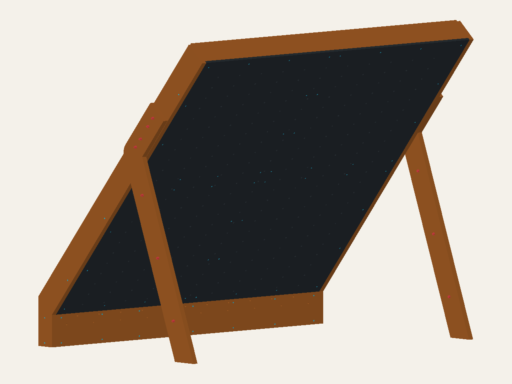

# Two wood-based redesign candidates

These are separate, inspectable alternatives to `top-joint-development`, not
construction drawings or approved replacements. Both remove the previous
custom steel angles and preserve the purchased face-plywood assumption,
official hold/LED axes, side-rim datums and four independent plywood leg plies.
Neither introduces anchors, ballast, adhesive/composite-action credit or a new
FEA result. Earlier candidates and their evidence remain available.

## What changes

| | Wood-first MVP | Commercial-bracket MVP |
| --- | --- | --- |
| Viewer | [wood-first-mvp](https://mckayreedmoore.github.io/mini-moonboard/?model=wood-first-mvp) | [commercial-bracket-mvp](https://mckayreedmoore.github.io/mini-moonboard/?model=commercial-bracket-mvp) |
| Principal framing | Two on-edge 2×6 uprights and three full-width on-edge 2×6 beams | Two continuous on-edge 2×6 uprights and two separate beam spans at each of three levels |
| Main connections | Complementary 69.85 mm half-depth cuts at upright/beam crossings; 9.525 mm beam-end housings in the rims | Butt-ended beams with twelve Simpson ML24Z connector representations; central gap remains open |
| Main tradeoff | Fewer purchased connectors, but substantial timber section deductions and provisional retention details | No deep upright housings, but factory geometry, screw access and bracket load paths need verification |

Both use flat timber face-bearing ledges with complementary housings, rather
than treating the deep framing as continuous face support. The nominal
18.25625 mm face panels remain separate from the nominal 19.05 mm leg/splice
plies. Solid timber blocks replace the kicker's custom-angle retention route.
The existing cheek/splice profiles remain; deleting their former angle bolts
does not by itself qualify the replacement load path.

The former 14.0671 mm-margin kicker bolt holes are not retained. The two lower
splice screws on each side move to board-local S/N = −40/80 and −25/110 mm.
Their nominal limiting splice-outline distances become 30 and 26.9437 mm;
center spacing becomes 33.541 mm. These are geometric improvements, not approved
edge distances or screw spacing. The undrilled profiles are rebuilt with only
the new connection pattern.

The one-climber planning assumption remains 250 lb maximum intended use, with
150/200 lb comparisons and 300 lb sensitivity retained as historical study
cases—not ratings of either new frame. Pads remain separate and excluded.

## Hardware and fabrication status

Inherited leg, stitch, cheek-splice and kicker connections retain their existing
selected-product representations. **New wood-joint screws are provisional
commercial-hardware envelopes**, not a complete selected SKU schedule. Their
lengths, pilots, head seats and effective engagement require a joint-specific
decision; presence in CAD is not an installation instruction.

The bracket alternative specifies ML24Z with six SDS25112 screws per connector
(72 new connector screws). It is **not** the earlier A21/UK-proxy route. Its
50.8 × 50.8 × 101.6 mm connector envelope uses assumed 2.7 mm thickness,
sharp bends and provisional factory-hole positions. Verify the actual product
before accepting fit; do not drill, trim or bend purchased connectors to match
this model. No custom steel fabrication is proposed in either alternative.
The manufacturer's [2026 Wood Construction Connectors catalog](https://www.strongtie.com/resources/literature/wood-construction-connectors-catalog),
page 323, specifies the ML24Z dimensions, six ¼ × 1½ in SDS screws and separate
screw purchase. It directs lateral-load questions to engineering letter
L-C-MLZ; its table is not a capacity rating for this inclined frame joint.

## Assembly concept and decisions still open

Start detailed joint review with the **wood-first variant**: it directly meets
the owner's woodworking preference and avoids reliance on assumed factory
connector holes. Keep the bracket variant as an alternative if the deep
half-laps leave inadequate net timber or prove impractical to assemble.
This is a fabrication-direction recommendation, not a strength ranking.

Both use ordinary nominal 2×4, 2×6 and 2×8 timber sections; grade, species and
actual stock dimensions still need confirmation. The wood-first full-width
beams are 2457.45 mm (96.75 in) before any cutting allowance, so an 8 ft board
is too short: obtain longer stock. The bracket spans fit shorter stock but
add twelve purchased connectors and 72 connector screws. No current price or
local-stock quote is claimed; compare those purchases against the additional
housing-cutting labor. Ordinary saw/router/chisel/drill work is required;
neither route requires owner metal fabrication.

For the wood-first arrangement, inspect and trial-fit the housed frame before
closing access with skins; confirm how the housed ends are retained against
separation, not merely supported in bearing. For the bracket arrangement,
inspect the butt joints and actual connector installation access before fitting
skins. In both, establish the kicker/block and independent-ply connection
sequence, lighting removal access and temporary support before fabrication.
These are assembly concepts, not an erection procedure.

Review actual net sections, fastener edge/end distances, threaded engagement,
head/washer bearing and tool access. Check all retained hold/LED reservations
and the received harness. Resolve stock dimensions, plywood direction,
connection resistance and unanchored stability separately. No geometry check
establishes a climber rating or converts rejected force recovery into design
loads.

## Inspection files and verification

The climbing-face render below comes directly from the wood-first CAD assembly.
Both candidates share the same climbing-side geometry; rotate the linked
viewers to inspect their different rear joints and select individual parts.

Each export directory contains matching STEP, metric/imperial parts CSV,
connection/hardware CSV and a source/artifact manifest:

- [Wood-first STEP](../exports/wood-first-mvp/wood-first-mvp.step),
  [parts](../exports/wood-first-mvp/wood-first-mvp_parts.csv),
  [connections](../exports/wood-first-mvp/wood-first-mvp_connections.csv),
  [manifest](../exports/wood-first-mvp/manifest.json).
- [Bracket STEP](../exports/commercial-bracket-mvp/commercial-bracket-mvp.step),
  [parts](../exports/commercial-bracket-mvp/commercial-bracket-mvp_parts.csv),
  [connections](../exports/commercial-bracket-mvp/commercial-bracket-mvp_connections.csv),
  [manifest](../exports/commercial-bracket-mvp/manifest.json).

`tests/test_redesign_mvp.py` checks body validity, face/grid preservation,
floor seating, connection inventory and body-only contact/intersections. These
checks passed for both candidates. `tests/test_mvp_fasteners.py` also passed:
heads/washers/nuts, unrelated shafts, distinct fasteners, open pilot axes and
actual receiver presence; 142 T-nut flange and 132 LED rear reservations were
screened against framing and hardware. These checks do not establish thread
capacity, minimum effective engagement or driver-access swept volumes.

The 21 focused cases across those modules and `tests/test_mvp_exports.py`
passed on 2026-09-07. Export checks compare source/artifact hashes, inventories,
dual-unit schedules, STL bounds and independently imported STEP per-solid
spatial fingerprints against CAD. The local browser check
`node scripts/check_mvp_viewer.cjs <installed-playwright-path>` loaded all
176 wood-first and 257 bracket meshes, exercised rear-side selection and
displayed both unit systems without browser errors. Captured front/selection
screens were visually inspected; this is representative interaction coverage,
not an exhaustive viewer or fabrication-access audit.

Two independent three-agent review passes covered correctness, tests and
export/dataflow. The first added missing hardware-pair/service and imported
geometry checks; the final pass found no further substantial MVP findings.
The wood-first inventory is 36 parts and 140 fasteners; the bracket inventory
is 51 parts (including twelve connectors) and 206 fasteners.

## Review queue after this MVP

1. Verify actual timber grade/species, plywood thickness/orientation and
   tolerances; size net sections and the unanchored load path using valid loads.
2. Select exact new wood-screw products and approve edge/end spacing, engagement
   and bearing. Resolve both-ply load allocation and the revised kicker splice.
3. Replace commercial connector proxies with measured or manufacturer geometry;
   verify factory-hole positions, bend radii and each screw's driver access.
4. Trial the assembly/disassembly sequence, housed-end retention, wiring access
   and floor interface before construction release. Geometry contact is not
   strength, and the current checks do not model tool swept volumes.
5. Obtain appropriate structural and IP review before treating either concept
   as approved plans; see [independent-design boundaries](wood-first-redesign.md).
