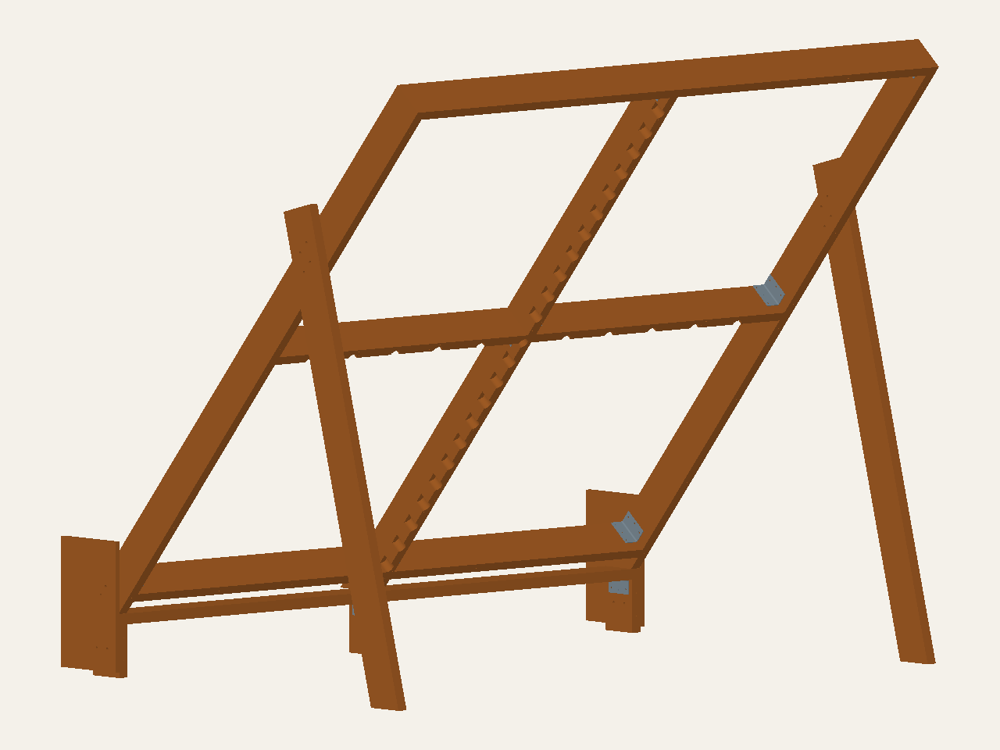

# Single-member 2×6 layout: correction and recommendations

The preceding model used individual 2×6 stock but still had paired framing.
That did not satisfy the request to avoid stacked members. This revision removes
those pairs while preserving the earlier models as historical evidence.
The viewer now opens this corrected candidate by default; historical entries
are explicitly labeled as having paired seam rails.

[Open the corrected interactive model](https://mckayreedmoore.github.io/mini-moonboard/?model=single-2x6-development&view=rear).
[STEP](../exports/single-2x6-development/square-2x6.step),
[wood schedule](../exports/single-2x6-development/wood-parts.csv), and
[geometry analysis](../exports/single-2x6-development/geometry-audit.json).

## What was stacked and what changed

The old `base_rail_mid_lower_*` and `base_rail_mid_upper_*` boards touched along
the entire middle seam. Each pair formed a 76.2 mm band. The two center
principals were separated by only 38.1 mm, with two matching center posts.
Checking each board's stock dimensions and checking volume overlaps missed this:
boards can touch face-to-face without overlapping volume.

The new model has one 38.1 mm seam rail per bay, one centered principal and one
center post. Lumber count falls from 18 to 14; all remain single nominal 2×6.
There are also eight plywood panels/gussets. The two rear legs and the outer rims
remain separate load-path members joined locally by bolts.

Panel screw holes are regenerated rather than added beside old holes. Shared
seam screws and opposing brackets are staggered. There are 56 panel/kicker
screws, 16 through-bolts and 14 brackets using 84 specified connector screws.
No threaded inserts or insert pilots are installed. Both bottom rails remain
square-cut and free of light-relief pockets. The center upright and middle rails
retain service pockets around the hold/LED access envelopes; this is not a
claim that all framing is pocket-free.

## Analysis of the corrected candidate

| Check | Result | Meaning |
| --- | --- | --- |
| Touching parallel lumber | None | New assembled-layout screen catches both old middle-rail pairs |
| Wood and hardware collisions | Pass | Nominal modeled bodies clear, except intended screw engagement |
| Screw receiver penetration | Pass | Receiver material exists; this is not a resistance check |
| Future insert reservations | 56 fit | No repair strength or damaged-hole acceptance established |
| Hold/LED access at changed framing | Pass after service pockets | Bottom rails remain pocket-free |
| Rim/leg bolt edge screens | Pass | Bolt-group resistance remains uncalculated |
| Header bearing | Three failures, about 73.6% contact each | Both rims and the single principal still overhang the shallow header |
| Shared-seam screw edge screen | 28 failures: 9.525 mm available versus 10.3505 mm preliminary screen | Seam fastening needs another detail |
| Complete structural analysis | Not run for this candidate | No load rating or build approval |

The screw screen uses 2.5 times the modeled 4.1402 mm screw diameter as a
preliminary placement recommendation. That recommendation appears in the
[AWC NDS commentary errata, Table C12.1.5.7](https://awc.org/wp-content/uploads/2021/12/AWC-2015NDS-Updates-Errata_20240109.pdf).
It is not a complete current-code or product-specific connection design. AWC's
[current connection calculator](https://awc.org/resources/connection-calculator/)
provides lateral and withdrawal calculations under the 2024 NDS; those capacities
have not been calculated here.

Each shared panel edge has 19.05 mm nominal support width. Screws halfway across
that width leave only 3.4544 mm of nominal wood beside the reserved 12.1412 mm
insert cylinder. Geometric fit therefore remains a weak basis for future repair.
Panel gaps, manufacturing tolerances, actual wood properties, damaged wood,
head pull-through and connection load direction still need consideration.

The existing 40 mm lower-panel overhang also remains unresolved. Removing members
and brackets changes stiffness and force distribution. Neither the earlier fit
checks nor the 1.24 mm gravity displacement from a different assembly transfers
to this frame.

## Recommended next changes, in order

1. **Resolve shared panel-seam fastening.** Keep this single-member candidate as
   the baseline. Evaluate a single wider-faced receiver or a rated metal
   panel-edge attachment with screws/bolts. Turning a 2×6 flat provides a wider
   fastening face but changes stiffness and service pockets, so it requires a
   new load-path check. A selectively larger single solid receiver is another
   later option. A conventional on-edge 2×8 or 2×10 still has a 38.1 mm fastening
   face and does not solve this edge-distance problem. Do not add a sister board.
2. **Resolve base bearing before upsizing the rest of the frame.** The current
   bearing footprint reaches about 187.86 mm behind the retained front datum,
   versus a 139.7 mm header depth. Investigate a direct-bearing base arrangement
   or a designed metal seat; a selectively wider single header remains an
   alternative if those add too much complexity. None is installed by this change.
3. **Check actual forces in the resulting assembly.** Use the chosen wood
   species/grade, panel properties and exact connector schedule to check panel
   bending, rim/principal bending and deflection, leg buckling, connection
   resistance, base bearing and unanchored sliding/tipping. Include asymmetric
   climber loading. Selective enlargement should follow those results.
4. **Keep the repair concept provisional.** Retain ordinary panel screws for
   new construction. Approve an insert repair only where the final receiver and
   remaining undamaged wood support it; do not treat the present reserve as an
   approved repair schedule.

This is a corrected geometry candidate with explicit failures, not completed
MoonBoard construction plans.

## Verification

Fifteen focused geometry, layout, export and historical-regression tests passed
in 33.91 seconds; the updated selector regression also passed. Separate complete
hardware/wood and hardware/hardware collision checks passed. The browser loaded
all 192 current-model entries, selected the center principal, checked the grid,
exercised the new default and selector navigation, and captured desktop/mobile
views without browser or request errors. Independent source review found no
substantial defects. Ruff and diff checks passed. These checks preserve the
three bearing and 28 preliminary screw-edge failures; they are not a load test.
