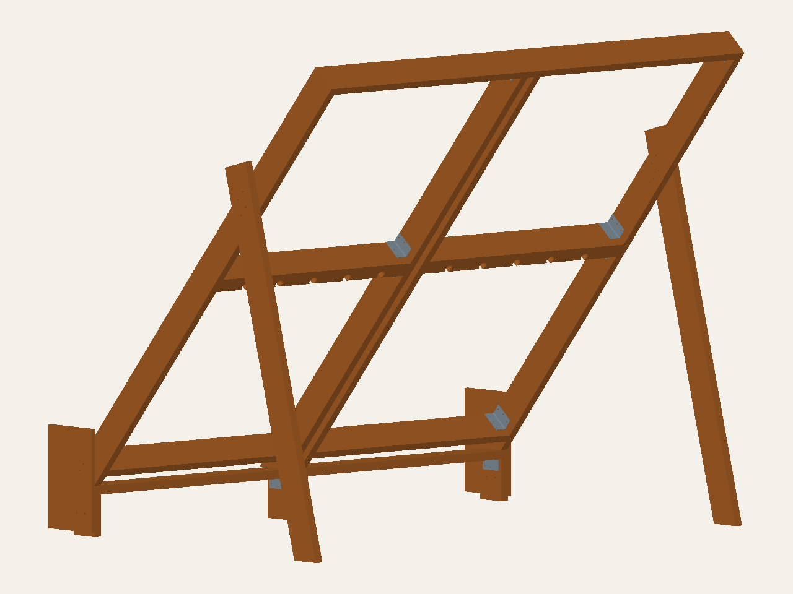

# All-2×6 revised layout and interactive render

All lumber remains **single nominal 2×6**, including the base header. Larger
stock is only a later option. The original [failed baseline](square-2x6-mvp.md)
is preserved; this revision corrects hardware placement while deliberately
retaining the shallow-header bearing failure. Neither candidate is build-ready.

- [Open revised all-2×6 interactive model](https://mckayreedmoore.github.io/mini-moonboard/?model=square-2x6-revised-development&view=rear)
- [Open original all-2×6 baseline](https://mckayreedmoore.github.io/mini-moonboard/?model=square-2x6-development&view=rear)
- [Revised STEP](../exports/square-2x6-revised-development/square-2x6.step)
- [Wood schedule](../exports/square-2x6-revised-development/wood-parts.csv),
  [connections](../exports/square-2x6-revised-development/connections.csv) and
  [geometry audit](../exports/square-2x6-revised-development/geometry-audit.json)



The static image is rendered from CAD. The interactive model includes face and
kicker panels, all modeled screws/bolts and purchased brackets. Both entries
are available in the Design selector; the old website default is unchanged.
No insert bodies are installed. All 56 possible future insert spaces remain.

## Changes from the first baseline

Four header brackets move onto the four remaining posts. Two rear central posts
that did not contact the shallow header are removed. The outer-post gusset bolts
move with the smaller post section. Rim/gusset bolt axes move below the new lower
rails so their heads and washers clear that wood.

The leg bolt group moves downhill along the unchanged leg centerline until it
is centered in the 139.7 mm rim. Its spacing becomes 70 mm along the leg by
50 mm along the rim. Minimum nominal rim depth-edge distance is 41.15 mm;
minimum leg side-edge distance is 49.35 mm. This is new drilling for a new
candidate, not a proposal to add holes beside the old pattern.

All 18 remaining lumber members are single 2×6. Square lower rails, unnotched
principal bottoms, the leg outline/foot location and panel-screw repair
reservations remain. The lower rails still avoid the hold/LED service envelopes;
existing service reliefs elsewhere remain.

## Checks and unresolved work

The repeated nominal receiver and rim-edge checks now pass. All future insert
space checks pass. Hardware/wood and distinct-hardware collision checks pass.
These checks do not establish bolt-group resistance, washer pressure, qualified
bracket installation, screw resistance or manufacturing allowances.

**Four bearing checks still fail:** only about 73.6% of each sloped rim/principal
bearing face overlaps the retained 2×6 header. The full footprint reaches about
187.86 mm behind the retained header-front datum; current stock is 139.7 mm deep.
A later revision can change base geometry or selectively increase stock. No
larger header is included in this first all-2×6 rendering.

The 40 mm lower-panel overhang, actual material properties, complete connection
resistance and unanchored stability remain unresolved. No structural solve has
been run for this revised frame. The earlier 1.24 mm gravity result belongs to
a different assembly and does not validate this one.

```sh
uv run python -m fea.square_2x6_revised_audit --output /tmp/revised-audit.json
uv run python -m mini_moonboard.square_2x6_revised_exports --output /tmp/revised-package
uv run python -m mini_moonboard.square_2x6_viewer --variant both --output-root /tmp/viewers
uv run pytest -q tests/test_square_2x6_revised.py
```

Verification: 12 focused regression tests passed. Separate hardware/wood and
hardware/hardware collision checks passed. Browser checks loaded all 254 baseline
and 238 revised viewer entries, exercised part selection and grid labels, and
captured desktop/rear/narrow views without request or browser errors. An
independent source review found no substantive defects. Ruff and diff checks
passed. These do not close the recorded bearing or structural gates.
