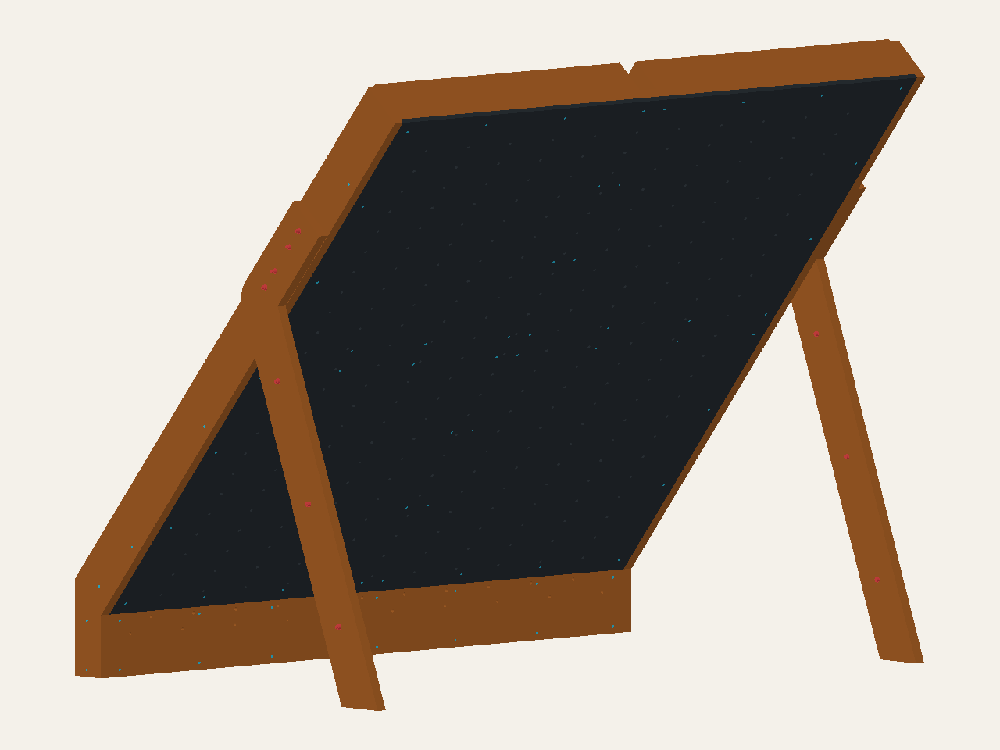

# Square-cut frame comparison

**Preferred next inspection candidate: A, the square-cut bracket frame.**
It removes the fitted timber housings while retaining a commercial-connector
route. B replaces those connectors with bolted wood blocks for comparison.
Neither is a construction release, a strength ranking or a new FEA result.
Earlier models remain separate.

| | A: square-cut bracket | B: square-cut wood blocks |
| --- | --- | --- |
| Viewer | [square-cut-bracket](https://mckayreedmoore.github.io/mini-moonboard/?model=square-cut-bracket) | [square-cut-wood-blocks](https://mckayreedmoore.github.io/mini-moonboard/?model=square-cut-wood-blocks) |
| Deep beam/upright joints | Twelve ML24Z connector proxies and 72 SDS25112 screws | Twelve 139.7 mm-long 2×4 blocks; 36 provisional through-bolt assemblies |
| Shared front backing | Three continuous horizontal ledges; eight square-ended vertical infills | Same |
| Fitted housings in new framing | Zero | Zero |
| Main practical tradeoff | Purchased connectors and factory-fit verification | More aligned through-drilling, washer/nut access and tightening work |

## What actually becomes easier

The eight infills are each **1060.45 × 88.9 × 38.1 mm**
(41.75 × 3.5 × 1.5 in). They butt against the horizontal ledges instead of
interlocking with them. The deep framing retains continuous uprights and
square-ended side spans. This removes the bracket MVP's remaining 24 mating
half-lap recesses, not merely their labels.

Eight principal-to-ledge screws now start at the open front of the backing,
N=0, and run rearward. Their nominal length is **63.5 mm (2.5 in)** instead
of the previous 165.1 mm (6.5 in) rear-driven route. Fit these before the
climbing skins. Additional front-driven screws retain the horizontal ledges;
two small lower-corner blocks connect the lower ledge to the side assembly.
New ordinary wood-screw products and head/pilot details remain provisional.

**The whole board is not square-cut.** Purchased face thickness and all
official hold/LED positions remain unchanged. The curved independent leg
plies, kicker cheeks, shaped splice plies, their floor interfaces and round
service reliefs remain. Those parts still need profile transfer and drilling;
the face panels still need their complete hole pattern.
The four retained kicker blocks also have a 76.2 × 38.1 mm cross-section with
grain along their 40 mm dimension, so they require stock preparation/ripping;
they are not represented as new standard-section offcuts. By contrast, the
two new lower-corner blocks are 88.9 mm-long 2×4 offcuts with grain along S.

## Stock and hardware burden

The generated inventories confirm 57 bodies and 196 connections for A, versus
57 bodies and 160 connections for B. The preceding bracket MVP has 51 bodies
and 206 connections. A connection is an assembly, not one loose hardware item:
B's 36 new bolts also require 36 nuts and 72 washers. Its blocks replace the
twelve clips one-for-one; fewer connections do not automatically mean less work.
These counts exclude holds and T-nut installation hardware.
Both new variants have eight nominal diameter/length fastener combinations,
down from ten in the preceding bracket MVP. That is not eight approved SKUs:
selected and provisional products with matching nominal dimensions still need
product reconciliation. A has 182 screws and 14 bolt assemblies; B has 110
screws and 50 bolt assemblies. No labor-hour reduction has been measured.

Two 41.75-inch infills fit in an 8-foot board with room for kerf and end trimming.
The nominal 96-inch continuous members require verification of usable stock
length; do not assume an exactly 8-foot board allows squaring both ends.
Group repeated cuts, but do not confuse a profile's bounding blank with its
finished shape or guaranteed sheet yield. No current price or stock quote is
claimed. Compare A's connector purchases with B's additional blocks, bolt
assemblies, through-drilling and access work.

## Practical layout and assembly approach

1. Measure the actual stock and mark one reference face and edge on each piece.
   Establish the climbing-panel rear plane as the common assembly datum.
2. Cut repeated infills with a stop setup; measure the first part and test its
   fit before batching the rest. Do not chain dimensions from successive cuts.
3. Assemble and square the main frame on a flat supported surface. Dry-fit the
   horizontal ledges and infills; set joint clearances deliberately rather than
   forcing nominal zero-clearance CAD contacts together.
4. Lay out connector or block holes from the actual mating pieces. Install the
   front-driven backing screws before skins close that access. Do not drill a
   purchased connector to match a proxy hole pattern.
5. Resolve the retained kicker/leg assembly order, temporary support and
   lighting installation/removal access before standing or loading the frame.

This is a jig/layout guide, **not an approved 1:1 production template or erection
procedure**. A fit allowance changes hole positions, engagement and stock
contact; it must be reconciled with the final joint detail.

Use one stop setup for the eight infills, a clearly handed layout card for
each leg ply, and a separate hole-locating guide for each connection family.
Do not independently mark mating bolt holes from long chains of measurements:
locate them from a common datum or a clamped, verified stack. Keep the actual
connector hole pattern authoritative. Plan access to both bolt ends before
closing adjacent work, and allow removal of the face panels to service the
covered front-driven backing screws. Retain the board/kicker as one major
assembly and the two legs as the other two; moving/raising that large assembly
still needs a lifting and temporary-support plan.

## Inspection schedules

The front looks similar because the climbing geometry is preserved. Rotate
either viewer to inspect the changed backing and its individual connections.

The exporter writes separate directories
[`exports/square-cut-bracket`](../exports/square-cut-bracket/) and
[`exports/square-cut-wood-blocks`](../exports/square-cut-wood-blocks/).
For each key, inspect:

- `{key}.step`, `{key}_parts.csv` and `{key}_connections.csv` for the geometry,
  nominal stock, hardware positions and metric/imperial dimensions.
- `{key}_blank_groups.csv` for repeated blank dimensions. Grouping does not
  establish identical profiles, holes or grain orientation.
- `{key}_hole_entries.csv` for entry locations measured from each part's
  minimum X/S/N coordinates: positive X toward climber-right when facing the
  holds, positive S uphill, positive N rearward away from the climbing face.
  These are assembly-axis coordinates, not inferred grain axes. Shaped and
  kicker parts need the STEP reference; repeated material runs may produce
  multiple rows for one connection. Purchased steel is excluded.
- `manifest.json` for source and artifact identity.

## Verification

On 2026-09-07, `uv run pytest tests/test_easy_frame.py -q` passed all 26 cases:
preserved faces/grid/floor, full square-cut stock, connected bodies, actual
receiver paths, body/hardware/service collisions, shorter front screw direction
and a provisional Ø25.4 × 100 mm front-driver approach with skins and legs
absent. This last check is not a measured tool swept-volume or complete
assembly-access qualification.

`uv run pytest tests/test_easy_exports.py -q` passed all six cases, independently
checking STEP per-solid geometry, STL bounds, source/artifact hashes, inventories,
metric/imperial schedules, blank groups and each part-local hole-entry material
run. The hole datum uses exact transformed shape bounds, including curved
profile extrema. No earlier model or source-bound export was rewritten.

The local browser command
`node scripts/check_mvp_viewer.cjs <installed-playwright-path> square-cut-bracket square-cut-wood-blocks`
loaded all 253 A meshes and 217 B meshes without browser errors, exercised real
rear-part selection and displayed metric/imperial dimensions. Front and
selection screenshots were visually inspected. This is representative desktop
coverage, not a complete viewer interaction or mobile-access audit.

Two independent review passes covered correctness, testing and publication
dataflow. The final pass reported no substantial remaining findings within
this inspection scope. Product/strength gates below are not treated as passed.

## Finite remaining gates

Verify actual stock and plywood direction; select the new wood screws and B's
bolt products; replace A's factory-hole/bend proxy with verified product
geometry; check pilots, seats, edge/end distances, engagement and real tools.
Then resolve net-section/joint resistance, independent-ply load allocation,
safe assembly and unanchored stability using qualified demands. Positive CAD
clearance is not capacity. The one-climber 250 lb intended maximum remains a
planning assumption, not a rating; no anchors, ballast or glue/friction credit
is introduced.
