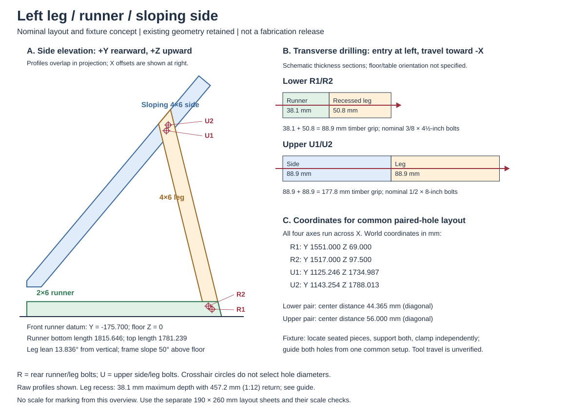

# Eoere builder drilling and fixture development

This guide starts the owner-requested builder-support work for the existing
`eoere-grid-aligned-wire-cutouts-v1` layout. It describes proposed workholding
and documentation methods, not released drilling operations. Keep the current
100 bolt axes, 66 Hillman axes, panel outlines, trimmed cleats and aligned wire
passages. No geometry, hardware recipe, drilling diameter or tolerance changes
are adopted here. Complete joint resistance remains unqualified; the earlier
six-case numerical results do not evaluate the later cleat trim or wire changes.

Start with the [current disposition](README.md),
[current geometry record](hypotheses/hl35-candidate/thin-frame-comparison/eoere-successor-v1/occupied-aligned-wire-v1.json)
and preserved [nominal shop packet](eoere-shop-assembly-guide.md).
The packet's raised-rail hole identities remain useful because the later
revisions retain every bolt and screw axis. Its old untrimmed cut profiles,
receiver surfaces and machining details are not current cutting templates.

## What can be drilled together

The current geometry's `axes[].receivers` gives the following census. A receiver
count describes timbers crossed by one shaft, not demonstrated tool access or
an instruction to stack unrelated parts.

| Proposed setup family | Physical bolt axes | Timber receivers per axis | Planning approach |
| --- | ---: | ---: | --- |
| Ordinary angle attachments, including shared angle shafts | 80 | 1 | Locate the delivered fitting and register a separate drilling guide to the timber. |
| Upper angle shafts through side and exterior cleat | 4 | 2 | Fixture side and current trimmed cleat in their intended relationship; reconcile the fitting's actual hole position. |
| Dedicated cleat-to-outer-post connections | 4 | 2 | Fixture the mating pieces and develop a common drilling setup. |
| Leg-to-sloping-side connections | 4 | 2 | Two holes per side; develop a matched leg/side setup with guided transverse drilling. |
| Front outer-post-to-runner connections | 4 | 2 | Two holes per side; develop a matched post/runner setup. |
| Rear leg-to-runner connections | 4 | 2 | Two holes per side; develop a matched leg/runner setup. |
| Total | 100 | 80 single, 20 double | No completed drilling-access qualification follows from this census. |

The four side/cleat shafts are `eoere_bolt_067/071` left and
`eoere_bolt_070/074` right. The other paired families use
`cleat_post_bolt_*`, `lumber_leg_bolt_*`, `rail_front_bolt_*` and
`rail_rear_bolt_*`, with `_1/_2` at each left/right connection.
All twelve starting frame bolts have two timber receivers. Both leg connection
families have world-X transverse axes, rather than bores along the sloping leg.
Angle attachment directions vary with the receiving member.

Here, drilling together means holding mating pieces in their final relative
position. It does not mean piling blanks flat and drilling repeated coordinates.
The angled pieces need a cradle or support blocks that establish their intended
orientation without using bolt tightening to correct seating errors.

## Proposed matched-part method

For the first fixture design, use matched mating-part sets, labeled separately
for the left and right sides, rather than claiming interchangeable independently
drilled parts. Mark each part's identity,
reference face, reference end and mating partner. Preserve those labels through
transport and reassembly. A later interchangeable-parts method would need its
own dimensional and fixture evidence.

Develop a fixture drawing for each paired family in the table. It must show:

1. The intended member contacts and current finished profiles, including the
   trimmed cleats. Identify positive locating stops and supports separately
   from clamps; a clamp should hold the established position.
2. Accessible reference faces and the location of both axes from those faces.
   Avoid accumulating measurements through several unrelated cut ends.
3. Bit entry, exit and full guided travel, support behind the exit, and clearance
   for guide, chuck and clamps. Check the actual multi-member drilling depth.
4. How the setup remains fixed between the first and second holes. An installed
   first bolt alone does not establish a verified two-hole drilling fixture.
5. Which fittings must be present or located before marking, and how a separate
   guide is aligned. Do not assume an Eoere factory hole is a suitable drill
   bushing, or authorize drilling or enlarging the steel.
6. Head/nut orientation, full washer support, counterholding space and bolt
   insertion/removal paths. A drilling path does not establish wrench access.

Drilling the whole timber stack in one pass is one proposed method. Transferring
the common axis and drilling supported pieces separately with a controlled
guide is another where travel or access prevents a through-stack operation.
Neither method is validated yet. There is no authority here to elongate holes,
force a bolt through, add packing, move an axis or enlarge a factory hole.

## Guide construction and printable drawings

Use rigid timber or plywood cradles as the initial cutting/support fixture
concept. A printed locator or drill-guide body may be useful, but drill guidance
should be designed around suitable metal bushings, secure clamping and an actual
tool envelope. Printer accuracy, material stiffness, bushing retention and
wear remain inputs to the guide design. Do not require a 3D printer when a
dimensioned plywood fixture can accomplish the same operation.

Printable templates should include a scale-check dimension in each direction,
part/side labels, reference-face arrows and cut-side shading. Provide dimensions
as well as outlines. A paper wrap is a marking aid, not a straight-drilling guide.
Do not issue a template generated from the preserved untrimmed profiles as a
current cleat template. Print scaling and actual lumber sections must be
reconciled before using any template.

## First corner: pull-saw layout and paired drilling

The owner has a circular saw, handheld drill, clamps and a pull saw, and prefers
the pull saw for 4×6 cuts. This first operation drawing uses that tool policy;
it does not require a miter saw, drill press or 3D printer.



The [overview](eoere-builder-drawings/leg-corner-overview.svg) shows the left
runner, leg and side from saved broad-face profiles, plus the two different
transverse stacks. Those three finished bodies have the same source hashes in
the current aligned-wire receipt and the preserved raised-rail datum tables.
This permits reusing their raw profiles and four shaft identities; it supplies
no transferred strength or machining acceptance. The overview is not to scale
for marking. Its side-elevation overlaps are projections of different X bands.

### Reference faces and nominal cut layout

For the left leg, name its outer broad face, rear long edge and rear foot heel
**B**. The leg's outer broad face is X = −1308.1 mm in the model. B has
world Y = 1639.946483 mm, Z = 0. Measure **L** along the rear long edge from B
toward the top. Measure **W** across the broad face from the rear long edge
toward the front edge, perpendicular to L. The nominal face width is 139.7 mm;
the transverse thickness is 88.9 mm. W is the negative of the saved local V
coordinate, not a distance measured vertically above the floor.

| End | Rear long-edge mark, L | Front long-edge mark, L | Nominal angle away from square |
| --- | ---: | ---: | ---: |
| Leg foot | 0 mm at B | 34.408 mm | 13.836° |
| Leg top | 1989.026 mm | 1886.918 mm | 36.164° |

For the runner, name its bottom edge and rear bottom heel B. Its nominal depth
is 139.7 mm and transverse thickness is 38.1 mm. From its front plane, the
bottom edge reaches 1815.646 mm and the top edge reaches 1781.239 mm.
Connecting those rear marks defines the same 13.836° inclined end. The shared
heel name identifies the intended side-elevation location, not an independently
verified finished fit. These dimensions are nominal drawing values rounded
to 0.001 mm, not a demand for that woodworking precision or a stock cut order.

For pull-saw guide development, carry each end line onto both broad faces and
connect it across the thickness faces. Identify the retained side and waste
side. A clamped straight fence should follow the end line on a broad face and
keep the blade square through the 88.9-mm thickness. Supporting fences on both
broad faces can establish a common cut plane; their actual blade clearance,
clamp positions and guide retention remain to be designed. The guide's angle
comes from the marked end line rather than a rounded saw setting. Back-spine
clearance, tooth set, kerf and usable cutting depth depend on the actual pull
saw. Do not infer that any particular pull saw can complete the full cut in
this setup. The manufacturer's [saw-guide description](https://www.veritastools.ca/en-ca/shop/tools/hand-tools/saws/saw-guides/67717-veritas-magnetic-saw-guides)
provides an example of blade registration against a guide, not a qualification
of this angled cut or a specified purchase.

The inner-face runner recess is a separate operation. It removes at most
38.1 mm, leaving 50.8 mm below the taper, then returns to full thickness over
457.2 mm along grain (1:12). In this left-leg coordinate system, full-depth
removal ends at L = 180.343 mm and the return reaches full stock at
L = 637.543 mm. The 2-mm runner-top gap and zero nominal transverse fit
allowance are recorded model dimensions, not cutting tolerances. The foot/top
paper sheets show the **outer-face raw outline**, not that recess. The pull-saw
end-cut method does not yet supply a complete recess cutting/finishing method
with the owner's tools; do not replace the tapered recess with a square notch.

### Three printable nominal layout sheets

| Sheet | Registration and use |
| --- | --- |
| [Left leg foot](eoere-builder-drawings/left-leg-foot-template.svg) | Outer broad face, rear long edge and heel B. Shows foot line and nominal R1/R2 centers. It marks the opposite face from the proposed drill entry. |
| [Left leg top](eoere-builder-drawings/left-leg-top-template.svg) | Outer broad face and rear long edge; rear-edge top is L = 1989.026 mm from B. Shows top line and nominal U1/U2 centers. |
| [Left runner rear](eoere-builder-drawings/left-runner-rear-template.svg) | Inner broad face, bottom edge and rear heel B. Shows R1/R2 and rear cut. |

Each SVG page is **190 × 260 mm**, with a horizontal and vertical **100-mm
scale check**. Print at actual size/100%, without fit-to-page. Check both
directions with a rule and compare the reference-face width against the actual
timber before relying on an outline. Crosshair circles are marking targets,
not hole diameters. Red lines identify nominal end cuts; dashed continuation
edges are not cuts. These are left-side sheets only, not instructions to mirror
the recess or reverse head/nut sides on the right. Paper scaling and attachment
have not been physically observed.

### Nominal two-hole coordinates

| Label and shaft | Leg L from B | Leg W from rear edge | Runner distance forward from rear B | Runner height above bottom |
| --- | ---: | ---: | ---: | ---: |
| R1, `rail_rear_bolt_left_1` | 88.269 mm | 69.864 mm | 88.946 mm | 69.000 mm |
| R2, `rail_rear_bolt_left_2` | 124.074 mm | 96.062 mm | 122.946 mm | 97.500 mm |
| U1, `lumber_leg_bolt_left_1` | 1807.733 mm | 84.840 mm | — | — |
| U2, `lumber_leg_bolt_left_2` | 1854.913 mm | 54.673 mm | — | — |

The R pair has a 44.365-mm diagonal center distance; the U pair has a 56-mm
diagonal center distance. Neither pattern is two holes at one common height.
Individual offsets matter; center distance alone does not locate the pair.
The [source-bound drawing data](eoere-builder-drawings/leg-corner-data.json)
retains the unrounded coordinates and receiver occurrences.

### Proposed workholding and drilling sequence

1. Keep left runner/leg/side identities and their reference marks together.
   Develop the end cuts and recess first; their resulting contact geometry
   determines where the pieces are held. Do not use drilling to fix a poor seat.
2. For the lower pair, fixture the runner in its intended recessed leg seat.
   Support each piece independently and clamp without distorting the established
   position. Register the common two-hole guide to the runner's bottom/rear
   datums and reconcile the leg's independent marks.
3. The intended lower entry is the runner's inner face, X = −1219.2 mm;
   travel is toward −X. The wood path is **38.1-mm runner plus 50.8-mm remaining
   leg = 88.9 mm**, not a 38.1 + 88.9-mm stack. The proposed drilling setup needs
   guided travel through that wood, its own bushing and the intended exit support.
4. For the upper pair, fixture the side and leg in their intended relative
   position. Register the common guide to identified reference faces while
   reconciling the leg's top-layout marks. An upper-joint fixture must preserve
   the required leg-to-runner relationship rather than independently choosing
   another lean angle.
5. The intended upper entry is the side's inner face, X = −1130.3 mm;
   travel is toward −X. The wood path is **88.9-mm side plus 88.9-mm leg =
   177.8 mm**. A handheld-drill plan needs sufficient cutting length and chuck
   clearance for the wood plus guide. A nominal 8-inch bolt is not an 8-inch
   drill-travel specification. If common-stack access fails, use a separately
   developed controlled transfer setup; do not casually drill from opposite
   faces and expect the bores to meet.
6. Keep the fixture position between both holes of each pair. Use support at
   the exit and keep clamps clear of the complete tool path. Reconcile drill
   size, drift, timber edge distances and allowed accumulated error before an
   executable operation is issued. Maintain the recorded head/nut directions
   when assigning the matching hardware; changing drilling entry does not
   automatically authorize reversing the installed bolt.

This is a setup concept, not proof that all three members can be laid directly
on a flat table. Their transverse bands differ, the lower seat includes a
recess and the frame is large. Cradle heights, bit/guide model, supported travel,
clamp layout, adjustment range and dimensional acceptance remain open. No
standalone jig dimensions or approved drilling diameter follows from the sheets.

### Reproduction and scope

The standard-library [drawing helper](eoere-builder-drawings/leg-corner.py)
reads five saved records and checks the three unchanged finished-body hashes.
It uses their saved vertices and hole coordinates; it does not import CAD,
change the geometry or evaluate mechanics. Check the five generated files with:

```sh
.venv/bin/python -B docs/wood-joints-mvp/eoere-builder-drawings/leg-corner.py --check
```

The eight source hashes are in the drawing data. `--write` reproduces only this
new drawing set. It is not a command to regenerate frozen shop tables.

## Missing inputs and first development target

The left rear leg-to-runner and upper leg/side connections now have the nominal
side-elevation drawing, transverse grip diagrams and three layout sheets above.
Next, complete the recess operation and dimension the actual support/drill-guide
fixture with an identified saw, drill and bit. Check whether support and guide
access allow a tabletop operation before claiming that the whole side assembly
can be laid flat. Then reuse the method for the mirror side where applicable.

The next work must establish reference faces, current cut outlines, actual
tool/guide envelopes, axis-transfer method, operation sequence and allowable
accumulated cutting/drilling errors. The current model's bore envelopes are not
a released drill-bit list. Nominal bracket clearance is not a complete tolerance
budget. The lower cleat's recorded 0.340625-mm bore/screw gap remains an explicit
unresolved compatibility constraint, not acceptable workmanship allowance.

The [documentation audit](completion-ledger.md#build-package-completion) also
records missing face-specific saw settings, drill selection and separate
drilling/wrench/removal access. A printed outline or fixture cannot close those
gaps by itself. The preserved mass estimate and original Eoere proposal contract
keep their earlier revision scope.

Keep receiving and Actual/Disposition cells blank until observed. Missing joint
resistance, panel/screw reference exceedances and floor assumptions retain their
recorded limits. Builder-support development can proceed without asserting that
the structure is qualified or commissioning new native solves.

## Active and retained work

Active: the representative paired-corner fixture/tool/tolerance work and the
repeated setup families above. Retained: this source-bound nominal drawing set,
current geometry, the frozen numerical and nominal shop
packets, and all prior candidate evidence. No archival or deletion is proposed.
No fabrication, physical guide print, physical trial, fixture CAD or mechanics
run has been performed for this guide. Digital SVG renders were inspected;
that checks presentation, not printed scale or construction.
