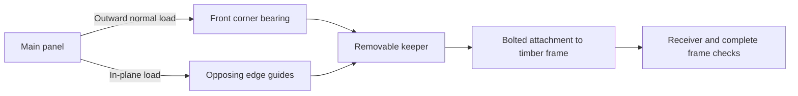

# Panel edge-restraint proposal

This is an unadopted layout and load requirement for owner review. The current
frame, panel outlines, 66 Hillman stations and purchased screw policy remain
unchanged. It supplies no keeper timber profile, frame attachment, compatible
frame response, resistance result or physical release.

## Why this correction is being considered

The current [panel worksheet](README.md) retains the all-two-receiver force
source `two-receiver-frame-attempt03`. The nominal A12-rear upper-left
`edge_2` screw has 1836.884 N withdrawal and 807.662 N simultaneous lateral
force. The upper-right `rim_4` has 1274.054 N lateral force at K12-rear.
The lower-left `edge_2` also reaches 993.956 N withdrawal at A1-rear, with
481.794 N lateral force at its separate `rim_2` governing lateral state.
These exceed one or more declared generic Hillman reference comparisons.
They establish no measured Hillman capacity or physical failure.

The correction must cover lower-panel withdrawal and in-plane load transfer
as well as upper-panel normal restraint. The
[one-stock-fastener screen](fastener-alternative.md) checks GRK RSS 12217
as a same-length proposal; it does not close the saved demands or supply an
applicable complete plywood connection rating. It is not selected, and the
result does not exclude every alternative fastener.

## Proposed contact regions

Reserve a **20 mm margin at the four corners of each main panel** for removable
frame-mounted keepers. Each corner has a 20 × 20 mm front bearing patch and
two edge guides. Each guide bears on 20 mm of the existing plywood edge,
through its nominal 18.25625 mm thickness. Front bearing restrains outward
panel motion; opposing edge guides provide both signs of in-plane restraint
across the panel. No friction is credited.

The sixteen proposed corner contact sets cover all four main panels. The two
kickers and their eighteen screws remain separate existing duties. These are
contact regions, not sixteen qualified or selected hardware products.

Coordinates use X across the panels, T up their inclined faces, and N toward
the backing frame:

| Main panel | X boundaries, mm | T boundaries, mm |
| --- | --- | --- |
| Upper left | −1219.200 / −1.5875 | 1419.8241 / 2639.0241 |
| Upper right | −1.5875 / 1216.025 | 1419.8241 / 2639.0241 |
| Lower left | −1219.200 / −1.5875 | 200.6241 / 1419.8241 |
| Lower right | −1.5875 / 1216.025 | 200.6241 / 1419.8241 |

The front patch centre is 10 mm from each adjoining X/T boundary, on the
saved front face. Each edge guide is at its exact panel boundary, 10 mm from
the corner along that edge, at the plywood mid-thickness. The source model
nodes determine the unrounded coordinates used in the calculation.



The bolted attachment shown in this diagram is a required new load-path
definition. It has not been provided by the existing frame bolts or by the
static contact calculation. No extra capacity is assigned to an existing
top, side or service joint. A keeper attached only through the original
Hillman screw does not establish this bypass.

## Static calculation and its limits

[edge_restraint_proposal.py](edge_restraint_proposal.py) uses the saved model,
raw row identities, physical D operator and simultaneous forces. It solves
four independent panel free bodies in each of the twelve saved states:
**48 panel states**. Each panel's existing screw forces are set to zero in
this proposal calculation. Its normal back-face contacts may redistribute;
other interface actions, if present, stay fixed.

All proposed bearing forces are compression-only. The calculation preserves
the source six-component panel wrench and minimizes the largest sum of the
three force magnitudes at a corner. That sum bounds the corner's force-vector
magnitude. The minimum is an optimistic static requirement, not a predicted
keeper force, design capacity or bound over compatible frame states.
Reported front/edge pressures are mean demands on the specified patches;
no plywood bearing resistance is supplied by their areas.

All 48 allocations have compression-only witnesses and matching LP dual
objectives. The following maxima are separate panel/case results:

| Main panel | Minimum largest corner L1 load: zero gaps, N | Minimum largest corner L1 load: modeled gaps, N | Governing case in each column |
| --- | ---: | ---: | --- |
| Upper left | 971.490 | 1047.058 | A12-rear |
| Upper right | 998.610 | 1083.408 | K12-rear |
| Lower left | 1030.117 | 935.399 | A1-rear |
| Lower right | 716.353 | 756.094 | K12-rear |

The largest minimum is **1083.408 N**, at upper-right K12-rear with modeled
gaps. Its top outer corner witness has 968.583 N front bearing and 114.825 N
T-edge bearing; its separate top inner corner has 744.693 N front bearing
and 338.715 N X-edge bearing. These are feasible static witnesses, not
compatible design reactions.

Across the witnesses, the separate maximum front mean pressure is
**2.460486 MPa** and maximum edge mean pressure **2.225506 MPa**. Both occur
in lower-left A1-rear, zero gaps, at different corners. Maximum panel force
and moment residuals are 4.30e-8 N and 3.16e-5 N·mm. No pressure allowable
or favorable load adjustment is adopted.

Each panel retains its other contact actions. Upper panels retain 56 source
contact rows at their adjacent panels and legs. Lower panels retain 104
rows at their adjacent panels and kickers, including the opposite-normal
kicker contacts. Only the 96 back-face contact rows per panel redistribute.

There is no displacement, contact opening/closure, keeper stiffness, receiver
balance, floor-law update or compatible frame solve in this calculation.
Existing frame/member/joint results cannot be transferred to a frame carrying
these new keeper reactions. The current 66 Hillman screws remain installed
in the proposed policy; zero credit here avoids assigning an unsupported
main-panel structural resistance to them.

## Required changes before integration

Owner permission is needed to cover the stated narrow front margin: the
current scope preserves the climbing surface and reviewed panel geometry.
The proposed contact layout makes that change explicit. It does not authorize
changing screw count, screw stations, panel outlines, through-bolting panels
or installing inserts.

After that scope decision, define an actual removable keeper and its bolted
frame attachment, including the inside seam and lower corners. Identify every
new timber piece, bore, bolt, washer and nut; account for any changed original
stack. Recheck head/hold/light occupancy, backing, edge support, installation,
removal and individual transport. The current 50-body/104-stack BOM does not
already include these parts.

Then calculate one compatible six-case response with the keeper contact and
attachment laws. Check simultaneous keeper/frame bolt demands, wood bearing,
splitting, receiver transfer, panel and kicker duties, and the top-rail local
shear/torsion result. A static allocation cannot establish those results.
Preserve the current force source and geometry as history.

All 47 formal criteria remain pending and all eight physical-release flags
remain false. No reviewed geometry, native model, source authority or
Actual/Disposition record is changed by this proposal.

## Reproduction and saved result

From the repository root, choose a fresh output directory:

```sh
OPENBLAS_NUM_THREADS=1 OMP_NUM_THREADS=1 .venv/bin/python \
  docs/wood-joints-mvp/hypotheses/mvp-resume-2026-10-01/panel-attachment/edge_restraint_proposal.py \
  --output docs/wood-joints-mvp/hypotheses/mvp-resume-2026-10-01/panel-attachment/results/edge-restraint-replay
```

The completed `results/edge-restraint-attempt01/result.json` contains all
48 witnesses, proposed contact coordinates, retained rows, source hashes,
pressures and primal/dual checks. Its 165,493 bytes inherit the existing
hypotheses JSON ignore rule. The saved producer snapshot is byte-identical
to the maintained source. Ruff passes. No software tests, native/CAD/frame
solve, geometry edit or agent review loop was run.

| Artifact | SHA-256 |
| --- | --- |
| Producer | `893acd3752e13d07742ebbf7d46230858ee1bb992c9cb757c6fee3e3d1016137` |
| Saved result | `e6f0641d763f67ee16d84d1631881e7fa29f5b82e8c2dc4be20d5358795952f1` |
| Current frame comparison | `0ff0dfc00c112a906910641141fd242f4a58295aa3324ca569132a3fa2d388a5` |
| Current response | `774c3bbddf8061f6b9d1cfdd5f22efbeb1025bd57431a249912ae8e60a731f52` |
