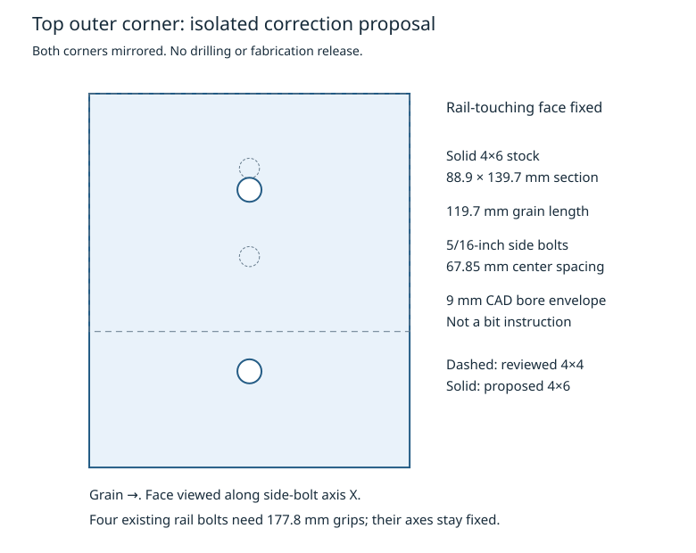

# Top outer corner correction proposal

Status: **isolated proposal, not selected and not a complete-joint pass**.
The reviewed `led-clearance-2x6-runner-seated-blocks-v1` scene, selected
baseline, preserved failures and physical release flags are unchanged.
The separate upper-left service-joint agent retains that joint.

## Required changes

This proposal addresses the two top outer corner side-bolt concerns identified
by the [six-case simple frame calculation](simple-model.md). It uses solid
4×6 stock for these two cleats and 5/16-inch side bolts. No new connector,
panel fastener or fabricated steel is introduced.

| Item | Reviewed layout | Proposed local correction |
| --- | --- | --- |
| Two cleat sections, X × T | 88.9 × 88.9 mm | 88.9 × 139.7 mm, full 4×6 stock |
| Cleat grain direction and length | ±N, 119.7 mm | Same direction and length |
| Cleat placement | Existing rail-touching face | Face fixed; opposite T face extends 50.8 mm down the inclined frame |
| Four side bolts | 1/4 inch, 33 mm pair pitch | 5/16 inch, 67.85 mm pair pitch |
| Side bolt `side_1`, each corner | Existing axis | Translate −42.875 mm in T |
| Side bolt `side_2`, each corner | Existing axis | Translate −8.025 mm in T |
| Eight side bore receivers | Existing 7.5 mm CAD voids | Replacement 9 mm CAD envelopes in the cleats and side hosts |
| Four rail bolts | Existing axes, 127 mm wood grip | Axes fixed, 177.8 mm wood grip; evaluate an 8-inch length class |

The proposal retains 92 candidate bolt axes, twelve starting frame-bolt
arrangements and all 66 current Hillman axes. The four moved axis IDs and
exact old/new global coordinates are recorded in the output JSON.
CAD bore envelopes are not drill-bit instructions.



## Why the block section changes

With 5/16-inch bolts, the deliberately explicit pure-direction geometry
scenarios require a 31.75 mm perpendicular loaded edge and 39.6875 mm
spacing between rows for the cleat's `ell/D > 6` case. A nominal 88.9 mm
section cannot provide both loaded edges and that row spacing: it would
need at least `4D + 5D + 4D = 103.1875 mm`.

The 139.7 mm section provides the required geometry. The selected 67.85 mm
pair pitch also accounts for the parallel-grain edge rule: the closest
35.925 mm edge exceeds half the row spacing, 33.925 mm, by 2 mm. Its 59.85 mm
grain ends exceed the 55.5625 mm full softwood-tension comparator. The side
hosts' closest grain end is 74.025 mm and closest transverse edge is
59.85 mm. These are nominal analytical dimensions, not observed wood or
cutting tolerances.

The source is [NDS-2024 Chapter 12](https://awc.org/wp-content/uploads/2026/09/AWC_NDS2024_withCommentary_20260911_Website_Chapter-12-Dowel-Type-Fasteners.pdf),
§12.5.1.3 and Tables 12.5.1A–D, printed pp.98–99. The producer checks the
hash-pinned official PDF. The two pure-direction component scenarios do not
establish an oblique multiple-fastener interaction method.

## Fixed-demand lateral calculation

The producer preserves each original side pair's complete lateral force and
moment about its original datum in all six cases. It retains each bolt's
original T force component and solves the two N components from equilibrium
at the proposed positions. All twelve pair wrenches reproduce to better
than `1e-5 N` and `1e-3 N·mm`; no equal sharing is assumed.

The new diameter requires its own wood bearing input. Table 12.3.3, printed
p.93, gives `Fe_parallel = 11200 G` and
`Fe_perpendicular = 6100 G^1.45 / sqrt(D_in)`. For the existing conditional
DF-L `G=0.50` scenario, the new inputs are 5,600 and 3,994.030 psi. The
quarter-inch 4,450 psi reference is not carried into the new diameter.
Hankinson angle dependence and the existing six-mode yield helper are used,
with zero gap, nominal full-body bearing and `CD=1` before other adjustments.

| Corner / controlling case | Old bolt lateral force | Proposed force | Proposed ratio, 106 ksi hypothesis | Proposed ratio, 45 ksi hypothesis |
| --- | ---: | ---: | ---: | ---: |
| Left / A12-left, `side_2` | 1,102.2 N | 1,136.1 N | 0.811 | 1.244 |
| Right / K12-rear, `side_2` | 1,280.6 N | 1,304.1 N | 0.930 | 1.428 |

The wider pair does not halve demand. Moving its center changes the couple
that the pair must carry, and its controlling force increases slightly.
The larger bolt supplies the lateral-reference improvement.

The 106 ksi input remains the existing unadopted Grade 5 Commentary estimate,
not a guaranteed or tested product minimum. The 45 ksi sensitivity still
exceeds one. These results support retaining this layout as a candidate for
the next calculation; they do not accept the bolt property or close a
structural criterion. Earlier diameter-only sensitivity arithmetic held the
quarter-inch bearing references fixed and is superseded by this
diameter-specific, wrench-preserving proposal for these side bolts.

## Geometry and straight tool approach

All 50 archived finished wood/panel STEP sources are hash-checked. The two
proposed full block blanks have zero volume intersection with the other
finished members; their closest main-panel clearance is 20 mm. Extensions
of the source 40.1 mm service-passage cylinders also show no block overlap.
This does not establish complete cable routing or hold-hardware clearance.

Two isolated side-host STEP copies replace the old pair of bore voids before
cutting the new pair. Their restored and removed volumes match the declared
cylinders; the remaining source features are retained. This describes a
different drilling layout for new stock. It is not a repair or an instruction
to fill actual holes. The larger, moved holes must not be added to an
unchanged old receiver model.

Sixteen straight 25.4 mm diameter, 50 mm long tool-approach enclosures show
no volume collision with the proposed wood/panels or the other 91 candidate
shaft envelopes. Turning sweeps, shaft withdrawal, installed heads/nuts/
washers and retained-frame/hold hardware remain outside that result.

## Hardware changes and next calculation

The local BOM change is two full 4×6 cleats, four 5/16-inch side bolts, four
matching nuts and eight matching washers, plus four longer quarter-inch
rail bolts. Catalog leads include an explicitly partially threaded
[5/16-18 × 8-inch Grade 5 cap screw](https://www.grainger.ca/en/product/CAPSCREW-GR-5-ZP-UNC-5-16-18X8--5-PK/p/EBP22TC01),
[5/16-inch Grade 5 nut](https://www.kljack.com/products/31cnfh5z/) and
[5/16-inch USS washer](https://www.kljack.com/products/31nwus/).
These are source leads, not selected, purchased or fit-qualified hardware.
The listed washer nominal dimensions are 3/8-inch ID and 7/8-inch OD with
0.064–0.104-inch thickness; its numeric metal yield remains unspecified.
The nut is nominally 17/64 inch thick with a 1/2-inch hex. Usable shank,
full-form thread engagement, washer transfer and compatible package cost
still need reconciliation.

Next, calculate the changed normal contact/tie transfer and re-evaluate all
six frame demands with the proposed geometry and connector properties.
The current calculation holds the old whole-frame demands fixed and does
not include new cleat self-weight or stiffness redistribution. Splitting,
finished sections and complete bolt/washer transfer must follow those
simultaneous actions. Continue with the declared simple model; no detailed
native washer mesh or recurring agent review is selected by this proposal.

All 47 formal criterion dispositions remain pending. The reviewed geometry
and all release flags remain unchanged.

## Reproduction and artifacts

```sh
OPENBLAS_NUM_THREADS=1 OMP_NUM_THREADS=1 /usr/bin/timeout --signal=KILL 60s \
  .venv/bin/python docs/wood-joints-mvp/hypotheses/mvp-resume-2026-10-01/top_corner_correction.py
```

[top_corner_correction.py](top_corner_correction.py) produces
[proposal.json](top-corner-correction/proposal.json),
[24 lateral states](top-corner-correction/lateral-states.csv), the side-view
SVG and four proposed STEP solids. The JSON records source, producer,
dependency and output hashes. The producer and scoped Ruff pass. No software
test suite, native solve, independent review, staging, commit or push was run.
