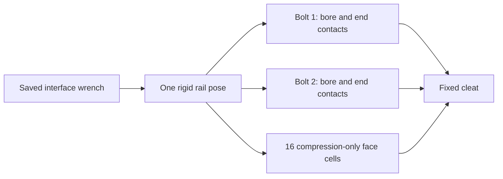

# Upper-right rail pair: shared-host local response

**2026-10-02 — conditional analytical working model. Complete joint and
physical release remain HOLD.** Geometry, hardware selection, source frame
forces and the 47-criterion authority remain unchanged.

## Decision

All **six cases converge and balance** under one rail pose. Compatibility
changes the axial split substantially: at K12 right, rail_2 tension rises
from **235.258 to 405.814 N**, while rail_1 falls from **757.336 to
709.053 N**. At K12 rear the corresponding rail_2 increase is
**228.374 to 402.805 N**. The frozen individual bolt forces are therefore
not the compatible force split of this particular rigid-rail/contact model.

The maximum nominal smooth-bolt stress proxy is **188.629 MPa**, or
**0.2974** of the declared 92 ksi steel hypothesis. No steel comparison
exceeds that hypothesis. Face pressure peaks below **0.549 MPa** in the
sampled cells. The maximum tilted washer wood-seat pressure is
**7.146 MPa**; washer metal stress and actual capacity remain unassigned.
This supports a working rail-pair transfer scenario with the stated limits.

The subsequent [shared-side calculation](upper-right-side-pair.md) now
completes all six cases under one side-member pose. It changes axial shares
but leaves side_2 carrying approximately 1,098.757 N peak lateral load;
side_1 remains effectively unloaded laterally. Both packets preserve their
own source wrenches and independent host poses under a fixed cleat. The
subsequent [washer-flexure check](upper-right-washer-flexure.md) now balances
all 48 saved end states and one finer governing witness. It supplies a
deformation sensitivity under the fixed loads; unresolved inner-edge
stress and boundary residuals supply no washer resistance. Neither frame
response nor pair force allocation is rebound.

## Finite scope

This extension gives the two upper-right rail bolts **one shared rigid rail
motion**, including the sixteen existing cleat-face normal contact cells.
It derives the two bolt tensions, lateral bearing shares and end moments
under each preserved six-component rail-interface wrench. Source individual
bolt forces remain a comparison; this local constitutive scenario does not
replace the frozen frame response.

The cleat is held fixed. The side pair and timber deformation outside the
local springs are excluded. This is a rail-pair compatibility calculation,
not compatibility of both orthogonal groups or complete joint qualification.
The [independent local transfer packet](upper-right-combined-transfer.md)
remains frozen.



## Sources and wrench convention

Current input is the six nominal-gap states of `frame-250-attempt02`.
The rail interface contains **22 source rows**: four lateral components
(1808–1811), sixteen face contacts (1870–1885), and two axial ties
(1886–1887). Only rows joining `base_rail_top` and
`top_outer_right_cleat` are included.

The common datum is the existing nominal cleat rail-face center:

```text
cface = [1082.675, 1449.9256507823475, 2178.633244417593] mm
```

The cut holes shift the contact-area centroid to
`[1082.683372740,1449.925650782,2178.633244417]` mm. That point is on the
same plane and differs by about 0.00837 mm in X. It does not replace the
declared wrench datum or change geometry. Total retained contact area is
10,552.972707 mm².

The current raw operator D supplies each row's force and moment on the
rail. With its body-coordinate scaling `[t,1000*theta]`:

```text
F_on_rail = -D_translation.T * f
M_at_cbody = -1000 * D_rotation.T * f
M_at_cface = M_at_cbody + (cbody-cface) cross F_on_rail
external_local_wrench = -(F_on_rail, M_at_cface)
```

The original rail body datum is the mean of unique source solid-node
coordinates: approximately
`[-1.5875,1469.831199167,2186.798514971]` mm. The sign is checked against
all 22 signed point actions at their actual stations. Maximum difference is
1.14e-13 N and 6.1e-10 N·mm. No gravity or remote force is added again:
the negative saved interface wrench is the local external load.

For example, K12 right gives external force
`[36.368432,1023.735400,-385.244963]` N and moment
`[36878.351614,10809.027352,-9428.072742]` N·mm at the common datum.
K12 rear gives
`[58.447985,1012.200962,-416.922126]` N and
`[37292.415824,6023.223787,-5283.619282]` N·mm.
The prior face-contact totals are 629.665 and 641.224 N, respectively.
Those individual forces are not imposed on the new local contacts; their
contribution is retained in the simultaneous wrench.

## Chosen assumptions

Use the middle branch of the frozen local packet, with no further sweep:

- Reviewed 6.35 mm smooth bolt, 7.5 mm bore, 0.575 mm radial gap in each
  receiver, 38.1 mm rail grip and 139.7 mm cleat grip. Pitch remains 33 mm.
  The two receiver gaps sum to the source frame's 1.15 mm relative gap.
- Hypothetical bolt E=200,000 MPa, bore and washer wood-seat
  K=20 MPa/mm, head-to-washer K=10,000 MPa/mm.
- Rigid, concentric Bolt Depot 2994 washer scenario: minimum OD 18.4658 mm,
  maximum ID 8.3058 mm; hypothetical flat head/nut circle diameter 10 mm
  at both ends. Washer stress and actual resistance remain unassigned.
- Two transverse Euler–Bernoulli bending planes per bolt, with the same
  eight elements per receiver as the previous packet. Bolt tensile
  geometric stiffness and projected shortening are included.
- Compression-only radial bore contact, compression-only head/washer/wood
  annuli, positive bolt tension only, no preload, friction or adhesion.
- Existing sixteen face contact points, areas and source stiffnesses.
  Their hypothetical normal modulus remains **100 MPa/mm**, independent of
  the 20 MPa/mm bore/washer-seat scenario.
- One rigid rail with six degrees of freedom; fixed cleat; small rotations,
  smooth bolt section and symmetric hypothetical bearing profiles.

Circular annulus quadrature is rotated to follow the tilt direction.
This makes its finite sampled response rotationally invariant; it is an
explicit numerical approximation, not an actual head profile. Source
three-dimensional forces and moments are retained.

## Compatible energy model

Let the bolt direction from rail to cleat be n. Rail motion at any point is
`d(p)=t+theta cross (p-cface)`. Positive normal opening at a bolt is
`q=-n dot d(p_interface)`. Bore samples use the same rail motion along
the whole host grip; the two bolt hosts are not independent.

For a two-component bore offset v with radial gap g:

```text
Ubore = 1/2 * Kwood*d*weight * max(norm(v)-g,0)^2
Uface = 1/2 * kface * min(-n dot d(pface),0)^2
```

The flat annular series contacts reuse the frozen local model. At a given
T and relative bolt/wood slope, each end returns complementary energy W,
signed center closure C and the same moment through head and wood contacts.
Both ends carry full T. The rigid washer tilt is determined by moment
balance, with nonnegative normal pressure and opening permitted.

Let `S=1/2*integral (norm(w'))^2 dx` be projected shortening and
`A=pi*d^2/4`. Bolt normal energy is obtained by eliminating T:

```text
Psi = max_T>=0 [T*(q+S) - T^2*L/(2*E*A)
               + W_host(T,slope_host) + W_cleat(T,slope_cleat)]
```

An active tie satisfies
`q+S = C_host + C_cleat + T*L/(E*A)`.
At zero T, the first-contact closure is the limiting tilted bearing
geometry; no zero-force contact is retained to create stiffness.

Minimize bending energy, the two normal energies, all bore/face energies
and negative external wrench work together. This supplies one common rail
pose and derives force shares. End moments follow the same contact solution.
The producer records
whole-rail balance, local residuals, source-force comparison and any
neutral modes or stopped branch. Actual hardware capacities remain null.

## Same-state force comparison

All forces below are in N. Each row is one simultaneous case;
arrows mean **frozen point-force demand → derived shared-rail response**.
The last column is the maximum nominal smooth-bolt axial/bending/shear
proxy in that case, evaluated at the same beam station.

| Case | T1 | T2 | V1 | V2 | Face compression | Steel proxy, MPa |
| --- | ---: | ---: | ---: | ---: | ---: | ---: |
| A12 rear | 100.4 → 84.2 | 72.6 → 85.8 | 13.8 → 30.1 | 69.0 → 53.2 | 105.8 → 102.9 | 15.400 |
| A12 forward | 51.0 → 43.7 | 37.9 → 43.8 | 6.3 → 13.5 | 30.1 → 23.0 | 55.9 → 54.5 | 7.042 |
| A12 left | 60.6 → 51.8 | 44.6 → 51.6 | 15.1 → 19.2 | 27.6 → 23.5 | 59.8 → 58.1 | 7.454 |
| K12 right | 757.3 → 709.1 | 235.3 → 405.8 | 535.3 → 526.7 | 498.3 → 506.8 | 629.7 → 751.9 | 184.100 |
| K12 rear | 744.1 → 695.6 | 228.4 → 402.8 | 536.1 → 531.5 | 510.3 → 514.9 | 641.2 → 767.1 | 188.629 |
| A1 rear | 13.0 → 12.1 | 11.6 → 12.2 | approximately 0 → 0 | approximately 0 → 0 | 16.3 → 16.0 | 0.625 |

Derived V is the integrated host-bore force magnitude. Bolt host wrenches
also include the axial tie and outer-seat moment; a single V at the
interface does not reproduce that entire distributed interaction.
Source and derived individual components, signs and full wrenches remain
in the machine output. Recovered bolt and face wrenches together balance
the same preserved external wrench.

The heavy-case total bolt tension rises by **12.3% at K12 right** and
**12.9% at K12 rear**, with face compression rising by approximately
**19.4% and 19.6%**. This is local redistribution under the chosen laws.
It does not update the full frame or certify the old spring-law shares.

## Contact and motion outputs

Values in each row are case envelopes over the two bolts/ends, except motion,
which is the common rail pose at the declared datum. End moment and seat
pressure can have different witnesses within a case.

| Case | Lateral slip at datum, mm | Rail rotation magnitude, degrees | Maximum end moment, N·m | Maximum wood-seat sampled pressure, MPa |
| --- | ---: | ---: | ---: | ---: |
| A12 rear | 1.219 | 0.506 | 0.311 | 0.929 |
| A12 forward | 1.179 | 0.318 | 0.140 | 0.438 |
| A12 left | 1.190 | 0.183 | 0.144 | 0.481 |
| K12 right | 2.056 | 0.451 | 2.292 | 7.146 |
| K12 rear | 2.066 | 0.479 | 2.293 | 7.092 |
| A1 rear | approximately 0 | 0.0103 | 0.00606 | 0.0670 |

Normal opening at the datum peaks at **0.246 mm**. The largest sampled bore
pressure is **9.332 MPa**, rail_2, K12 rear. The peak nominal steel witness
is on that bolt at **x=55.5625 mm** from the host outer face, with internal
bending-moment magnitude approximately **4.413 N·m**. This internal moment
is separate from the end contact moment and is carried through the
distributed bore reaction.

At K12 right, host-end mean/peak wood-seat pressures are approximately
**3.319/7.146 MPa for rail_1** and **1.900/5.072 MPa for rail_2**.
The rail_2 active wood contact area is **164.068 mm²**, about **76.8%** of
the minimum annulus. Its head resultant is at **86.6%** of the hypothetical
circle radius; K12 rear reaches **86.9%**. Nonnegative contact fields exist
within the declared discrete circular model. They supply no actual head,
nut or washer strength.

The retained 4.309 MPa timber reference is a mean bearing reference,
not an imposed pointwise cap. The sampled seat peaks identify dependence
on actual seat compliance and redistribution; they do not establish an
adopted timber failure or a failed physical test. Washer rigidity and the
absence of thread/root bending remain explicit model limits.

A1 rear has **seven tangent neutral modes**, with essentially zero
transverse drive and no active bore samples. Its returned pose is a
representative seating position. The other five local tangents are
nonsingular at the declared numerical threshold. Neither observation is
a complete motion envelope or a whole-frame stability finding. Assembly
and movement acceptance are not changed by this packet.

## Receipts and reproduction

Maintained producer: [upper-right-rail-pair.py](upper-right-rail-pair.py).
Completed ignored output: `rawlocal/upper-right-rail-pair/attempt01/`.
It contains six case records, twelve bolt states, 960 beam sampling rows,
576 bore sampling rows, 96 face-cell records, source pins, a producer
snapshot and a standalone saved-result worksheet summary. The previous
independent transfer packet is unchanged.

| Source / completed artifact | SHA256 |
| --- | --- |
| Frozen `frame-250-attempt02/comparison.json` | `bea6cbc330af3cdb20499d774a8f6bb24481d687c3150adb01ede18e4c1d50ca` |
| Frozen `frame-250-attempt02/response.npz` | `0625196497b0dbc7b297724d7b9947f7c7c61bb282cd4d9681705629302c76c7` |
| Maintained producer / snapshot | `4243b53bbb7377753f0b1fdd73fa1aa6c80e1a96c99d428def88e82a899e6f96` |
| `attempt01/checks.json` | `e0cccb56abb94ed16c322da888cd64a9904c4e49d1e34f573a6903c8b8b98d3d` |
| `attempt01/source-pins.json` | `ce6537af4a64e0024398c63838c085f575fd2264ed45aaf4dd0856f908a9d969` |
| `attempt01/worksheet-summary.json` | `8a96bccbe987ebdb31be25857f813ab01054a76362f830f16b60520f2c509dc6` |

The source receipt also binds the current model, raw row identities,
operators, fresh corner component packet and frozen pure beam/contact
helper. All **eight source pins and eight generated output pins** were
rechecked. The separate worksheet postprocessor only reads completed
results; it does not repeat the local solve.

All cases converge in **2–8 iterations**. Maximum mixed scaled-gradient
residual is **2.12e-6 N**, whole-rail force component residual
**2.57e-7 N**, and whole-rail moment component residual **2.58e-6 N·mm**.
Maximum axial compatibility error is **1.97e-16 mm**. The fixed local
criteria are 1e-4 N mixed gradient, 0.001 N / 0.2 N·mm whole-rail
components and 1e-9 mm axial compatibility. These numerical criteria
do not alter the 47-criterion authority.

For reproduction, run the producer with `--output` naming a new ignored
directory; it refuses to overwrite an earlier attempt. Environment is
Python 3.12.3, NumPy 2.5.2 and SciPy 1.18.1. Ruff passed. No software tests,
native/frame/CAD solve, review loop, staging, commit, push or physical work
was performed by this worker.
