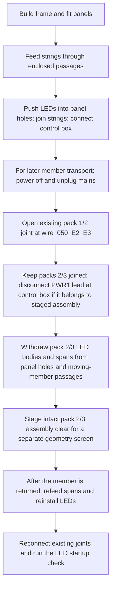

# Service-harness staging hypothesis for member transport

Status: **reversible staging hypothesis for a separate geometry diagnostic**.
No LED or harness mockup, post-install removal trial, or transport sequence has
been demonstrated. This note does not approve a shop procedure. It is scoped to
the WJ-04 service-wire intersections and does not add a blanket prerequisite to
initial assembly.

## WJ-04 wire conflicts

The [WJ-04 local +N result](wj04-pair-access-local-n.md) keeps 132 LED bodies
and 131 wire spans fixed while the right lower and upper service rail/cleat
pairs move. It reports exact sampled rail intersections with these five wire
spans per rail:

- Lower: `wire_078_G6_G7`, `wire_090_H7_H6`, `wire_102_I6_I7`,
  `wire_114_J7_J6`, `wire_126_K6_K7`.
- Upper: `wire_079_G7_G8`, `wire_089_H8_H7`, `wire_103_I7_I8`,
  `wire_113_J8_J7`, `wire_127_K7_K8`.

The wire hits occur at sampled offsets 19.766–69.181 mm (lower) and
19.760–69.159 mm (upper); the largest modeled wire-envelope overlap is
478.779 mm³. These are exact intersections of modeled solids at discrete
poses, not evidence that every physical route is blocked or clear. The local
screen does not prove continuous motion.

The model derives 131 named spans from the 132-datum LED order and marks spans
50 and 100 with provisional string-connector envelope solids. The hit IDs
therefore fall in both the second pack (spans 078/079/089/090) and the third pack
(102/103/113/114/126/127). Staging only one pack cannot clear the ten listed
wire intersections. The candidate minimal harness state for a follow-up
diagnostic is the intact, joined second-and-third-pack subassembly, opened from
pack one at `wire_050_E2_E3`; leave the pack-two/three join at
`wire_100_I4_I5` connected. This is a proposed state assignment from modeled
connector locations, not a demonstrated disconnection operation.

The current report still retains both far-end outer SDS duties as unresolved
obstacles, with zero accepted replacements. Harness staging would not clear
those separate WJ-04 blockers.

## Source-supported assembly order and proposed stage

The local service reference says to build the frame, attach panels, then feed
the strand through enclosed passages and install lights from the rear
([reference, lines 10–14](../../round-service-wiring-reference.json#L10)).
It leaves cable and connector dimensions, bend radius, feed access, and slack
unqualified (lines 16–33).
The [round-service frame](../../../mini_moonboard/round_service_frame.py#L1)
also labels lights as installed after panels. This supports initial assembly
with rails in their final position before wiring; the member-move question is a
separate, later teardown case.

The following graph is a **candidate diagnostic state sequence only**:

Moon Climbing's V5 50-LED guide documents three 50-LED strings for Mini
(printed p. 1), pushing LEDs into panel holes from the rear and joining packs
with push-fit connectors (p. 4), and a supplementary PWR1 connection at the
end of the second string (p. 5). It does not document releasing a connector
after installation, withdrawing LEDs from installed panels, or refeeding the
string through enclosed timber passages. The WJ-04 route does not resolve the
physical PWR1 lead routing; treat its disconnection as an endpoint to identify,
not as a solved path. The guide's damaged-LED repair uses wire cutting and
splicing (pp. 6–7); that is not the proposed transport method. No per-link
connector or wire cut is assumed.

Accordingly, do not assume that a complete string stays attached to one
detached panel: the modeled route crosses many LED datums and enclosed member
passages. The separate stage above asks whether the two affected packs can be
removed and restored intact using their existing pack joints. A physical
handling/continuity check and a WJ-04 geometry rerun with the staged service
state are still needed before claiming that stage clears the wire conflicts.
The diagnostic must also keep the unresolved SDS duties and all other retained
obstacles. It does not establish a complete transport operation, temporary
support, or final assembly procedure.

## Source pins

- [Local wiring reference](../../round-service-wiring-reference.json#L10):
  installation order and unqualified feed handling, slack, and geometry
  (lines 10–14, 26–33).
- [LED route and connector-envelope producer](../../../mini_moonboard/round_service_wiring.py#L48):
  132 datums, one-based span IDs, connector envelopes at 50/100, and modeled
  light/wire bodies (lines 48–75, 88–108); enclosed passage generation
  (lines 116–150).
- [WJ-04 panel-off and retained-service state](../../../scripts/wood_joint_wj04_pair_access.py#L137):
  fixed lights/wires and unverified panel paths (lines 137–157); retained outer
  SDS prerequisites (160–199); sampled local move and obstacle selection
  (677–775).
- [WJ-04 result JSON](wj04-pair-access-local-n.json):
  `operations.panel_off_state`,
  `operations.rail_cleat_placement_removal.local_plus_n_sampled_solid_screen`,
  and `operations.outer_duty_prerequisites`.
- [Moon Climbing build guide](https://moonclimbing.com/build-your-moonboard):
  frame, panel, then LED installation steps.
- [Moon Climbing V5 50-LED installation guide (PDF)](https://moonclimbing.com/media/moonboard-pdf/MB_LED_Installation_V5%2050%20LED%20Nov%202025.pdf):
  Mini pack count (printed p. 1), installation and existing pack joints
  (p. 4), control-box/PWR1 connections (p. 5), and damaged-LED repair (pp. 6–7).
