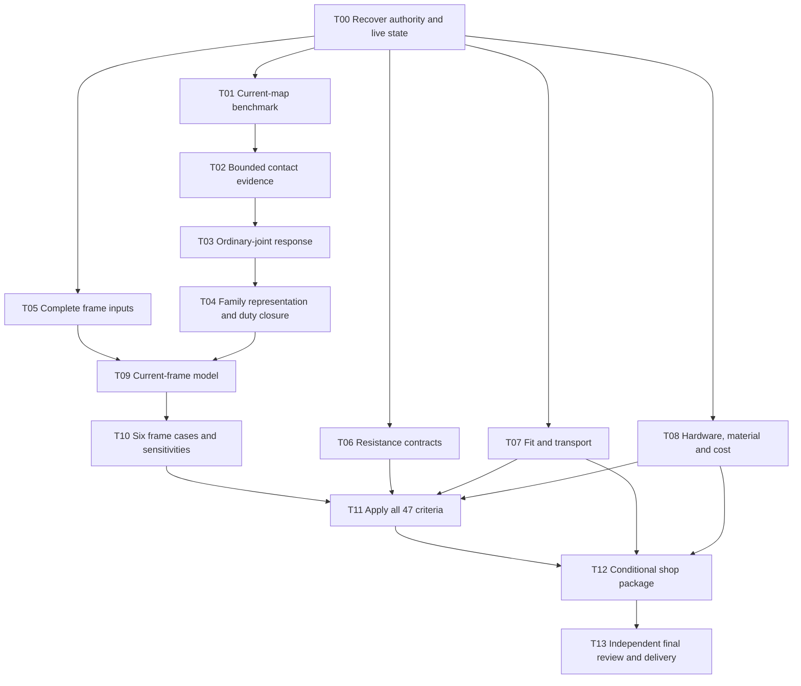

# Luna maximum-reasoning handoff to finish MVP-E

**Current route update:** The owner subsequently authorized the accelerated
reduced static route. For its next work, start with the
[current coordinator handoff](hypotheses/mvp-acceleration-2026-09-28/COORDINATOR-HANDOFF.md).
The MVP-E endpoint below remains in force; the older implicit-contact
instrumentation sequence is not the automatic critical path for that route.

**Current operational addendum (September 29, 2026):** use the
[root continuation note](hypotheses/mvp-acceleration-2026-09-28/root-continuation-note-2026-09-29.md)
for the exact-hash A/B/register review results, parent-owned T09 mesh-only
go/no-go, and current T02/T09 environment status. It supersedes stale
next-action statements in this longer handoff while preserving the full MVP-E
endpoint and the other task workstreams. It authorizes no mesh or solver run.

Prepared at the owner's September 27, 2026 request. This is the operational
handoff for a **Luna coordinator at maximum reasoning effort**, using Luna
workers at maximum reasoning effort. It continues the existing full MVP-E
goal; it does not replace that goal with completion of a benchmark or plan.

Use the [task queue](luna-max-task-queue.json) for scheduling and the
[completion ledger](completion-ledger.md) for engineering dispositions.
This document specifies execution order and ownership. The
[next MVP plan](next-mvp-plan.md), [criteria register](criteria.json), and
[47-row coverage record](current-criteria-coverage.json) retain their engineering
scope. The queue is planning state, never acceptance evidence.

## 1. Endpoint and authority

Finish the conditional engineering and shop-document package for
`compact-floor-flush-wood-joints-development`, reviewed revision
`led-clearance-2x6-runner-seated-blocks-v1`. The geometry contains 24 blocks in
seven designs, 92 candidate bolt axes, twelve retained starting frame-bolt
arrangements, and 66 Hillman axes: 58 unchanged and eight previously approved
moves. The full-frame source bundle contains 20 frame timbers, six plywood
panels and 24 blocks. Preserve the kerf-right surface and edge-support duties.

Read [AGENTS.md](../../AGENTS.md) and
[the candidate's current revision](../../wood-joints-candidate.json) before
acting. The selected angle-frame authority in
[current-candidate.json](../../current-candidate.json) remains separate.
Older top-level candidate wording, WJ-03/04/05 reports, session handles and
historical orchestration tables are not current geometry or permission gates.
The owner already resumed analysis of this revision. The handoff is not a
new request for model approval or a revocation of native-analysis authority.
See the [September 29 live status](luna-max-status-2026-09-29.md) for the
current reviewed attempts and immediate coordinator blockers.

MVP-E requires all of the following, on the same authenticated revision:

1. Demonstrated ordinary-joint mechanics and justified representations for
   every remaining connection family, all 24 replacement duties, both center
   kicker paths and all twelve retained frame bolts.
2. Fresh, complete current-frame results for the six specified load cases,
   including signed simultaneous joint/member actions and stability evidence.
3. Evidence-backed dispositions for all 47 exact criteria. Every applicable
   adopted requirement must pass for MVP-E completion. A narrowly justified
   non-applicability disposition cannot remove a replacement load-path duty.
4. Complete installation, reversible removal, service, tolerance and
   individual-member transport checks; source-backed materials, hardware,
   whole-board quantities and costs; coherent drawings and instructions.
5. Independent review of critical methods, source bindings, calculations and
   the integrated package, followed by coordinator validation.

An engineering failure may prevent this reviewed design from reaching MVP-E.
Report the affected detail and evidence before changing geometry; record the
needed owner decision and continue independent work. Do not promise a pass,
invent capacities or close a criterion because a solver converged. Physical
receiving, fabrication, drilling, candidate selection, floor qualification and
climbing release remain outside this goal. Keep their flags false and Actual /
Disposition observation cells blank. Do not add a floor-friction test or a
blanket external-signoff prerequisite.

## 2. Current checkpoint: resume here

The mechanics critical path is a bounded implicit current-bolt-map benchmark,
followed by contact observability and a justified ordinary-joint response.
Do not restart the long diagnostic history.

| Item | Current usable result | Remaining consequence |
| --- | --- | --- |
| Reviewed geometry and STEP bundle | Current source replay, inventories and exact finished STEP evidence exist. | They establish geometry, not connections, capacity or full-frame readiness. |
| T04 station-family inventory and duty-path graph | The source-pinned inventory and attempt01 review reconcile 24 former duties to 22 stations, 92 candidate bolt axes, 12 retained frame-bolt arrangements, 66 Hillman axes, and 50 current member STEP identities. Attempt01 passed at its frozen snapshot; later queue edits changed only its mutable queue-context pin, so that packet is not described as freshly verifier-clean. Attempt02 reconstructs the current contact graph against the exact frozen owner review report; parent and independent checks confirm 142 source pins, 50 STEP joins, graph parity after omitting only `parent_run` metadata, and exact receiver-screen parity. It records 1,225 pairs, 147 exact-BRep evaluations, 1,078 AABB-separated pairs not evaluated exactly, and six zero-area/unresolved pairs. The new [overlap_contact geometry inventory attempt07](hypotheses/evaluation-resume-2026-09-24/current-overlap-contact-geometry-evidence-attempt07/README.md) is frozen, locally verified, and passed 20 focused tests plus three independent reviews with no findings. | Attempt02 and attempt07 improve nominal geometry inventory only. Attempt07 preserves geometry-only scope and `overlap_contact=pending`; neither artifact establishes active bearing, face ownership, solver mapping, force transfer, fastener engagement, response, resistance, mechanical equivalence or duty acceptance. All 24 mechanical duties, 66 screw paths, center-kicker paths and twelve retained frame-bolt paths remain open. See the [attempt02 map](hypotheses/evaluation-resume-2026-09-24/current-geometric-interface-map-attempt02-2026-09-28/README.md), its [independent review](hypotheses/evaluation-resume-2026-09-24/current-geometric-interface-map-attempt02-independent-review-2026-09-28/README.md), and the original [duty-path graph](hypotheses/evaluation-resume-2026-09-24/current-duty-path-graph-attempt01-2026-09-28/README.md). |
| C3D10 free-coordinate translation fixture | Direct and mapped implicit cases pass 100 increments. | Uniform translation does not qualify current rotational maps. |
| Free-impact fixture attempt02 | Original and trace executables pass 70 states with motion, force, energy and separation checks. | This small coupon does not establish current-joint contact or complete work accounting. |
| Current-map fixture attempt01 | All three frozen native cases pass the declared checks with ten accepted states each; independent postrun review confirms the result, 24 local files, 14 external dependencies and 27 captured files. | A source-bound A00–A03 inventory is parent-reviewed: every map passes a rank-six rigid-field check, but support populations and equation rows differ and exact transformed coefficient equivalence is absent. Only A00 has native qualification. Bind the selected ordinary-joint history to its active map IDs before deciding any further native cases. |
| Historical current-joint implicit transient | Only its tiny first increment is accepted in the latest external-force branch. Later iterations fail the contact-count gate; the runner stops after its 600-second accepted-state/monitor-progress watchdog, with `OOMKilled=false`. | Generated point count is not force error, and the watchdog stop is not a native convergence verdict. No automatic relaxation, endpoint increase or equivalent quasi-static result follows. |
| Full-frame manifest attempt04 and mesh-source review | 50 STEP identities, 778 mass rows, six applied cases, timber/block orientations and candidate steel scenarios are bound. The independently reviewed mesh audit confirms the available C3D10 mesh is a local 19-body patch: three of 50 current members are covered, 47 are absent. | `inputs_ready=false`: Docker access was revalidated on 2026-09-29 UTC, but Gmsh 4.12.1 is still not authenticated as available in a usable image or package; the exact package is absent locally and its previous download route failed DNS. T05 attempt07 and its independent review searched additional APA/Roseburg public routes but found no Lowe’s item/model crosswalk. Exact sheet identity, panel layup/axes/properties, full-frame body/element/node/DOF maps, attachment/contact laws, support/load transfer and response remain open. See the [environment probe](hypotheses/evaluation-resume-2026-09-24/current-frame-mesh-preparation-environment-attempt01/README.md). |
| Full criterion register | T06's current-source overlay, NDS-2024 individual-bolt method, and bounded group-action helper are parent-reviewed. The M–N–V interaction remains only a source lead for a different steel-plate-to-wood topology. Washer attempt01 and its review support a source-obstacle finding for the unreadable Heap scan. MIT OCW attempt02 and the generic clamped-annulus helper attempt01 now pass source, parent, and independent checks within their idealized scope; the helper has 15 focused tests. | The M–N–V proposal does not establish applicability to this timber-only through-bolt or its thread/root sections, support span, or U.S. design format. The generic helper models only uniform pressure on an isotropic thin annulus with both edges clamped; its `b/a >= 1.02` cutoff is numerical. It does not model candidate washer contact/support or resistance. All 92 axes and all 47 criteria remain pending. See [attempt08](hypotheses/evaluation-resume-2026-09-24/current-steel-direct-screen-attempt08-timber-bolt-mnv-2026-09-28/README.md), its [independent review](hypotheses/evaluation-resume-2026-09-24/current-steel-direct-screen-attempt08-timber-bolt-mnv-independent-review-2026-09-28/README.md), the [helper packet](hypotheses/evaluation-resume-2026-09-24/current-washer-plate-response-helper-attempt01-2026-09-28/README.md), and its [independent review](hypotheses/evaluation-resume-2026-09-24/current-washer-plate-response-helper-attempt01-independent-review-2026-09-28/README.md). |
| Fit and transport | T07 attempt02, the T07/T08 option crosswalk and critical-envelope attempt01 are parent-reviewed: 170 operation rows bind to 340 source pointers; six candidate nut/washer CAD hits span four axes, and 12 retained bolt-component sweeps span four leg-bolt stacks. | These are nominal source-CAD/proxy comparisons only. All 170 physical fit, tool, installation/removal, support/capture and transport dispositions remain unresolved. No candidate product or tool is selected; the current 7/16-in retained proxy is undersized for the #407 3/4-in reference. |
| Hardware, material and cost | T08 attempt01 remains the parent-reviewed 35-source register. The append-only attempt02 closeout has 30 source pins and a durable [independent review](hypotheses/evaluation-resume-2026-09-24/current-hardware-material-cost-closeout-attempt02-independent-review-2026-09-28/README.md) supporting its 92/12/66 (58 unchanged, eight moved)/144 count reconciliation and displayed-price arithmetic. A [follow-up verifier](hypotheses/evaluation-resume-2026-09-24/current-hardware-material-cost-closeout-attempt02-independent-review-followup-2026-09-28/README.md) preserves reproducibility across queue edits. | Eight candidate bolt-lead pages show numeric prices, but across unlike lengths and tiers; they do not establish a candidate cost bound. Candidate bolt/nut/washer selection, delivered engagement, board yield/order quantities, compatible lumber and plywood prices, total cost/range and product-specific weight remain unsupported. The review did not reopen supplier pages. No physical operation or criterion is cleared. |
| Contact-output preparation | T02 capture attempt09 is frozen; its 39 offline tests, zero-fuzz source replay, and independent architecture, correctness and test reviews pass. | It has not had a production build or native run. Keep the pinned-runtime, fresh readiness and run-once gates closed. The current joint still lacks a response; do not treat capture-method qualification as joint acceptance. |

The immediate fixture directory, abbreviated **M** below, is
[`hypotheses/evaluation-resume-2026-09-24/implicit-current-map-known-answer-attempt01/`](hypotheses/evaluation-resume-2026-09-24/implicit-current-map-known-answer-attempt01/README.md).
Its final handoff status and exact hashes are in the queue checkpoint and
the [terminal verifier preflight](hypotheses/evaluation-resume-2026-09-24/implicit-current-map-known-answer-attempt01/verifier-preflight.md).
Independent review found no remaining verifier blocker and reproduced all 24
synthetic controls. Recompute hashes before relying on them.
The subsequent parent continuation set readiness metadata, froze the packet and
completed all three native cases. See [the result](hypotheses/evaluation-resume-2026-09-24/implicit-current-map-known-answer-attempt01/RESULTS.md)
and the queue's live checkpoint before dispatching work. The procedure in T01
below records the execution workflow; it is not a request to rerun this
completed attempt. No archived process/session identifier proves a process is alive.

The parent-reviewed [remaining-map audit](hypotheses/evaluation-resume-2026-09-24/current-map-remaining-scope-attempt01/decision.md)
binds all four maps in attempt09. A00/A01 are parallel rail axes with 251/258
support nodes and 754/775 terms per equation; A02/A03 are principal axes with
254/259 nodes and 763/778 terms. Each map independently reproduces six rigid
modes, but the fitted coefficient records are not identical and no exact
coordinate transform proves equivalence. The only available ordinary-joint
N+ contract is a 1 mm relative-N static input with no accepted response; the
next transient force history is unselected. Bind the intended case/history to
its active map IDs before choosing extra map captures. Do not require all four
maps as a blanket prerequisite when the eventual case uses fewer.

The parent-reviewed [bounded-contact contract](hypotheses/evaluation-resume-2026-09-24/implicit-bounded-contact-capture-attempt01/README.md)
passes 20 offline synthetic controls and rehashes 11 pinned solver-source
members plus 14 artifacts. Its calculated worst-case capture is 94,959,616 B
under a 134,217,728 B cap. It remains a proposal: no source patch, build,
input freeze, native run, or current-joint threshold is qualified. It cannot
bound force for unmapped or unexplained excluded points and does not provide
the nodal correction-work channel.

The [panel-source record](hypotheses/evaluation-resume-2026-09-24/current-plywood-material-scenarios-attempt01/README.md)
reconciles all six panel STEP identities. Plywood crosswalk attempt05 and its
[independent review](hypotheses/evaluation-resume-2026-09-24/current-plywood-product-crosswalk-attempt05-independent-review/review-report.md)
correct the live Roseburg card wording to “AC Sanded Plywood” and support only
a 23/32-in, AC/sanded-face descriptor comparison. No Roseburg source maps
Lowe’s item 12235/model 119055 to that option; Lowe’s Douglas-fir field remains
a retailer assertion, and exact species, layup, sheet/lot marks, body
orientation, per-panel properties and axes remain unset.

The [exact47 aggregator attempt02](hypotheses/evaluation-resume-2026-09-24/current-criteria-aggregator-attempt02/README.md)
passes 17 focused tests and is parent-reviewed as a fail-closed evidence
boundary only. Producer-declared methods, limits and demands must match
independently bound acceptance and demand manifests. The aggregate still has
47 pending rows; this is not a capacity implementation or T11 acceptance
result. The [method-map reconciliation](hypotheses/evaluation-resume-2026-09-24/current-criteria-method-map-reconciliation-attempt01/README.md)
confirms that the frozen coverage file's older map hash matches the prior Git
blob and that the only tracked content change is the `steel_direct` row. Both
frozen authority files remain untouched. The [current-source overlay attempt](hypotheses/evaluation-resume-2026-09-24/current-criteria-overlay-attempt01/README.md)
now passes 22 focused tests and parent review. It removes only the stale-pin
provenance blocker and cannot imply that the revised row is an adopted
resistance method. The aggregate remains 47 pending.

The [T07 attempt01 parent review](hypotheses/evaluation-resume-2026-09-24/current-fit-transport-closeout-attempt01/parent-review.json)
found that the claimed exact 104-stack/66-screw arrays were absent. The
[attempt02 register](hypotheses/evaluation-resume-2026-09-24/current-fit-transport-closeout-attempt02/README.md)
now binds all 92 candidate bolt IDs, 12 retained bolt IDs and 66 panel/kicker
screw IDs to exact attempt04 manifest records, matching operation-coverage
records and per-axis status rows. Parent review confirms the joins; every
physical fit, tool, install/removal, capture/support and transport disposition
remains unresolved. This inventory does not itself clear any operation.

The [T08 hardware/material/cost register](hypotheses/evaluation-resume-2026-09-24/current-hardware-material-cost-closeout-attempt01/README.md)
reconciles 35 source files and passes 24 internal checks. It binds 92
candidate-axis lead references, 12 retained catalog-reference stacks, 66
separate Hillman axes and 144 removed SDS axes. All candidate hardware remains
unselected; its thread/engagement bounds are not delivered-lot evidence. The
24-block stock schedule remains conditional, four 4×6-ripped blanks lack a
post-rip grade disposition, no whole-frame lumber quote/yield or candidate
cost range is supported, and product-specific weight remains unknown. The
[T07/T08 option crosswalk](hypotheses/evaluation-resume-2026-09-24/current-fit-transport-option-crosswalk-attempt01/README.md)
and its [parent review](hypotheses/evaluation-resume-2026-09-24/current-fit-transport-option-crosswalk-attempt01/parent-review.json)
are now bound: all 170 operation rows join to conditional candidate leads,
retained reference rows or the fixed Hillman policy through 340 hashed
record pointers. It selects no product and clears no physical operation. Its
conditional identities are consumed by the parent-reviewed critical-envelope
attempt01 below. That source-CAD comparison covers six candidate nut/washer
hits across four axes and twelve retained wire sweeps across four leg-bolt
stacks; all physical fit, tolerance, tool, support/capture, service and
transport gates remain open.

T08 attempt02 adds current public listing observations and an exact axis-count
reconciliation. Eight candidate bolt-lead pages expose numeric prices, but
the $0.2314–$2.54 per-bolt display envelope mixes lengths and tiers and is not
a candidate cost range. The [independent review](hypotheses/evaluation-resume-2026-09-24/current-hardware-material-cost-closeout-attempt02-independent-review-2026-09-28/README.md)
supports the frozen pins, counts, formulas and claim boundaries without
reopening supplier pages. The [procedural follow-up](hypotheses/evaluation-resume-2026-09-24/current-hardware-material-cost-closeout-attempt02-independent-review-followup-2026-09-28/README.md)
rechecks the 30/30 frozen pin record while reporting, rather than pinning, the
mutable live queue hash. Candidate product selection, matched accessories,
delivered engagement, lumber/plywood cost bounds, cut yield, receipt amount,
weight and physical fit remain unresolved; see the [attempt02 packet](hypotheses/evaluation-resume-2026-09-24/current-hardware-material-cost-closeout-attempt02/README.md).

## 3. Team, ownership and dispatch rules

The new root coordinator is Luna/max. It owns readiness decisions, source
freezes, the single native execution slot, integration, engineering status,
commits and final validation. Workers prepare and review; they do not launch
native jobs or change adopted criteria. Use the model identifier
`gpt-6-luna` with reasoning effort `max` when the available agent interface
supports these explicit settings. Confirm the actual configuration; do not
describe another model as Luna/max. This handoff does not change the model of
an already running root agent.

Start with these bounded roles; expand only when independent work is ready:

| Role | Workstream | Initial ownership |
| --- | --- | --- |
| `method_author` | Current-map verifier, then narrowly scoped contact/method implementation | Assigned new attempt files or named maintained mechanics files only |
| `method_reviewer` | Independent methods, input/output and native postrun review | Separate review artifacts; never the implementer's files |
| `frame_inputs` | Plywood, retained roles, mass/load maps, attachment graph and current-frame adapter | New frame-input attempt and explicitly assigned adapter files |
| `resistance` | Source-bound resistance methods and later 47-row evaluations | New resistance contract, evaluators and focused tests |
| `fit_transport` | Exact installed/tool/service/reverse-removal and transport sequence | New fit/sequence attempt; shared CAD writes require coordinator slot |
| `hardware_materials` | All 104 stacks, 66 Hillman policy, stock/yield, product specifications and cost | New source/selection/BOM artifacts; existing research remains read-only |
| `integration_reviewer` | Dependency, coverage and package review when artifacts arrive | Independent review output; no blanket recurring audits |

One author and one reviewer per dependent deliverable is enough. Do not fill
every available agent slot with overlapping research. Lightweight read-only
reviews may overlap; serialize native cases and shared CAD mutations. At most
three independent local CPU jobs may overlap only after checking current
resources, with separate outputs and bounded memory. Historical resource
measurements are not current capacity guarantees.

The coordinator maintains each task's owner, reviewer, input hashes, allowed
writes, state, outputs and next action in the queue. Valid states are
`queued`, `ready`, `active`, `review`, `needs_revision`, `waiting_dependency`,
`done` and `decision_required`. A `done` implementation task is not an engineering
pass. A reviewer reports reproducible defects and concrete corrections.
The author stops editing at terminal handoff; the reviewer hashes those bytes.
If edits resume, the review binding must be updated before freeze.

Workers must return: outcome; changed paths; reproduction command; input/output
hashes; validation result; applicability limits; remaining blockers; and the
exact next executable action. The coordinator resolves ownership conflicts
before edits. Preserve other agents' tracked and untracked files. In particular,
the separate bolt-thread and solver-switch/Code_Aster investigations are
read-only unless their owners explicitly hand them over.

## 4. Dependency order and first dispatch



The graph shows acceptance dependencies, not a ban on earlier preparation.
T05/T09 can build authenticated adapters and run offline mapping checks before
T04's source-bound station inventory is complete, but its mechanical duty
graph and response-family qualification remain open. T06 can implement
resistance methods before fresh demands exist. T07/T08 can finish substantial
work alongside mechanics. T03 does not
need fresh full-frame demands for explicitly labeled component characterization;
a claimed physical transient does need source-bound simultaneous histories.
Do not create that dependency cycle.

T09 needs the hardware/material assumptions consumed by its mechanics, not
completion of T08's price and package research. T11 ultimately needs the full
hardware contract. Equally, final resistance formulas are not a prerequisite
for computing demands once the response/transfer law is defensible.

First coordinator cycle:

1. Run T00. Read only the authority, this handoff, queue, latest ledger and the
   specific source artifacts required by assigned tasks.
2. Inspect the completed T01 captures, verifier result and passing independent
   postrun review. Do not duplicate implementation, captures
   or review without changed inputs or a specific concern. Existing team
   handles are useful only if still live.
3. Reconcile T05–T08 owners against the live agents and queue before dispatch.
   T06 method attempt01 and the T07/T08 crosswalk plus T07 critical-envelope
   attempt01 are parent-reviewed source-bounded steps, not criterion or physical
   acceptance. Continue T06 with the next distinct resistance method and T07
   only where new authoritative product/route evidence or a separately bounded
   conditional operation analysis can change a disposition. T05's exact-panel
   binding and T08's source register are completed subtasks, not reasons to
   repeat them. Attempt07 and review found no public product crosswalk; keep
   exact panel identity open until new authoritative evidence appears. Resume
   each parent task at its next missing input. Reassign
   only an owner that is no longer active, with separate writable paths and a
   concrete deliverable rather than a broad status request.
4. Preserve the reviewed T02 attempt01 contract and frozen attempt09 source
   patch. Its offline gate and independent reviews pass, but production build
   and coupon execution require the now-available pinned runtime, fresh parent
   readiness, run-specific authorization, and durable run-once tracking. Bind the intended ordinary-joint history to
   its active maps before freezing a current-joint case; launch no native case
   without its own readiness gate.
5. Keep one next native job selected. At every completed result, record the
   engineering decision settled and select one next action.

## 5. Executable work packages

### T00 — Recover and bind the starting state

Read the current-revision authority, the latest ledger, this plan, the queue,
and [current criteria coverage](current-criteria-coverage.md). Check `git status`,
live agents/processes, active goal and current Denver time. Preserve the full
existing goal; create it only if no unfinished goal exists. Do not inherit an
old pause or quiet-hours deadline without its dated scope. Recheck current
quiet-hours and publication instructions before commits or pushes.

Verify the queue's source snapshot against files. A mismatch is a prompt to
inspect newer evidence and update planning state, not permission to regenerate
frozen evidence. Reconcile 24/92/12/66 counts, reviewed revision and all 47 IDs.
Create a small coordinator checkpoint with ownership and the ready queue.
No CAD rebuild or test-suite rerun is needed merely to recover context.

**Done:** authority and active work are unambiguous; no duplicate worker/run;
ready tasks have exact owners and write boundaries.

### T01 — Finish the actual current-map benchmark

Inputs: M's `prepare.py`, three decks, `expected.json`, independent references,
input audit, acceptance, verifier, runner and terminal reviews. The verifier
must reject missing/duplicate/nonfinite data, wrong controller gain despite
unchanged physical fields, wrong mass/energy/axis and malformed status rows.
Its synthetic subset is only an offline test fixture. Native verification must
cover every required physical/control/carrier node and all ten accepted states.

The following was the parent-owned execution order from the repository root.
This attempt has now completed captures, passed its verifier and independent
postrun review. Inspect those results instead of rerunning steps 1–6. For a justified new
attempt, use its own directory, inputs and reviews.

1. Inspect the completed independent `M/verifier-preflight.md` and verify its
   final verifier, runner and acceptance hashes. It already corrects the old
   reference-review wording: the producer uses the native quadrature weight,
   while the independent parent reference retains exact 1/24. Preserve both
   reviews; do not repeat the review merely because a new coordinator starts.
2. Resolve actual review defects. Then change only readiness metadata in
   `M/acceptance.json` to ready, recording the previous and new hash. Do not
   change numerical gates after seeing native results.
3. Run `.venv/bin/python M/verifier.py --self-test` with M expanded to the real
   directory. Parse stdout as JSON and write `M/verifier-self-test.json` once,
   adding `verified_source_sha256`, `expected_sha256`, `acceptance_sha256`.
   Do not confuse this with `verifier.json`, reserved for the native audit.
4. Create `M/parent-review.json` with `ready_for_native_fixture_only: true` and
   `reviewed_files_sha256` equal to the current SHA-256 of **every** entry in
   `run.py::STATIC_FILES` except `parent-review.json` itself. Include review
   rationale and the limited scope. This prevents circular self-hashing.
5. Check no other native case is running. Execute the following commands from
   the root, replacing `<FREEZE_SHA>` with the hash returned by `--freeze`:

   ```sh
   .venv/bin/python docs/wood-joints-mvp/hypotheses/evaluation-resume-2026-09-24/implicit-current-map-known-answer-attempt01/run.py --check
   .venv/bin/python docs/wood-joints-mvp/hypotheses/evaluation-resume-2026-09-24/implicit-current-map-known-answer-attempt01/run.py --freeze
   .venv/bin/python docs/wood-joints-mvp/hypotheses/evaluation-resume-2026-09-24/implicit-current-map-known-answer-attempt01/run.py --run --freeze-sha <FREEZE_SHA>
   .venv/bin/python docs/wood-joints-mvp/hypotheses/evaluation-resume-2026-09-24/implicit-current-map-known-answer-attempt01/verifier.py --audit-dir docs/wood-joints-mvp/hypotheses/evaluation-resume-2026-09-24/implicit-current-map-known-answer-attempt01/output --write
   ```

   Execute each command only after inspecting the preceding result. `--freeze`
   performs packet checks and replays synthetic controls again to bind the
   exact bytes it freezes. The preceding `--check` follows the terminal
   independent review's recommendation and requires the same parent-readiness
   files. The runner itself
   invokes NumPy-based parent references, so use `.venv/bin/python`, not a
   system interpreter lacking NumPy. Do not run an entire shell block blindly.
6. The runner serializes `direct`, `mapped_no_carrier`, `mapped_carrier`, with
   one CPU, 1 GiB, no network, 120 s and 64 MiB output per case. Use short tool
   yields and monitor it. If capture stops, retain the failure and inventory;
   do not launch later cases manually to evade the stop policy.
7. Independently review raw accepted-state counts, all required fields,
   controls, equations, carrier kinematics, energies, parity and inventories.
   Write a new `RESULTS.md` and independent postrun review. Replay the terminal
   verifier without replacing its recorded report, and update the ledger.

**Pass branch:** qualifies only the actual A00 map, small Y forcing, chosen
timestep and carrier. Inventory the other three maps/modes; establish exact
equivalence or propose the smallest missing native fixture before relying on
them in a joint. Do not automatically run a Cartesian product of benchmarks.
**Fail branch:** distinguish native capture failure, parser/contract defect,
reference applicability, and map/carrier behavior. Preserve frozen files and
gates. A corrected attempt gets a new directory and preregistered criteria;
an in-memory diagnostic does not convert the original failure into a pass.

**Done:** reproducible independent disposition, bounded applicability and a
selected next method step. Passing this task never closes a joint criterion.

### T02 — Complete bounded contact observability and select the next method

Read the [point-census source review](hypotheses/evaluation-resume-2026-09-24/contact-point-census-source-review-attempt01/README.md),
the trace coupon's existing capture proposal, free-impact attempt02 and the
[pair-output contract](hypotheses/evaluation-resume-2026-09-24/current-pair-output-contract-review-2026-09-27/README.md).
The earlier full trace is coupon-only and unbounded at current-joint scale. The
parent-reviewed [attempt01 contract](hypotheses/evaluation-resume-2026-09-24/implicit-bounded-contact-capture-attempt01/README.md)
settles its offline census/join design and synthetic caps only; it is not a
patch or solver qualification. Next author work must implement the output-only
capture in a new immutable attempt, verify the pinned 2.23 source branch and
unchanged mechanics on bounded analytic fixtures, and return a build/source
hash inventory. The coordinator then freezes actual input scope and numerical
decision thresholds before any serialized native diagnostic. Keep force/work
unknown where the source does not expose a valid mapping.

Build only the bounded instrumentation needed to decide whether contact-count
changes have material force/work consequences. Before implementation, write
the decision, settling observation, next action and a byte/runtime estimate.
The contract must include:

- Frozen pair/slave-face roster; runtime per-face offset/span conservation,
  including zero spans, total point count and exactly-once point outcomes.
- Generation state versus corrected-trial state, mapping/normal/area/weight
  identity, and explicit end markers and overflow failure. Runtime counts are
  not an independently predicted geometric point count.
- Geometric correspondence for cross-sweep comparisons. Integration-point
  indices are sweep-local and may be added, removed or reordered.
- Accepted/rejected iteration identity, complete required resultant force and
  moment channels, and an explicit treatment of unmapped/inactive points.
  Missing evidence is not zero force. Changed quadrature weights/mappings
  prevent an unchanged-point energy identity from being applied blindly.
- Bounded aggregate output plus selected diagnostic samples, with proof of
  aggregate coverage. Preserve signed positive-gap trial values from old sets.

Pin the exact solver version, source and binary. Test output-only changes on
the existing small analytical fixtures using matched resources/threads and
the same numerical gates. No change to solver mechanics, convergence checks,
mass, stiffness, friction, gaps or supports is authorized by instrumentation.

**Decision branches:** source-bound observations may support the current
method, reveal a specific defect, or show that another method is needed.
Consult the separately owned solver-switch/Code_Aster work read-only before
duplicating it. An alternative solver requires its own loading, constraint,
contact, material and output known-answer checks; a stock trial does not
qualify the current joint. Select one route with reasons. Do not migrate the
whole frame on the strength of a generic solver recommendation.

**Done:** a reviewed bounded capture/method contract and qualified implementation
that can settle the named current-joint question, with numerical thresholds
frozen before the run that uses them.

### T03 — Demonstrate the ordinary joint's complete response

Use the current bottom-center right joint: three full timber members, four
bolt stacks and all three wood contacts. Start from the current attempt09
motion/map sources and authenticated mesh/material inputs; its
`port_motion_n_plus.inp` is the reviewed motion deck, whereas
`response_n_plus.inp` is an older force/gauge deck. Never confuse them.

1. Freeze body/face ownership, element quality/volume, finite contact coverage,
   normals, clearance, grains, material scenarios, bolt/nut axial engagement,
   initial state, boundary/port maps, load/actuation path and required outputs.
   Check internal mechanisms at zero load/preload as well as global rigid
   motion. Keep the free cleat free. Unsupported axial engagement is
   `UNRESOLVED_ENGAGEMENT`, not a rigid restraint or zero bolt action.
2. Declare whether the run is component characterization or a physical
   transient. The analyst's 1 N pulse is not a service history. Implicit dynamics
   is not automatically dynamic relaxation or a quasi-static solution.
3. Bind the intended load/actuation history to the four actual A00–A03 map
   IDs. The A00 global-Y dynamic fixture and A09 1 mm relative-N static input
   are different methods; neither is presumed to stand for the eventual
   response. Require demonstrated map/carrier applicability only for the maps
   used by this characterization, plus T02's needed observation contract.
   Freeze sign and near-zero thresholds for the eight wood-bore pairs
   `WJCP_020`–`WJCP_027`, complete accepted outputs, and two accepted states after
   first resolved bearing. Do not require all eight pairs to bear simultaneously.
   A zero curved-face resultant may conceal cancellation; nonzero resultant can
   witness bearing without identifying exact first local touch.
4. Select an evidence-backed actuation extent; the idealized no-bearing motion
   witness does not justify an unchanged heavy 1 mm retry or a guessed larger
   endpoint. Do not add an arbitrary cleat gauge, friction, preload, stabilization
   or close gaps to obtain convergence.
5. Capture signed interface/bolt actions, member equilibrium, opening/slip/
   rotation and contact pressures/work. Demonstrate transfer through the joint;
   first contact on one bore side is insufficient.
6. Run declared mesh, timestep/contact and physical-assumption sensitivities.
   If quasi-static interpretation is proposed, separately justify rate,
   kinetic-energy, work/energy and response-branch checks with numerical limits.
   Low kinetic energy alone is not sufficient.

Reuse `fea/wood_joint_patch_wrench.py` and
`fea/wood_joint_patch_equilibrium.py` for audited accounting, within their
scope. New maintained adapters require tests for real mapping/transfer errors;
do not repair unrelated historical adapters. Exercise each adapter promptly on
the actual current artifact before generalizing it.

**Done:** a source-bound ordinary-joint response/stiffness representation with
validated transfer and declared applicability/sensitivities. It is not final
demand-to-capacity acceptance before T10/T11.

### T04 — Extend to all families and close the mechanical duty graph

Classify every station by actual geometry, grain, contact, bolt stack,
engagement, clearances and response range. The seven block designs are not
automatically seven mechanically equivalent families. Cover ordinary,
tall-center and complete exterior sandwich joints, both inner-header bolts
per side, direct seats, runner contacts, changed hosts and all twelve retained
frame bolts. Reconcile the source [attachment-topology index](hypotheses/evaluation-resume-2026-09-24/current-attachment-topology-attempt01/README.md).

For each family, either demonstrate equivalence to T03 over the required
signed action/rotation range or implement and qualify a separate representative
method. Preserve off-diagonal coupling, opening, slack, bearing and engagement
needed for full-frame redistribution. A reduced law needs independent response
and work/energy checks against its detailed reference and a validity range.
Do not infer equal bolt shares, ideal pins or rigid joints for convenience.

Join every duty to actual mechanical edges, not merely touching CAD bodies.
Include the 66 panel screws, panel/edge transfer, the two center-kicker paths,
all 92 candidate and twelve retained stacks, and declared floor support.
Identify shared physical fasteners to prevent duplicate stiffness, mass or
resistance. Quantify remote-cut assumptions where used.

Current offline progress: the frozen [attempt07 geometry inventory](hypotheses/evaluation-resume-2026-09-24/current-overlap-contact-geometry-evidence-attempt07/README.md)
has 50 member/panel nodes and 1,225 pairs; 147 were exact-BRep evaluated,
1,078 were excluded by disjoint AABBs without exact-BRep evaluation, and six
remain zero-area or unresolved. Its verifier and 20 focused tests pass; the [correctness](hypotheses/evaluation-resume-2026-09-24/current-overlap-contact-geometry-attempt07-correctness-review-2026-09-28/review-record.md),
[testing](hypotheses/evaluation-resume-2026-09-24/current-overlap-contact-geometry-attempt07-testing-review-2026-09-28/review-record.md) and
[architecture](hypotheses/evaluation-resume-2026-09-24/current-overlap-contact-geometry-attempt07-architecture-review-2026-09-28/review-record.md) reviews found no findings. Treat all of this
as nominal geometry only. Do not infer active bearing or close a mechanical
duty from it. After the independent review, continue mechanical path work by
assigning interface ownership and supported contact/engagement behavior, then
bind transfer and response to the T03 ordinary-joint result and T09 solver
maps. Keep all 24 replacement duties, 66 screw paths, both center-kicker
paths and twelve retained frame-bolt paths open until their evidence is
complete. The 1,078 AABB-only rows and six unresolved rows are limitations to
resolve when required by the actual interfaces; they are not proof of a
physical defect or an instruction to alter geometry.

The append-only [face-pair atlas attempt01](hypotheses/evaluation-resume-2026-09-24/current-geometric-interface-face-atlas-attempt01-2026-09-28/README.md) adds source-bound nominal face identities for all 115 finite opposed body pairs: 378 planar faces across the 50 exact STEP bodies resolve to 117 face-pair mappings and Boolean regions. Parent verification and three independent reviews pass; independently reconstructed per-pair area differences remain below the 1e-6 mm² absolute tolerance. Six unresolved pairs, 26 exact-separated pairs and 1,078 AABB-only pairs remain unmapped. One low architecture note records that the frozen README's face-pair/region wording is snapshot-true (117 of each) but could need separate counts if future face pairs have disconnected regions. Face IDs still do not establish physical ownership, active contact, load transfer or mechanics.

**Done:** 24/24 replacement duties have complete source-bound paths; every
station has a usable behavior law or explicit detailed representation and
coverage/equivalence evidence. Final resistance waits for current demands.

### T05 — Complete full-frame inputs while local mechanics advances

Start from [manifest attempt04](hypotheses/evaluation-resume-2026-09-24/current-full-frame-input-manifest-attempt04/README.md)
and [material-map status](current-material-map-status-2026-09-27.md). Preserve
the frozen attempts; put additions in a new attempt. Reuse
`scripts/wood_joint_current_geometry.py::build_current_geometry` and exact STEP
exports. Rebuild CAD only if a missing current consumer or identified mismatch
requires it.

Deliver these concrete maps, with units and complete coverage:

- Source body/face to solver body/element/node/DOF ownership for 50 finished
  members and all represented hardware. Verify actual taper and cut geometry,
  mesh volume, positive Jacobians and material orientation.
- Material/axis assignments for 20 frame timbers and 24 blocks; two transverse
  scenarios per member are conditional alternatives, not observed ring bounds.
  Bind the six plywood panels to actual supported layup/axis/property scenarios;
  do not infer Structural I properties from the panel outline or exterior label.
  The owner-designated Roseburg/Lowe’s model 119055 still has no manufacturer
  crosswalk. Attempts05 and 06 support only limited 23/32-in, AC/sanded-face
  descriptor comparison. Attempt07 and its independent review add bounded APA
  and Roseburg public-route observations, but still find no product-code or
  model-applicable property link. Its Roseburg brochure shows multiple AC
  constructions, so descriptor similarity cannot identify the panel. Exact
  model product/species/layup, received-sheet IDs/marks, axes, elastic
  properties and density-card assignment remain unset. Do not repeat the
  reviewed routes or queries; preserve the unresolved state until new exact
  product or sheet/lot evidence is available.
- Assignment of 460 candidate and 60 retained hardware roles, avoiding separate
  mass for a head/shaft already counted as one bolt. Reuse the parent-reviewed
  retained-steel attempt02 map for the 60 roles and its nine conditional E/nu
  cases; do not repeat that inventory. It selects no material and supplies no
  solver assignment, connection law, delivered grade, yield strength or bolt
  resistance. Candidate roles, actual solver mapping and all connection
  behavior remain open.
- The 778-row gravity inventory plus separate 25 kg accessory scenario mapped
  exactly once to solver masses/loads. Reconcile total force and moment.
- The 66 Hillman screw receivers, embedment and panel/frame transfer model;
  no SPAX/SDS/inserts substitution. Geometric axes alone are not attachments.
- The six applied cases and load datums from
  `scripts/wood_joint_current_load_cases.py`, plus support/contact definitions
  under the unchanged conditional no-slip floor assumption.

Physical receiving may remain unknown while explicitly conditional analysis
scenarios proceed. Do not turn post-rip grade observations into a blanket
block on diagnostic methods. A final grade-dependent resistance must carry a
defensible conditional specification and its conformance limits.

**Done:** a reviewed current-frame input contract identifies each missing
connection behavior explicitly, with complete non-response inputs ready for
T09. Do not set the old manifest's readiness flag or fabricate an FE deck by
assuming away unassigned interfaces.

### T06 — Implement source-bound resistance and criteria methods

Use [criteria-method-map.md](criteria-method-map.md) as the obligation list,
not as proof that methods exist. The [attempt02 exact47 aggregator](hypotheses/evaluation-resume-2026-09-24/current-criteria-aggregator-attempt02/README.md)
is parent-reviewed after 17 focused tests as a fail-closed evidence boundary;
it still produces 47 pending rows and implements no engineering resistance
method. Producer method/limit/comparison and demand claims now have to match
independent acceptance and demand manifests. The frozen coverage file's map
pin is separately reconciled in
[`current-criteria-method-map-reconciliation-attempt01`](hypotheses/evaluation-resume-2026-09-24/current-criteria-method-map-reconciliation-attempt01/README.md):
the old digest matches its prior tracked blob and the only map-content change
is the `steel_direct` row. Preserve both authority files. A versioned current
source overlay is parent-reviewed with 22 tests, four hash-tamper controls and
one missing-binding control. It suppresses the stale-map error only while the
fixed-path overlay, frozen coverage, current map, reconciliation and exact
coordinator-review hashes agree. All 47 rows remain pending.
AWC NDS-2024 access attempt01 directly confirms the edition designation and approval date but does not expose the official References 39–41 list; its independent review passes the packet-integrity and claim-boundary checks. Attempt02 tested five new AWC API/sitemap/robots routes, and its independent review confirms that none returned content through the available reader. The repeated landing-page request is disclosed and excluded. The numbering remains a non-AWC mirror transcription, not an authenticated AWC mapping, and no timber-grip N+V+M method follows. No capacity or criterion result follows. Do not repeat those routes absent a new access mechanism. See [attempt01](hypotheses/evaluation-resume-2026-09-24/current-awc-nds-2024-references39-41-attempt01/README.md), [attempt02](hypotheses/evaluation-resume-2026-09-24/current-awc-nds-2024-references39-41-attempt02-primary-route-probe-2026-09-28/README.md), and [attempt02 review](hypotheses/evaluation-resume-2026-09-24/current-awc-nds-2024-references39-41-attempt02-primary-route-probe-independent-review-2026-09-28/review-record.md).

The parallel-grain local tear-out evaluator has a separate source gate: pin the exact NDS-2024 Appendix E.2–E.4 text before implementing it as an NDS-2024 method. The official [AWC 2024 NDS page](https://awc.org/resources/2024-nds/) exposes a “Free View-Only Option” button, but its accessible page record contains no destination URL, and no Appendix E pages were available through the current reader. A separate check of the [ANSI IBR portal's SDO roster](https://ibr.ansi.org/Standards/) found APA listed but not AWC, so it provides no NDS reader route. The bounded route check did not use non-AWC mirrors or repeat the five API/sitemap/robots probes above. This is an access limitation, not evidence that AWC’s reader is unavailable. The smallest next step is an interactive browser with working DNS to follow the button, or the unshortened first-party reader URL; keep the evaluator and affected criteria pending until the exact text is pinned.

`mini_moonboard/bolted_timber_checks.py` and `fea/dowel_yield.py` are
constituent/reference helpers. Build the missing complete-joint methods with
exact source editions, formulas, units, applicability and verified independent
examples:

- Multi-member lateral bolt yield, gaps/thicknesses, actual bearing directions,
  adjustment factors and group effects including the adopted extra sensitivity.
- Bolt tension/shear/bending and simultaneous interaction at the actual common
  section and each shear plane; shank versus root/thread location matters.
  AISC attempt07 and its independent review are a bounded source screen only: §§J3.7–J3.8 do not provide bolt bending or establish steel-connection applicability to the timber grip. Preserve “not established by these sources,” not “no method exists”; the review records a minor exact-heading correction (“Tensile,” not “Tension”). No capacity or criterion disposition follows. See [attempt07](hypotheses/evaluation-resume-2026-09-24/current-steel-direct-screen-attempt07-aisc-2022-boundary-2026-09-28/README.md) and its [independent review](hypotheses/evaluation-resume-2026-09-24/current-steel-direct-screen-attempt07-aisc-2022-boundary-independent-review-2026-09-28/README.md).
- Loaded end/edge breakout, group tear-out and the separate splitting/fracture
  question. A parallel tear-out reference does not close cross-grain splitting.
- Finite unilateral wood bearing, opening and prying coupled to joint actions;
  washer support, steel bending and wood pressure; connector-body combined
  actions and actual housing/shoulder/net-section effects.
- Bored/tapered member normal/shear/torsion and stability methods, including
  limits of any rectangular/unbored approximation.

Each method needs positive known-answer examples, relevant limiting cases and
negative controls for missing material/grade/geometry/action data, unsupported
range and wrong signs/units. Validate engineering methods independently of
their implementation. Missing standards or unsupported capacities remain
named gaps; do not fill them with historical ML24Z values or generic steel
elastic properties. Research exact missing technical sources when needed;
the plan does not require new external signoff.

**Done:** executable reviewed methods ready to consume T10's simultaneous
demands, plus explicit unresolved methods and affected criteria if any.

### T07 — Resolve complete fit, service and transport

Use current candidate/retained access screens, not predecessor viewer fits.
Use the parent-reviewed [attempt02 exact operation register](hypotheses/evaluation-resume-2026-09-24/current-fit-transport-closeout-attempt02/README.md)
for the 92 candidate stacks, twelve retained frame stacks and 66 separate
panel-screw operations. It provides identity coverage only. The parent-reviewed
[T07/T08 attempt01 option crosswalk](hypotheses/evaluation-resume-2026-09-24/current-fit-transport-option-crosswalk-attempt01/README.md)
now joins all 170 axes to exact conditional candidate-lead, retained-reference,
or fixed Hillman-policy records using 74 source pins and 340 record pointers.
It reports zero selected candidate products, zero fit-qualified stacks, and
zero physical access/transport clearances. Retain every lead and tool profile
as conditional and preserve all unresolved operation statuses. Continue with
the parent-reviewed [critical-envelope attempt01](hypotheses/evaluation-resume-2026-09-24/current-fit-transport-critical-envelopes-attempt01/README.md)
and [parent review](hypotheses/evaluation-resume-2026-09-24/current-fit-transport-critical-envelopes-attempt01/parent-review.json).
It rehashes 72 transitive source paths and independently reproduces six
candidate nut/washer component hits across four axes plus twelve modeled
head/washer/shaft wire sweeps across four retained leg-bolt stacks. The four
candidate sideways-then-axial paths remain local CAD options assuming
thread-compatible unthreading; they do not establish capture, staging or
reverse assembly. The retained 7/16-in proxy is a size mismatch for the #407
3/4-in baseline reference, and the matching-size comparator remains unscreened.
The source-envelope work clears no operation. Continue only with a bounded
conditional comparator screen that has source geometry, or with newly supplied
authoritative stack/tool/cable records; keep all 170 operation statuses open.
Existing sideways nut-escape studies and removing two wire obstacles are local
hypotheses, not complete harness staging.

Select source-backed actual tool envelopes for insertion, counterhold,
engagement, stroke/regrip and removal. Bind thread disengagement and capture
before treating a nut or washer as freely translatable. Add product and cut
tolerances, all holds/T-nuts, LEDs/wires, panel/floor obstacles and service
states. A broad bounding-box overlap alone proves neither fit nor impossibility.
Report each local-N datum, installed projection and temporary workspace;
dimension any exception to the ordinary 139.7 mm envelope.

T07 and T08 must share stable product/tool option IDs and exact dimensional
revisions. Exchange proposed options early; neither task is done until its
final assumptions reconcile with the other's. This is an artifact agreement,
not a circular requirement that either whole task finish before the other starts.

Build an assembly/removal dependency graph with support/capture at each step,
then verify continuous or conservatively bounded part/tool sweeps in both
directions and individual-member transport. Keep zero routine structural
wood-thread removal; count the 66 Hillman operations separately. Check both
kerf-right kicker edge strips and current screw backing. Keep hypothetical
denser hold-grid midpoint studies separate from actual product compatibility.

**Done:** exact identity coverage plus complete geometric/sequence dispositions
with tolerances and stated physical-observation limits. Any necessary geometry
change is reported before implementation and invalidates affected downstream
evidence, not unrelated work.

### T08 — Finish materials, hardware, stock and cost

Use [current hardware coverage](current-hardware-coverage.md), the latest
bolt-thread research, [material-map status](current-material-map-status-2026-09-27.md)
and [cost coverage](current-cost-coverage-2026-09-27.md), plus the parent-reviewed
[T08 register](hypotheses/evaluation-resume-2026-09-24/current-hardware-material-cost-closeout-attempt01/README.md).
Attempt01 passes 24 source/count/arithmetic/scope checks but remains pending:
no candidate SKU, delivered engagement, compatible current lumber quote/yield,
candidate total/range or selected-hardware weight is supported. Read
other-thread research as inputs; do not overwrite it. All 104 stacks need matched bolt,
nut and washer specifications, not one representative nominal length.

For each axis bind grade, dimensions/tolerances, delivered usable shank,
thread start/runout, grip/shear planes, nut engagement, washer dimensions/
support and installation/removal/tool requirements. Keep modeled occupancy
diameters distinct from drill bits and purchased lengths. Preserve twelve
frame bolts and 66 purchased Hillman screws. No insert pilots are authorized.

Reconcile the 24 block blanks (18 nominal 4×4, four section-ripped 4×6, two
nominal 2×6) and current frame source stock to finished patterns/grain, kerf,
trim, defects, nesting, usable yield and conditional grade specification.
Do not transfer original grade-specific values across a rip without the
recorded disposition. Price current whole-board and package quantities with
dated sources, taxes/freight/unknowns and explicit alternatives. Do not add
mutually exclusive options or use the predecessor $71.72 subtotal as current.
Keep owned/purchased/conditional items distinct; missing receipt price is
unknown, not zero.

Use required sourcing skills when doing actual vendor lookup, and current
primary sources for specifications/prices. No purchase or supplier message is
authorized by this plan. No invented receipt, delivered measurement or stock
inspection is permitted.

**Done:** a coherent conditional product/material schedule, quantity/cost range
and weight with every missing selection identified. Hard incompatibility
blocks only the affected assembly/criterion and triggers a named finding.

### T09 — Integrate the current-frame analysis model

Consume T04 behavior/attachment coverage and T05 source maps. Develop the
adapter and offline checks early, but freeze native-ready inputs only when
the behavior required by the proposed cases is defensible. Reuse
`scripts/wood_joint_current_full_frame_manifest.py` only within its documented
input-manifest scope; it is not already a full-frame response solver.

Include actual recesses, finished sections, joint/slack/contact behavior,
panels/kickers/screws, direct seats, retained host connections, dead load and
conditional supports. Reconcile all force/moment datums and avoid duplicated
connections or imposed equal force sharing. Verify topology, rigid modes,
symmetry where truly applicable, load equivalence and output coverage. Freeze
mesh/convergence/work/equilibrium/monitor and sensitivity limits before runs.
Derive numerical tolerances from methods and units; this plan invents none.

The [current mesh-source audit](hypotheses/evaluation-resume-2026-09-24/current-frame-mesh-source-audit-attempt01/README.md) and its [independent review](hypotheses/evaluation-resume-2026-09-24/current-frame-mesh-source-audit-attempt01-independent-review-2026-09-28/README.md) confirm that the available mesh is a local patch (19 bodies; three of 50 current member identities) and leaves 47 full-frame members uncovered. The mesh review is complete; the full-frame mesh-preparation attempt remains blocked on a usable, authenticated Gmsh 4.12.1 package or image. Docker access is restored, but the exact package is absent from the local system/cache and its version-exact download route previously failed DNS; see the [environment probe](hypotheses/evaluation-resume-2026-09-24/current-frame-mesh-preparation-environment-attempt01/README.md). Revalidate an exact-version source route, then freeze a mesh-only attempt from the 50 exact member IDs and STEP hashes, verify per-body identity and mesh quality, and keep the model unready until all member, material, contact/attachment, support, load, mass-transfer and solver maps are assigned and independently checked.

**Done:** reviewed complete model and reproducible launch packet, every input
assigned, no unsupported behavior hidden behind a ready flag, and all required
current criteria have an output route.

### T10 — Run the six cases and declared sensitivities

Run these exact source-bound cases, serially under coordinator control:
`a12-rear`, `a12-forward`, `a12-left`, `k12-right`, `k12-rear`, `a1-rear`.
Preserve all failed attempts. Freeze finite resources and stop conditions per
case before launch; do not copy a small coupon's limits onto the full frame
without a justified estimate.

Extract signed simultaneous six-component interface/member actions, per-bolt
tension/lateral/bending demands, active contact/opening/pressure, screw and
panel transfer, reactions, displacements, deformed monitor gaps and stability
quantities. Require complete accepted output, force/moment closure, work/
energy checks appropriate to the method and source identity. Run declared
mesh and connection/material/contact sensitivity branches, selecting supported
worst-case envelopes without mixing unrelated component maxima into fictitious
simultaneous action vectors. Reconcile the original 18 taper-top monitors.

**Done:** independently audited fresh demands and sensitivity scope for all six
cases. Unit component responses and historical angle actions cannot fill gaps.

### T11 — Apply and reconcile all 47 criteria

Use the exact IDs in the queue's `criterion_ownership` and the authoritative
register. Implement a fail-closed aggregator: missing rows, stale hashes,
empty station/case coverage, NaN, missing capacity or zero-length inventories
must not pass. Each evidence row binds candidate/revision, method/version,
inputs/units/sources, applicable station/interface/case coverage, simultaneous
actions, result and limit, governing mode/case, sensitivities, disposition and
limits. Include the twelve retained bolts and changed hosts explicitly.

Reconcile every migrated angle-specific row to its replacement obligation.
No angles present does not mean zero utilization or automatic non-applicability.
Use T06 methods with T10 demands and T07/T08 contracts. Confirm static taper
subchecks against current evidence without promoting the full taper criterion
prematurely. Missing methods stay unresolved; failed checks stay failed.

**Done:** all 47 rows have complete dispositions and review. MVP-E advances
only when every applicable requirement passes; otherwise issue a precise
affected-operation finding and required revision/decision, with goal active.

### T12 — Assemble the conditional engineering/shop package

Update current development instructions, assembly/removal sequence, dimensioned
drawings, drilling/shop columns, receiver/cut schedule, tool/workspace needs,
material/hardware/BOM/cost/weight and criteria/results index from the same
revision. Mark documents as conditional development evidence, not fabrication
release. Keep actual inspection cells blank. Do not change the selected
baseline's bought-4×4/kerf-right shop packets to publish this candidate.

Reconcile drawing counts and dimensions against machine schedules and exact
finished geometry. Remove contradictory current instructions by superseding
them explicitly; preserve historical reports and failed attempts. Make the
entry point obvious in `docs/README.md` and the development working set.

**Done:** one coherent package whose links lead to reproducible evidence and
whose limitations agree with the actual criterion dispositions.

### T13 — Independent final review, validation and delivery

Use reviewers who did not author the critical calculations. Review mechanics,
47-row coverage, source/geometry preservation, full-frame cases, real hardware/
fit/transport and shop-document consistency. The coordinator resolves findings
and reruns only affected checks, then validates the integrated artifact/hash
inventory and local links. Run focused tests for changed maintained code and
required repository checks; broaden only for integration risks or failures.
Do not repeatedly rebuild unchanged CAD or run all historical diagnostics.

Commit/push only authorized dependency-complete chunks outside applicable quiet
hours, preserving unrelated changes and avoiding bulk addition of other-thread
files. No site deployment, message, purchase or physical action follows merely
from completion of this plan. Record delivered commit identity separately from
the selected-baseline source identity.

**Done:** all endpoint gates in section 1 hold and the coordinator has reviewed
the evidence. Only then mark the existing full goal complete. A polished plan,
benchmark pass, six converged runs or complete list of unresolved items is not
that endpoint.

## 6. Proposed implementation files and durable outputs

The following new paths are assignments to make after checking for equivalent
existing work. They are **proposed**, not claims that code or accepted results
already exist. Avoid creating a parallel implementation if another worker has
already supplied the required producer. Assign one writer per maintained file.
Use new attempt directories for immutable evidence, and keep reusable tested
code in the maintained source tree.

| Tasks | Existing entry points | Proposed implementation/output contract |
| --- | --- | --- |
| T02 | Existing trace source/format/build pins, contact census clarification, free-impact attempt02 and the parent-reviewed offline capture contract | Frozen `implicit-bounded-contact-capture-attempt09/` passes its offline gate and independent reviews. Docker access is restored. The attempt09 production build and separate 35-check independent provenance review pass; the prior r5 exact-touch coupon attempt01 remains a consumed failure. A distinct attempt09 exact-touch coupon attempt02 is frozen and undergoing independent pre-run review. No readiness, run-specific authorization, ledger reservation or new coupon run exists yet. After review, create parent readiness and a run-specific receipt under the recorded owner authorization, persist a new consumed run ID before one bounded serialized launch, and validate the results. Any coupon pass qualifies capture and standard-output invariance only; ordinary-joint history/map freeze and response remain separate gates. |
| T03 | `fea/wood_joint_wj24_patch_mesh.py`, `fea/wood_joint_patch_contact_contract.py`, `fea/wood_joint_patch_materials.py`, `scripts/wood_joint_current_patch_inputs.py`; source decks in attempt09 | A new ordinary-response attempt with body/surface/material/equation manifests, frozen deck, response fields, signed wrenches, sensitivity matrix, verifier and review. Extend only adapters consumed by that attempt. |
| T04–T05 | `scripts/wood_joint_current_contact_graph.py`, `scripts/wood_joint_duty_registry.py`, `scripts/wood_joint_current_receiver_screen.py`, `scripts/wood_joint_current_mass_topology_map.py` | New interface-atlas JSON: exact body/face/axis ownership, normals/gaps, mechanical law, datum, stiffness/engagement scenario and duty consumers. Distinguish tangent/zero-area geometry from usable bearing surfaces. |
| T05/T09 | `scripts/wood_joint_current_geometry.py`, `scripts/wood_joint_current_full_frame_manifest.py`, `scripts/wood_joint_current_load_cases.py` | Proposed `scripts/wood_joint_wj06_full_frame_model.py` and `hypotheses/evaluation-resume-2026-09-24/current-full-frame-model-attempt01/`: model manifest, body/element/node/DOF maps, materials, loads, surfaces, bolt/screw/monitor maps and candidate deck. Ready remains false until all consumed behavior is justified. |
| T06/T11 | `mini_moonboard/bolted_timber_checks.py`, `mini_moonboard/wood_joint_bolt_resistance.py`, `mini_moonboard/bolted_joint_mechanics.py`, `fea/dowel_yield.py`, exact47 overlay attempt01 | T06 attempt01 provides a parent-reviewed NDS-2024 individual-bolt lateral-yield component with corrected January 2025 `KD=10D−0.5` and independent examples. Follow-up attempt02 repairs malformed role-ID validation; parent review passes for the narrow patch and 28 focused / 76 related tests pass. The bounded NDS group-action helper is parent-validated through attempt10 for one-to-three-member rows only. Washer attempt01 is a reviewed source-obstacle packet. Attempt02 passes independent review as a generic MIT OCW clamped-annulus benchmark; the coordinator independently reproduces W(5)=17.551854163565… and zero boundary values/slopes. The generic helper is now implemented, parent-checked and independently supported with 15 focused tests and Ruff; it remains limited to ideal annulus response and implies no candidate washer method/check. All 92 axes and 47 criteria remain pending; splitting/tear-out, adjustment, and other applicable methods remain open. |
| T07 | Current access/retained-access/grip/receiver producers, T07 attempt02, T08 register attempt01 and parent-reviewed T07/T08 crosswalk plus critical-envelope attempt01 | The exact 92/12/66 operation register, 170-row crosswalk and conditional nominal-envelope matrix are parent-reviewed. Six candidate component hits occur across four axes; twelve retained component sweeps occur across four leg-bolt stacks. The work selects no product/tool and clears no operation. Next, use only source-backed full comparator geometry or new authoritative delivered-stack and cable-route evidence; keep tolerance, thread release, support/capture, reverse service, integrated sequence and transport open. |
| T08 | Current hardware, material and source/yield schedules; parent-reviewed attempt01 register and attempt02 public-price/count closeout | Attempt02 is frozen and independently reviewed for public display evidence and counts; it deliberately emits no candidate total/range. Continue with compatible material/product identity, a supportable stock cut/yield quantity, matched stack requirements, and source-backed cost inputs. Keep delivered-lot evidence, receipts, selection and receiving outside this goal. |
| T10 | `fea/wood_joint_patch_wrench.py`, `fea/wood_joint_patch_equilibrium.py`, current load-case producer | Proposed `scripts/wood_joint_wj09_postprocess.py`; six-case raw-output archive and complete accepted-action/monitor tables with original and local datums, signs, units and source hashes. |

For every machine artifact define required fields, units, identity coverage and
failure behavior before coding its consumer. Reuse the existing evidence schema
where it fits. New schemas must distinguish `inputs_ready`,
`method_demonstrated`, `current_demands_available` and `criterion_resolved`.
An output that merely lists all entities does not demonstrate transfer.

Test the actual input-to-output boundary. Examples: a rotated material basis
must rotate stresses correctly; changing a load datum must preserve the
equivalent global wrench; a missing screw/bolt/duty must invalidate coverage;
a malformed/duplicate/unaccepted state must be rejected; a missing grade or
capacity must stay unresolved. Add no tests just to mirror constants or prove
that a generated report contains its own hard-coded passing status.

## 7. Freeze, failure and change protocol

Every native attempt needs a decision memo, source-bound inputs, preregistered
numerical gates, complete parser/verifier controls, independent preflight,
parent readiness, immutable input freeze, finite resource limits, serialized
execution, raw-output inventory, automated audit and independent postrun review.
Pin solver source/version/binary and documentation; unfamiliar loading,
coupling or output requires a small known-answer check before heavy use.

One baseline and the preregistered sensitivity set form a bounded attempt.
After failure, classify it and write the settling observation and next action
before any retry. Do not run an unchanged expensive case, widen a threshold,
relax contact convergence or increase an endpoint merely to get progress.
If a correction changes frozen code/inputs, create a new attempt. A diagnostic
reinterpretation may explain a failure but cannot rewrite it.

Avoid indefinite method work: each new coupon, source investigation or trace
field must name the downstream engineering decision it unblocks. If it cannot,
defer it. After a failed bounded attempt, choose between a specific correction,
a justified alternative method, or a concrete owner decision; keep independent
frame/fit/resistance/sourcing tasks moving. Do not use elapsed effort or token
consumption as evidence for engineering acceptance.

Change impact rules:

| Change | Revalidate at least |
| --- | --- |
| Contact/map/engagement or material law | Method qualification, affected family behavior, frame cases/sensitivity and dependent criteria |
| Geometry/axis/receiver/cut | Owner-reviewed revision requirement, source/mesh/material/attachment maps, fit, family applicability, affected frame results and criteria, drawings/BOM |
| Bolt/nut/washer specification | Grip/engagement, shear/root sections, washer support, tool/removal, resistance, mass and affected frame response |
| Output parser/verifier only | Positive/negative controls, affected raw-output replay and independent review; preserve original frozen result |
| Documentation wording only | Source consistency and links; do not rerun unaffected mechanics |

## 8. Coordinator bootstrap prompt

Use this prompt in a new Luna/max coordinator session with this repository:

> Continue the existing full MVP-E goal for mini-moonboard. Read AGENTS.md,
> docs/wood-joints-mvp/luna-max-completion-handoff.md and
> docs/wood-joints-mvp/luna-max-task-queue.json, then inspect the active goal,
> latest completion ledger, working tree and live agents/processes. Use Luna
> agents at maximum reasoning effort for bounded author/reviewer work. You own
> readiness, immutable freezes, serialized native execution, integration and
> final validation. Preserve reviewed led-clearance-2x6-runner-seated-blocks-v1
> geometry, selected authority, other-thread files and all failed evidence.
> Complete T00, inspect the completed T01 result and independent postrun review,
> and advance independent T05/T06/T07/T08 work in parallel. Verify current
> task state rather than replaying old work. Follow the dependency and failure
> branches through T13; do not stop after a benchmark, plan or partial packet.
> Do not invent capacities, weaken gates or silently revise geometry. Report
> any required model change before implementing it. Keep the full goal active
> until every MVP-E endpoint requirement is actually satisfied; physical work,
> receiving observations, candidate selection and climbing release are outside
> scope. Give concise updates describing evidence, decisions and next actions.

Worker assignment template:

> Task ID and engineering decision: …
> Read these exact inputs and verify these hashes: …
> Own only these writable paths: …
> Deliver these artifacts and run these checks: …
> Reviewer and exit gate: …
> Prohibited changes and downstream consumers: …
> Return terminal hashes, validation, limits and one next executable action.
> Stop editing after handoff. Do not run native cases, mutate shared CAD,
> publish, purchase or alter engineering dispositions yourself.
