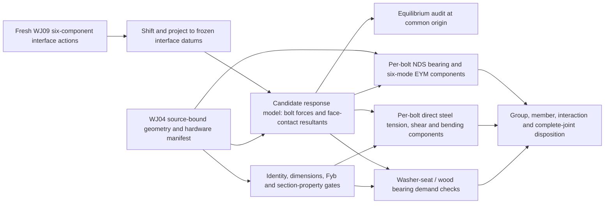

# Representative WJ-04 fastener resistance method preflight

Status: method preflight, 2026-09-24. This note scopes a reusable resistance
producer for the representative full-stock WJ-04 ordinary-bolt family. It does
not implement a producer, evaluate capacity, or change any candidate or release
status. It identifies checks that can be made from frozen geometry and sourced
hardware inputs before fresh complete-frame demands exist, and defines the
additional evidence needed to connect signed interface wrenches to fastener,
washer, and wood checks.

## Representative connection and current evidence

The source-bound WJ04 mechanics bridge covers the right-inner full-stock G7
cleat pair: eight unique physical 1/4-20 bolt candidates, four wood-to-wood
interfaces with two bolts per interface, and one wood shear plane per bolt.
Each bolt crosses an 88.9 mm cleat and a 38.1 mm host, for 127 mm nominal wood
grip. The forty modelled hardware shapes are five roles for each physical bolt
(bolt shaft/head, two washers, nut); they are not forty purchased fasteners.
The frozen bridge authenticates axes, member order and grain vectors, contact
plane datums, and catalog-bound geometry. It expressly leaves the fresh
six-case actions, distribution among the eight bolts, material adjustments,
delivered bolt section, nut and washer properties, and complete-joint response
open ([input report](hypotheses/wj16-full-stock-mechanics-inputs/README.md),
[mechanics contract](../../scripts/wood_joint_wj04_full_stock_mechanics_contract.py)).

The current hardware entries are modeling candidates only: K.L. Jack
`25C600HCS5Z`, 1/4-20 Grade 5, six-inch cap screw; K.L. Jack `25CNFH5Z` nut;
and two plain Type-A-wide washers per stack (16 washers total). The frozen
candidate bounds are:

| Part | Candidate dimensions already recorded | What can be compared before demands |
|---|---|---|
| Bolt | `D = 6.223–6.350 mm`; nominal length 152.4 mm with −2.54 mm tolerance; `Lb ≥ 127.0 mm`; `Lg ≤ 133.35 mm`; 1/4-20 UNC. | Stack projection, body/grip envelope, head and bore/seat clearance. `Lb` and `Lg` remain separate from first full-form thread location. |
| Nut | 1/4-20 UNC; thickness 5.3848–5.7404 mm; across-flats 10.8712–11.1252 mm; across-corners maximum 12.827 mm. | Wrench/access envelope, bearing-plane location, and thread-match screening. This is not proof-load, stripping or engagement strength. |
| Each washer | Type-A-wide plain steel; ID 7.7978–8.3058 mm; OD 18.4658–19.0246 mm; thickness 1.2954–2.032 mm. | Annulus and support-polygon geometry, stack height, and tool/seat envelope. These bounds do not give plate-bending capacity or prove full wood support. |

The historical `Dr = 0.189 in` entry is a standard-based 1/4-20 root
*scenario*, not a delivered thread measurement ([root reference](hypotheses/wj04-thread-root-lateral-reference.md)). Current supplier grade tables
can support an explicitly stated conditional Grade 5 property scenario, but
they do not establish that the candidate SKU or any delivered lot conforms.
The current sources also do not establish first full-form thread position,
functional nut engagement, seat contact, or complete-joint strength. See
[`wood_joint_wj04_config.py`](../../mini_moonboard/wood_joint_wj04_config.py),
the [source-correction note](bolt-dimension-source-correction.md), and the
[full-stock thread screen](hypotheses/wj04-full-stock-thread-screen/README.md).

The thread screen's result is deliberately narrow: all 256 member/corner
fractions remain below the NDS one-quarter comparison when 127 mm `Lb` is used
as a *screen boundary*. `Lb` is not the location of the first full-form
thread. The delivered member-specific thread-bearing lengths therefore remain
unknown, so the full-body-`D` exception or a smooth-shank claim is not
established for an actual candidate. A conditional lateral-yield calculation
can use the source-based `Dr` scenario while assuming thread root across each
bearing region; selecting full-body `D` or actual smooth-shank coverage needs
supported member-specific thread extents. Do not carry old single-bolt angle
samples or selected-angle-frame results into this G7 family ([historical root
reference](hypotheses/wj04-thread-root-lateral-reference.md)).

## Work that is possible before fresh actions

These are pre-demand checks. They can establish data completeness, identity,
dimensional compatibility, and method readiness, but they cannot establish
adequacy.

| Check | Executable from current frozen inputs? | Evidence and limit |
|---|---|---|
| Physical topology and counts | Yes | Reconcile eight unique physical bolt IDs, five component roles per stack, two bolts per each of four named interfaces, receiver order, and one shear plane per bolt. Reject duplicate fastener identity in a load path. |
| Candidate dimensional envelope | Yes, conditionally | Compare explicit standard/supplier bounds against the frozen stack datums, finished bore/seat geometry, and access envelope, labeling assumed conformity. Keep the 7.5 mm CAD bore as an occupancy envelope, not a drill size. Delivered identity and dimensions remain separate actual-part evidence. |
| Grip and thread-location screen | Partly | Reproduce the existing `Lb` boundary and tolerance-stack screen. It does not locate first full-form thread or prove nut engagement. To establish the actual candidate's thread position and nut fit, use a supported product drawing/guarantee or delivered measurement; MVP-E may instead state explicit thread-interval assumptions for a conditional fit scenario. |
| Candidate sectional-property manifest | Partly | Record the source and controlling section for `D`, `Dr`, tensile area `At`, and shear-plane area `Av`. An exact thread series/class supplies conditional thread geometry; assuming root at each shear plane avoids claiming an unknown smooth-shank interval. Actual shaft/thread section placement or larger smooth-shank `Av` needs product/drawing geometry or delivered measurements. Do not use `Dr` as a substitute for the direct-steel `At` or `Av`. |
| NDS `Fyb` evidence gate | Yes, with separate scenario, method, and delivery fields | `nds_fyb_basis_status` records an explicitly specified Fyb scenario before receiving. NDS-2024 §12.3.6.2 still requires ASTM F1575 bending yield or tensile yield tested under ASTM F606 with a supported evaluation into `Fyb`; grade, proof stress, or `Fu` alone is not normative/test-derived `Fyb`. An F606 record also needs its Fyb-derivation reference. Delivery conformance is a distinct caller record and is not authenticated by the helper. See [conditional ordinary-bolt property boundary](hypotheses/evaluation-resume-2026-09-24/ordinary-bolt-resistance-boundary-attempt01/README.md). |
| Nut, washer, and steel-strength basis completeness | Yes, as a fail-closed status | Identify applicable product standard, grade/material, size and evidence source. Dimensional standard conformity is not a nut proof/thread-strip result or washer bending/spreading resistance. ASTM F606's test procedures do not themselves assign a product property to an unverified part. |
| Geometry-only wood screens | Yes, within each helper's scope | Projected boundaries and nominal 4D/7D reserves can be reported as geometry. They do not classify the loaded edge, evaluate splitting, or give resistance. Existing `bolted_timber_checks.py` reference values need actual geometry, grain, load direction and adjustments before use. |

Primary source references for these contracts are the [ANSI/AWC NDS-2024
record](https://awc.org/resources/2024-nds/) and its [Chapter 12 — Dowel-type
fasteners](https://awc.org/wp-content/uploads/2026/08/AWC_NDS2024_withCommentary_20250328_WebsiteChapter-12-%E2%80%93-Dowel-type-fasteners.pdf),
[ASTM F1575/F1575M-24](https://store.astm.org/f1575_f1575m-24.html), and current
[ASTM F606/F606M-26a](https://store.astm.org/f0606_f0606m-26a.html). Product
dimensional standards are [ASME B18.2.1-2012 (R2021)](https://www.asme.org/codes-standards/find-codes-standards/b18-2-1-square-hex-heavy-hex-askew-head-bolts-hex-heavy-hex-hex-flange-lobed-head-lag-screws),
[ASME B18.2.2-2022](https://www.asme.org/codes-standards/find-codes-standards/b18-2-2-nuts-general-applications-machine-screw-nuts-hex-square-hex-flange-coupling-nuts),
and [ASME B18.21.1-2009 (R2016)](https://www.asme.org/codes-standards/find-codes-standards/b18-21-1-washers-helical-spring-lock-tooth-lock-plain-washers).
ASME states that these standards provide dimensional data; that does not
establish which candidate will be stocked, supplied, received, or qualified.
Sources checked 2026-09-24. See the repository's
[resistance-basis note](bolt-resistance-basis.md) for the exact NDS and
component-helper limitations already adopted here.

## Action-to-check chain

The reusable implementation should be split into a no-demand hardware/method
manifest and a demand-bearing resistance evaluator. A fresh signed interface
wrench is a boundary resultant, not an eight-bolt force schedule. In this
candidate each interface has two bolts plus finite wood-face contact; load
sharing depends on bolt/wood response, clearance and opening. Equal division,
per-bolt statics without a demonstrated determinate model, or old angle-ledger
actions are not acceptable substitutes.

The interface-action adapter should consume each of the six fresh WJ09 cases
with: candidate and source fingerprints; physical interface ID; action owner;
force and moment units; report point and basis; and simultaneous signed
`(Fx,Fy,Fz,Mx,My,Mz)`. Shift each wrench to the frozen contact/bolt-group datum
with `shift_wrench`, then project it into that interface's right-handed local
basis with `to_local`. Carry all signs and all six components; do not classify
loaded edges from an unsigned magnitude. Preserve the same-case relation
between frame demand, group response, individual fastener forces, and contact
forces.

The response step must emit, for every case and interface, each physical bolt's
signed force vector at an identified point/plane, any supported bolt bending
resultant, face-contact resultants/pressure and their application points, and
any other force path. It must state its contact and bolt/wood law, clearances,
material assumptions, and range of validity. Check the recovered force and
moment with `equilibrium_residual` at one common datum, including moment arms
for distributed and bolt reactions. An equilibrium residual is a bookkeeping
test, not proof that the proposed force distribution is unique or physically
correct. For this WJ04 candidate no accepted stiffness/contact model or fresh
action bundle currently supplies this result. The
[ordinary-joint response proposal](ordinary-joint-response-method.md) documents
the broader model inputs and limits.

## Resistance components after actions exist

For each physical bolt, retain the following as separate checks. Do not add
their reference values or ratios together without an applicable, supported
design interaction.

1. **Lateral wood/bolt yield:** Project the per-bolt lateral force onto the
   bolt-normal plane and derive its angle to each receiver's grain. Establish
   the two bearing lengths and zero-gap/contact applicability. For a
   conditional thread-root scenario, specify `Dr` from the thread class and
   assume root across each bearing region. To use `D` under the NDS one-quarter
   exception, establish thread-bearing lengths in each member; actual-candidate
   claims need supported product/drawing geometry or measurement. Use
   `nds_effective_bolt_diameter_in` and
   `wood_wood_single_shear_reference` only when their input contract is met.
   The latter returns six unadjusted NDS lateral-yield modes for one bolt and
   one shear plane. Apply all relevant end-use adjustment factors and any
   adopted additional reduction explicitly; the helper does not evaluate the
   two-bolt group, splitting, loaded-edge direction, or complete joint.
   See [NDS-2024 Chapter 12](https://awc.org/wp-content/uploads/2026/08/AWC_NDS2024_withCommentary_20250328_WebsiteChapter-12-%E2%80%93-Dowel-type-fasteners.pdf)
   and [AWC TR12-2026](https://awc.org/wp-content/uploads/2026/06/TR-12_2026_formatted.V3.pdf).
2. **Direct bolt steel:** Resolve the conditional or actual tensile and
   shear-plane sections and simultaneous signed axial/shear/bending demands
   per bolt. The current `bolt_first_yield_reference` can report separate,
   unadjusted tension and pure-shear first-yield references when `At`, `Av`, a
   specified minimum yield scenario, and their product/section bases are
   present. Delivered conformance is a separate receiving record. A nominal
   von Mises axial/shear material interaction is available only when one
   co-located section area and basis are supplied; separate `At` and `Av` do
   not establish that co-location. The result uses average shear stress and
   is not an AISC connection rule, design strength, or acceptance. Bending,
   fracture, thread failure, fatigue, pull-through, and nut/thread stripping
   remain outside this helper. Do not treat individual ratios as a pass.
3. **Nut and thread engagement:** Confirm exact thread compatibility,
   full-form thread through the required nut thickness plus the named project
   projection reserve (if retained), delivered fit, and any chosen proof or
   stripping method. A nominal 1/4-20 match and ASME dimensional envelope do
   not prove engagement under load. There is no accepted nut or thread-strip
   resistance helper in this candidate path.
4. **Washer seat and wood bearing:** Use the per-bolt axial action with the
   actual washer bounds, receiving wood face, bore, reliefs and supported
   footprint. `wood_washer_annulus_reference_lbf` supplies only an ideal
   full-annulus DF-L No. 2 compression-perpendicular reference under its
   625 psi assumption. It does not prove the pressure field or washer support.
   `washer_steel_resistance_status` now records a separate washer scenario and
   delivery status. It still returns the specific
   `washer_steel_bending_and_load_spreading_on_timber` method gap, even when
   scenario inputs are complete. A reviewed plate-bending/load-spreading
   method for the timber support contact is required before steel resistance
   can bound this limit state; additional sourcing alone will not supply it.
5. **Wood group and member modes:** Check loaded-end/edge and spacing rules,
   row/group tear-out, net section through all bores/cuts, splitting and
   perpendicular-to-grain actions on each finished receiving member. Existing
   DF-L bearing, net-tension, parallel tear-out and group tear-out helpers are
   reference components with narrow geometry/load applicability; none closes
   the G7 two-bolt group. Splitting remains a separate pending criterion.
6. **Joint disposition:** Bind every applicable component to the same physical
   bolt, interface, WJ09 case, geometry/hardware fingerprints and design
   basis. Preserve non-governing modes and unresolved methods. Only after
   member/group checks, steel/nut/washer checks, applicable adjustment factors,
   contact, force sharing, and a supported interaction are complete can a
   complete-joint criterion be evaluated. A missing action or property is
   `pending`/`unresolved`, never zero demand or infinite capacity.

## Reusable producer boundary

The candidate-plan map already proposes a representative producer at
`mini_moonboard/wood_joint_resistance.py` plus a WJ04 adapter script. This note
supports that split and recommends fail-closed records with the following
shape:

| Record | Minimum fields |
|---|---|
| Hardware manifest | Candidate/part ID; physical fastener ID; standards and product sources; source hashes; nominal dimensions and tolerances; delivered observations when available; thread, nut and washer identities; `D`, `Dr`, `At`, `Av` bases; separate conditional property-scenario and delivered-conformance fields; Fyb route/evidence/applicability; separate direct-steel material evidence. |
| Demand record | WJ09 case/run ID and frozen input hash; interface and physical member owners; source point/basis; signed six-vector and units; shifted datum; per-bolt action response ID; bolt/contact/other reaction points; equilibrium residual and response-model bounds. |
| Component check | Method/version and source clause; geometry/material/action input IDs; units; component demand/reference and applicable adjustment; result state; governing case/mode; explicit exclusions. Keep a component reference distinct from adjusted design resistance. |
| Summary | Coverage counts for eight bolts/four interfaces/six cases; missing inputs; unresolved interactions; criterion IDs actually covered; source fingerprints; no inherited angle/station result; explicit capacity and release booleans. |

The no-demand producer can first emit a candidate hardware manifest, geometry
envelopes, identity checks, and unresolved basis statuses. The demand-bearing
producer must reject absent or stale WJ09 actions and must not calculate
per-bolt loads itself from a lone interface wrench. A separately frozen
response adapter must supply physically supported fastener/contact shares;
the evaluator then checks its equilibrium and passes only authenticated
per-fastener actions to component methods.

Reusable code already present:

- [`wood_joint_wj04_full_stock_mechanics_contract.py`](../../scripts/wood_joint_wj04_full_stock_mechanics_contract.py)
  binds the eight axes, four interfaces, receivers, grain and datums, but its
  return contract marks actions, load distribution and resistance missing.
- [`bolted_joint_mechanics.py`](../../mini_moonboard/bolted_joint_mechanics.py)
  provides `Wrench`, `shift_wrench`, `to_local`, `equilibrium_residual`, and
  physical-fastener uniqueness accounting; it does not solve joint response.
- [`wood_joint_bolt_resistance.py`](../../mini_moonboard/wood_joint_bolt_resistance.py)
  supplies the fail-closed NDS diameter/Fyb inputs, separate direct-steel
  first-yield references, ideal wood washer-annulus reference, and unresolved
  washer-steel status.
- [`bolted_wood_wood_yield.py`](../../mini_moonboard/bolted_wood_wood_yield.py),
  [`fea/dowel_yield.py`](../../fea/dowel_yield.py), and
  [`bolted_timber_checks.py`](../../mini_moonboard/bolted_timber_checks.py)
  provide bounded, one-fastener or geometry/reference methods only.

No code or existing worker was changed for this preflight. No CAD, meshing, or
native solve was performed. All eight physical axes remain provisional; no
resistance, complete-joint adequacy, drilling, fabrication, or climbing
release follows from this method proposal.
