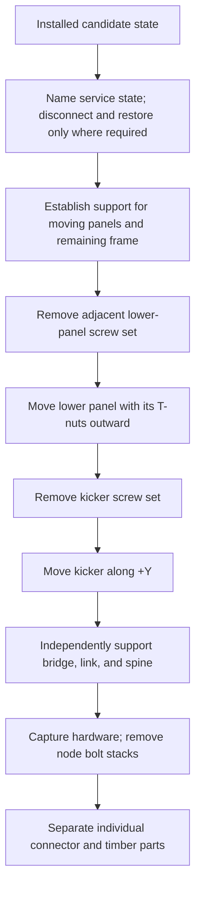
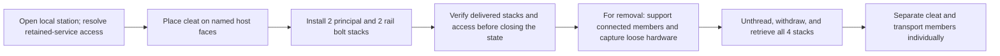
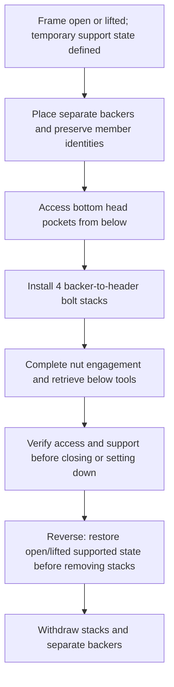

# Transport and assembly operation dependencies

Status: **planning record for WJ-07; no assembly or disassembly sequence is
approved.** This record translates current WJ-03, WJ-04, and WJ-05 diagnostics
into states that an integrated candidate must pass through. It is not a shop
procedure. A sampled nominal CAD path does not establish continuous motion,
support, human handling, service isolation, delivered-part fit, or safe staging.

## Transport contract and separate counts

The source inventory assigns distinct transport identities to 20 timber
members and six panels. Preserve those identities as individual transport
parts. Structural connections must remain demountable with through-bolts,
metal nuts, and washers; routine moves must not require removing structural
wood-engaging threads. These requirements come from the [MVP plan](plan.md),
[source inventory](source-inventory.json), and
[demountable transport criterion](criteria.json).

Counts below apply only to modeled local joints. “Bolt stack” means one
modeled bolt with its washers and nut; it is not an assembly-step count. A
future operation log must count each install or removal pass separately from
wood-part count. The retained 66 purchased panel/kicker screw operations stay
separate from structural-bolt operations.

| Local model | New connector/backer parts | Modeled structural bolt stacks | Scope boundary |
|---|---:|---:|---|
| WJ-03 mirrored outer-node pair | 6 connector parts | 20 provisional stacks | 3 connector parts and 10 stacks per side. Proposed topology removes four former outer angle duties and their SDS axes; all 12 existing frame-bolt arrangements remain. |
| WJ-04 `clip_horizontal_lower_right_1` trial | 1 cleat | 4 provisional stacks | 2 principal-interface and 2 rail-interface stacks. Proposed local state removes prior angle and six SDS axes; other retained SDS/frame-bolt envelopes remain. Four WJ-03 replacement nodes are absent. |
| WJ-05 center-kicker receiver trial | 2 discrete backers; 2 shifted center posts remain separate existing members | 4 provisional backer-to-header stacks | All 12 frame-bolt axes and 66 panel/kicker screw axes remain modeled. Four fixed kicker screw axes enter the backers; count them under the panel/kicker screw policy. |

These local counts must not be added into a whole-candidate BOM or move count.
WJ-06/WJ-07 must reconcile joint ownership and retained hardware on one
integrated model. WJ-03 screens 42 nearby panel/kicker screw axes (12 lower
panel and 9 kicker per side); WJ-05 audits all 66 fixed axes. Axis coverage is
not proof that a person can perform every screw operation.

## Current reviewed revision: sequence hypothesis to validate

On September 26, 2026, the parent selected the following operation order as
the current WJ-07 sequence hypothesis for
`led-clearance-2x6-runner-seated-blocks-v1`. It binds the reviewed 24-block,
92-candidate-bolt layout, 12 starting frame-bolt arrangements, and 66
Hillman panel/kicker axes (58 unchanged and eight owner-directed moves). This
is an order for integrated fit, support, service, and reversal checks; no
operation is accepted or released.

| Order | Forward assembly hypothesis | Reverse transport hypothesis | Current gate before relying on the operation |
|---:|---|---|---|
| 0 | Stage each transport member, connector, panel, and hardware stack under an independently supported setup. | Capture the complete assembly and establish support before releasing holds, panels, or joints. | Support points, load transfer, staging, and handling are undefined. The conditional no-slip floor assumption is not a support fixture or anchor. |
| 1 | Assemble the separate frame members; retain and individually recheck all 12 starting frame-bolt arrangements at the changed hosts. | Keep frame members supported; remove candidate connector joints before the 12 retained frame-bolt stacks, then separate members one at a time. | Identities and receiver pairs reconcile, but changed-host fit, access, mechanics, and withdrawal remain open. See [frame-bolt review](current-frame-bolt-review.md) and [retained access](current-retained-access.md). |
| 2 | Place the 24 connector blocks at their named receivers and install their 92 through-bolt stacks while receiver faces and tool sides are still accessible. Complete and capture one named stack at a time. | With both receiver members independently supported, remove each block's bolt stacks and then its block, in reverse order of installation. | No complete joint action/capacity or support result exists. The exact 92-axis screen has six local nut/washer slide hits; captured-nut motions are bounded local paths, not a complete operation. Actual bolt fit, thread disengagement, tools, counterhold, capture, and tolerances remain open. See [current access](current-access-screen.md) and [hardware coverage](current-hardware-coverage.md). |
| 3 | Install the six separate panels/kickers using the 66 purchased Hillman 42605 axes after backing and receiver checks; preserve all 58 fixed axes and the eight recorded moves. | Remove panel/kicker screws and stage the panels under support before removing connector blocks. Test a current-revision lower-panel-before-kicker dependency; the older WJ03 sampled order does not transfer. | Inner kicker edge support, kerf-right edge support, finished receiver fit, and full reversible screw operation are unresolved. Keep panel screws separate from structural bolts and use the shop checklist for the owner's selected pilot/countersink process. See [current obligations](current-layout-obligations.md). |
| 4 | Route the intact lighting harness through the specified passages and install lights after panel placement, preserving source connections and current wire ownership. | Remove/stage lights and manage the intact harness before moving panels; preserve electrical connections and capture throughout. | The current wire/LED route, G6/G12 corridors, connector handling, refeed path, and tolerance state are not closed. Do not infer that factory joins isolate panels. See [retained wire sequence](current-retained-wire-sequence.md). |
| 5 | Close the operation record only after every installed stack, receiver, support transition, and service state reconciles to the same frozen revision. | Finish by inventorying all 24 blocks, 92 candidate stacks, 12 retained frame stacks, six panels, and their separate fastener operations. | Actual/Disposition cells remain blank until observed; no physical operation, fabrication, or climbing release follows from this sequence hypothesis. |

The dependency choice is therefore: **frame and retained-bolt checks →
connector blocks and structural stacks → panels and the 66 Hillman axes →
intact harness and lights**. Reverse by **support/service capture → lights and
harness → panels/kickers → connector stacks and blocks → retained frame bolts
and separate frame members**. The exact within-family order remains to be
derived from the integrated access and support checks. In particular, this
sequence does not declare all blocks independently installable in any arbitrary
order.

The earlier [WJ24 assembly/transport map](wj24-assembly-transport-sequence.md)
is preserved as history for the prior 28-body, 104-candidate-axis layout. Its
order, collision findings, and 66-axis description do not transfer to this
reviewed revision.

## WJ-03 outer-node move dependencies

The [outer-node result](outer-node-result.md) and
[sequence diagnostic](wj03-sequence-diagnostic.json) support only this
conditional removal order. The current model carries hold T-nuts with their
panel and leaves LED bodies and wires fixed as separate services. The source
wiring sequence installs lights after panels
([reference](../round-service-wiring-reference.json)); no service disconnect
or reconnection motion is modeled.

Every box is a WJ-07 state or gate, not permission to perform that action.

- The 250 mm outward lower-panel paths had no sampled positive-volume hits at
  25 mm increments. At each terminal sample the panel is tangent to its
  same-side base-floor member (0.0 mm separation). Continuous motion, handling,
  support, service access, and dimensional bounds remain open.
- Direct kicker translation hits the installed lower panel at 1–18 mm. Once
  that panel is staged, the 100 mm kicker path has no sampled positive-volume
  hit at 1 mm increments. The panel and kicker support states are not modeled.
- Source proposes independent support for bridge, link, and spine before
  removing connector bolts. Temporary timber support geometry, placement, and
  load transfer are absent and unresolved.
- Two bridge/link nut paths per side intersect the kicker in the installed
  state. With the kicker removed, the modeled detached-hardware paths clear.
  A shorter nut/washer disengagement sweep also clears nominally with the
  kicker present, but no capture or retrieval method is modeled; it does not
  establish node-first disassembly.
- The 42 nearby screw-axis tool and withdrawal screens have no unrelated
  nominal hits. Real driver access, operator grip, and screw removal remain
  unverified. T-nuts travel with their panel; service wiring does not.
- The earlier pre-helper sequence at checkpoint `0ebf90eb` reported 35
  fixed-light hits (G1–K7), each 317.868340 mm³, at the right panel's restored
  250 mm terminal pose. The cause was the inherited kerf-right datum mismatch:
  the panel and its LED bores shifted 1.5875 mm inboard while electrical bodies
  stayed at their left-anchored source datums; endpoint sampling also differed
  between outbound and return. Candidate-only fixed-service-bore machining
  corrects that geometry without changing the selected baseline. The final
  sequence report (`b547a604…7e0f4`) clears the right return endpoint; the
  left return was already clear. No LED removal or disconnection is needed or
  inferred. Kicker motion still overlaps the lower panel by 1–18 mm if it
  remains installed; extraction and return pass after staging it first. This
  sequence does not establish continuous motion, support transfer, or staged-
  part stability. The staged pose has 0 mm nominal floor gap, so positive-volume
  clearance is not a tolerance margin.

## WJ-04 ordinary-joint state boundary

The current [workhorse trial](wj04-workhorse-probe.md) and
[source JSON](wj04-probe.json) describe the 95.25 × 38.1 × 119.7 mm cleat at
`clip_horizontal_lower_right_1`, with two principal and two rail bolt stacks.
This is a local CAD trial, marked `diagnostic_revise`; it is not a physical
trial or an approved joint. It removes the old angle and six SDS axes at this
station in its local proposed state, while retaining nearby panel/kicker
axes, upper-rail SDS, and frame-bolt envelopes. The actual conversion/removal
of the old hardware is not sequenced here.

The model screens installed stacks and tool/withdrawal shapes. For rail nuts,
the current 50 mm tool cylinder clears the upper rail by 6.352 mm during the
modeled unthread stroke; the modeled detached nut also clears its straight
rearward path. The earlier 95.25 × 50.8 × 119.7 mm comparison had a blocked
50 mm path and is not the active pose. Neither result checks a real tool,
hand access, capture, service reconnection, tolerance, or the complete
forward/reverse sequence. The 1.1176 mm nominal rail-bolt length reserve and
conditional edge-distance comparisons remain unresolved gates. WJ-03 parts
are absent from this local model, so WJ-04 motion cannot be composed directly
with the outer-node sequence.

## WJ-05 center-backer states and below access

The [backer transfer diagnostic](wj05-center-backer-transfer.md),
[transfer JSON](wj05-center-backer-transfer.json), and
[receiver audit](wj05-receiver-audit.md) model two unjoined 4×4 backers and
four provisional vertical through-bolt stacks into `base_header`. The two
center posts stay discrete after their X shifts. Four center-kicker screw
axes and the inner-edge support samples are assigned to the backers. The
backer/header joint is not accepted; its four bolt stacks lack a selected
product and complete joint evidence.

This graph records an access dependency, not an assembly instruction. The
diagnostic reports that its deep socket projects about 54.8 mm below the
backer before ratchet/extension clearance. Bottom-side installation is only
possible while the member/frame is open or lifted; ratchet/extension and
floor clearance are unmodeled. WJ-07 must show how temporary timber support
holds the parts through tool access and support transfer, and must show the
reverse operation before any set-down state removes below access. The
conditional no-slip floor assumption grants no support credit; do not add a
floor-friction test or anchor claim.

## WJ-07 acceptance record

For each integrated joint family and each individual transport member, WJ-07
must publish forward assembly and reverse disassembly states with evidence
for:

1. Named service and panel state: bind affected LED/wire positions to the
   panel bores and record their install/reconnect state if needed. Resolve the
   WJ-03 right-panel kerf datum mismatch and check final light fit after panel
   return. Record which hold T-nuts travel with which panel. Preserve all 66
   panel/kicker screw axes and count their operations separately.
2. Temporary support: show the supported state before releasing each panel,
   connector, or timber member; support remaining frame and detached parts
   through each transition. Name contact points and prove the support path.
3. Bolt disposition: list each installed bolt stack, whether retained or
   removed in that state, accessible head/nut side, unthread travel, bolt
   withdrawal path, loose-part capture/retrieval, and reinstallation pass.
   Count bolt operations independently from connector/member parts. Show zero
   routine structural wood-thread removals.
4. Continuous movement and staging: screen each member with attached hardware
   through the full translation/rotation and to a stable staging state,
   including service and backer solids, clearances under dimensional bounds,
   and both directions. Nominal sampled paths above are inputs only.
5. Below access and set-down: for WJ-05, prove bottom tool access while
   open/lifted, completion of the stack, tool withdrawal, support transfer,
   and reverse access before closing or setting down. Do not infer floor
   support from the assumed no-slip contact.
6. Reconciliation: bind all operation records to the integrated WJ-06 model,
   retain discrete transport identities, reconcile all 24 former duties,
   changed frame bolts, and all 66 fixed screw axes, and state any remaining
   blocked operation. No local count or pass transfers by itself.

WJ-07 may close this record only when every required forward and reverse
transition is source-bound, collision/tolerance checked, support-defined,
and recoverable without routine structural wood-thread removal. Until then,
all paths and operation orders above remain diagnostics or explicit
unresolved gates.
