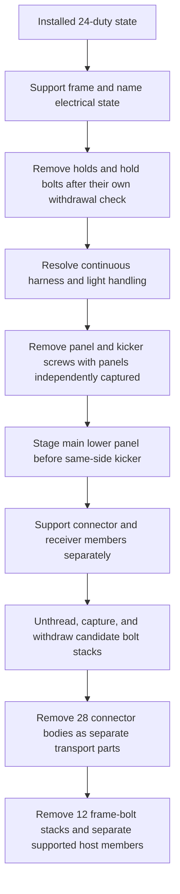

# WJ24 assembly and transport sequence

Status: **conditional operation map for WJ-07; no assembly, support, transport,
or removal sequence is accepted.** This document binds next geometry work to the
current `wj24-twenty-four-duty-integrated-static-v1` composition. The static
composition and individual LED sweep records establish bounded geometry only;
they do not establish capacity, real tool fit, continuous movement, support,
safe handling, tolerance, or release.

## Current layout and evidence boundary

The [integrated static record](hypotheses/wj24-integrated-static/README.md)
contains 16 rebuilt host members, 28 candidate wood connector bodies, 104
candidate bolt axes with 520 installed hardware roles, all 12 starting frame
bolt arrangements, and all 66 fixed panel/kicker screw axes. It replaces all
24 former angle duties and 144 SDS axes. The static source and collision
contracts reconcile, but movement or installation access is not proven. The
integrated diagnostic carries local approach-proxy rows for eight
`bottom_outer`, eight `top_center`, and eight `bottom_center` axes. These rows
do not resolve real receiver fit, complete turning/counterhold, sequential
hardware access, or the remaining candidate axes. The separate WJ03 twenty-
stack tool screen is tied to its earlier outer-node geometry and does not
close WJ24 access.
The current candidate part names are:

| Group | Candidate bodies |
|---|---|
| Mirrored outer knees | `knee_outer_left_rear_bridge`, `knee_outer_left_spine`, `knee_outer_left_under_header_link`, `knee_outer_right_rear_bridge`, `knee_outer_right_spine`, `knee_outer_right_under_header_link` |
| Bottom and top outer / center cleats | `bottom_center_left_cleat`, `bottom_center_right_cleat`, `bottom_outer_left_cleat`, `bottom_outer_right_cleat`, `top_center_left_cleat`, `top_center_right_cleat`, `top_outer_left_cleat`, `top_outer_right_cleat` |
| Center-post and principal connectors | `center_post_cleat_left`, `center_post_cleat_right`, `center_principal_cleat_left`, `center_principal_cleat_right` |
| Center-kicker backers | `inner_kicker_backer_left`, `inner_kicker_backer_right` |
| Service cleats | `left_service_inner_lower_cleat`, `left_service_inner_upper_cleat`, `left_service_outer_lower_cleat`, `left_service_outer_upper_cleat` |
| G7 / right outer cleats | `wj04_lower_full_stock_cleat`, `wj04_upper_g7_crosscut_full_stock_cleat`, `wj06_outer_lower_right_cleat`, `wj06_outer_upper_right_cleat` |

The rebuilt hosts are `base_header`, `base_post_center_left`,
`base_post_center_right`, `base_post_outer_left`, `base_post_outer_right`,
`base_principal_center_left`, `base_principal_center_right`,
`base_rail_bottom_left`, `base_rail_bottom_right`,
`base_rail_service_lower_left`, `base_rail_service_lower_right`,
`base_rail_service_upper_left`, `base_rail_service_upper_right`,
`base_rail_top`, `base_side_left`, and `base_side_right`. They remain distinct
transport members. The underlying floor/leg members and six panel parts
(`main_lower_left`, `main_upper_left`, `main_lower_right`, `main_upper_right`,
`kicker_left`, and `kicker_right`) retain their inventory identities; no joined
wood assembly becomes a transport part.

The [LED extraction diagnostic](hypotheses/wj24-led-extraction/README.md)
reconstructs all 132 retained light cylinders. Under its single-light,
rearward-only scenario, 131 pass a 19.25625 mm stroke ending with the cylinder
front 1 mm behind the panel rear, with all timber and hardware seated.
`light_G7` hits `wj04_lower_full_stock_cleat` by
319.657955 mm³. Wires, connector bodies, slack, flex, neighboring-light motion,
and supports are outside that screen.

The [WJ18 panel topology](hypotheses/wj18-panel-harness-topology/README.md)
assigns the 132 lights to `main_lower_left` (42), `main_upper_left` (30),
`main_lower_right` (35), and `main_upper_right` (25). Twelve routed wires cross
panel boundaries:

| Crossing | Wire IDs |
|---|---|
| Between left lower and upper panels | `wire_007_A7_A8`, `wire_017_B8_B7`, `wire_031_C7_C8`, `wire_041_D8_D7`, `wire_055_E7_E8`, `wire_065_F8_F7` |
| Between lower panels | `wire_072_F1_G1` |
| Between right lower and upper panels | `wire_079_G7_G8`, `wire_089_H8_H7`, `wire_103_I7_I8`, `wire_113_J8_J7`, `wire_127_K7_K8` |

The two factory joins, E2–E3 and I4–I5, are both within
lower panels; opening them does not isolate the four main panels. No wire cut
or electrical modification is authorized. A whole-harness reverse-feed for
disassembly remains unproven and needs its own operation definition. The
owner's provisional routing reference describes building the
frame and panels, feeding the continuous strand through enclosed passages,
then installing lights from the rear; cable dimensions, connectors, slack,
bend limits, and practical feeding are still open.

The [WJ-03 sequence diagnostic](wj03-sequence-diagnostic.json) samples a
different integrated geometry. Its lower-panel-before-kicker order is a
useful dependency to retest: the direct kicker path hits an installed lower
panel, then the sampled 100 mm kicker extraction and return clear after that
panel is staged. It also proposes support before removing outer bridge, link,
and spine hardware. These results do not transfer to WJ24. WJ03 uses older
body placements, does not model continuous wires, and does not prove support,
continuous motion, hand access, or real tool fit. WJ24's two provisional rear
hold-bolt envelopes also intersect the top-center and lower-center right
cleats at G12 and G1 respectively, so hold removal cannot be presumed clear.

| Bounded record | Established within that record | Still unresolved for the complete WJ24 sequence |
|---|---|---|
| WJ24 integrated static | Eighteen source/static checks pass; the 16 hosts, 28 bodies, 104 axes / 520 roles, 12 frame bolts, 66 panel axes, and 24 replaced duties reconcile. | Connector installation/removal motion, all-axis tool access, structural support, capacity, and tolerance. |
| WJ24 LED extraction | 131 individual seated-state rearward cylinder sweeps clear for the recorded 19.25625 mm stroke; G7 is blocked by the named cleat. | Wiring, connectors, slack, flexibility, neighboring lights, support, and panel motion. |
| WJ18 harness topology | Every light has one of four main-panel owners; 12 routed segments cross panel boundaries; the two factory joins do not isolate panels. | Physical bulb release, continuous-strand reverse feeding, connector passage, bend/slack limits, and panel staging. |
| WJ03 transport diagnostic | In its older scene, lower-panel-before-kicker dependency passes sampled motions; kicker motion hits while the panel stays installed. | Transfer to WJ24, continuous paths, current harness state, support/capture, real tools, and tolerances. |

## Conditional forward assembly dependencies

The following is the candidate dependency order for testing. “Support required”
means the moving member and the remaining assembly must have a defined support
and capture state before a fastener is released or a member is placed. The
support points, load path, fixtures, and transfer between them have not been
designed or checked.

| Order | Operation and required state | Must remain in the scene | Moving, installed, or removed set | Evidence status |
|---:|---|---|---|---|
| A0 | Stage separate transport parts on a support plan. Keep the 16 named hosts, remaining frame members, six panels, 28 connector bodies, and all bolts, washers, and nuts individually identifiable. | All parts remain separate and supported. | No join is closed. | Inventory identity only; support/staging not checked. |
| A1 | Assemble the 16 candidate hosts and retained frame members into the frame while temporary support carries the frame independently of unfinished joints. Place the 12 existing frame-bolt stacks only after their actual head/nut access and changed-host checks pass. | Every unjoined member and connector remains supported. | Host/member placement and the 12 frame-bolt operations. | Static WJ24 recheck reconciles 12 starting arrangements; the structural recheck and all bolt operations remain open. |
| A2 | While the relevant header is open or lifted and supported, place `inner_kicker_backer_left` and `inner_kicker_backer_right`; install their four backer-to-header stacks from the underside before closing any state that removes below access. | `base_header`, both backers, neighboring frame members, and other installed connectors remain supported. | Backers and `backer_header_left_1`, `backer_header_left_2`, `backer_header_right_1`, `backer_header_right_2`, each with head, head washer, shaft, nut, and nut washer. | WJ05 defines the below-access dependency; tool drive, support geometry, stack fit, and reverse access are unresolved. |
| A3 | Install the remaining 26 connector bodies at their named host interfaces. Seat each connector body before fitting its own bolt stacks; install each axis as one captured stack operation. Keep the receiving hosts supported throughout. | All 16 hosts, other 27 candidate bodies, all non-target stacks, frame bolts, services, panels, and LED bodies remain in place for each local operation. | For each target connector, only its own wood body and then its named axes / five roles per axis move. The full connector-to-axis ownership is in `composition.json`. | WJ24 confirms intended receivers and installed static envelopes; no connector insertion, real tool, capture, or full-frame assembly path is proven. |
| A4 | Before closing surfaces around a connector, verify every required tool approach, turning stroke, loose-hardware capture route, and reverse bolt withdrawal while retaining all other installed bodies. | All non-target members, connectors, hardware, panel axes, lights, and hold hardware remain in their installed state. | One named axis stack or one connector body at a time. | WJ24 has only local approach proxies at 24 axes; actual receiver fit, complete turning/counterhold and sequential access remain unresolved. |
| A5 | Install the six panels at the fixed 66 Hillman axes only after frame geometry and the receiver state pass. Keep the four main-panel identities, `kicker_left`, `kicker_right`, and all `hold_tnut_*` ownership with their source panel. | Completed frame, all 28 connector bodies and their stacks, 12 frame bolts, and any not-yet-installed panel remain retained. | `main_lower_left`, `main_upper_left`, `main_lower_right`, `main_upper_right`, `kicker_left`, and `kicker_right` at their original screw-axis sets. | The axis identities are preserved, not a panel lift, tool, receiver, or support pass. Count 66 Hillman screw operations separately from structural bolt operations. |
| A6 | Route the full continuous LED harness only through the specified enclosed passages, then install lights from the rear in source order. Verify factory string joins and controller/power branches remain accessible. | All panels, the frame, every already-installed light, and the uncut/unmodified harness remain in place. | The continuous three-string harness and each light being inserted; no electrical connector is opened as a substitute for panel isolation. | Owner-selected routing geometry is provisional. WJ18 topology and WJ24 G7 sweep leave reverse/forward feeding and actual connector handling open. |

The order between A1, A2, and each of the 28 connector installations is not
fully determined by the static composition. In particular, the four bottom
head stacks at the center-kicker backers impose a close-last / open-first
access dependency. The WJ24 integrated access audit must establish the other
local installation precedence before an assembly order can be frozen.

## Conditional reverse transport dependencies

This graph is the next candidate disassembly sequence. Every transition is
blocked until its support, tool, movement, and staging subcontracts pass.

| Order | Operation and dependency | Retained bodies | Removed or moving bodies | Present state |
|---:|---|---|---|---|
| D0 | Capture the whole frame and identify every service before releasing panel screws. Confirm an available support path for the frame when individual members cease sharing their current joints. | All hosts, all 28 connectors and stacks, 12 frame stacks, 66 panel screw axes, six panels, all 132 lights and continuous harness. | Support fixtures only, still unspecified. | Required, unmodeled. |
| D1 | Remove holds and hold bolts only after each actual bolt/hold withdrawal path, tool access, and loose-part capture is checked. | All timber, connectors, panels, wiring, and non-target hardware remain seated. | Named holds and their matching hold bolts; T-nuts stay with the owner panel. | WJ03 treats this as a precondition; WJ24 has G1/G12 provisional envelope intersections, and no full withdrawal operation is established. |
| D2 | Establish a no-cut electrical handling route before moving any panel. It must preserve every wire and connector, including the 12 cross-panel segments, while releasing a panel from its fixed geometry. | The four main panels and two kickers, remaining lights, all frame bodies, and a continuous harness stay captured. | For each light removal, only its bulb body may leave its panel; wires and mated factory connections remain in the scene unless an explicitly allowed manufacturer operation says otherwise. | No route is presently proven. Opening E2–E3 and I4–I5 is insufficient. Do not move to D3 until bulb release, connector envelope, passage feed, slack, bend, and service support checks pass. |
| D3 | Remove the same-side lower panel screws and move that lower panel along its checked path only after D2 and panel support pass. Then remove the kicker screws and move the kicker only after the lower panel is stably staged. Apply the dependency side by side only if the integrated paths pass. | Remaining panels and frame; all wires and removed bulbs stay continuous and captured; all non-target screws stay in their assigned owners. | `main_lower_left` with its 12 axes and 42 assigned lights, then `kicker_left` with its 9 axes; on the right, `main_lower_right` with its 12 axes and 35 assigned lights, then `kicker_right` with its 9 axes. | WJ03 samples a related lower-panel → kicker order. WJ24 retains all 66 axes but has no integrated panel/harness path or support pass. |
| D4 | After panels and lights clear, independently capture members meeting each candidate connector. Remove one connector's full bolt group before separating its wood body; capture every loose stack part. | All non-target hosts, connectors, installed hardware, and services remain seated. For the target, its two receiver members stay supported. | One target connector's bolt axes and five-role stack parts; then that connector body. Repeat for all 28 bodies only after each family path is checked. | Structural capacities, real tools, operation order, continuous movement, and capture/retrieval are open. WJ03 outer-node tool samples do not transfer. |
| D5 | Before removing the four `inner_kicker_backer_*` stacks, reopen or lift the frame to regain underside access and support the header/backers. Remove each stack, then separate the two backers. | `base_header`, center posts, principals, all other hosts/connectors and remaining frame members are independently supported. | Four named `backer_header_*` stacks, then `inner_kicker_backer_left/right`. | WJ05 records this reverse-access dependency; no physical support or under-tool fit is proven. |
| D6 | Remove the twelve retained frame-bolt stacks only after all adjacent timber members have independent support. Separate the 16 rebuilt hosts and other individually transported members one at a time after every attached candidate stack is removed. | All non-target timber remains supported. The 28 connector bodies and removed hardware stay separately captured. | One named frame-bolt stack, then one named timber member per checked path. | WJ24 source records reconcile frame bolt locations and host cuts; structural, tool, support, and individual member paths remain unverified. |

The lower-panel-before-kicker edge in D3 is a dependency to test, not a WJ24
pass. The full WJ24 scene must include the fixed light bodies, hold hardware,
all candidate bodies and hardware, the twelve frame stacks, wiring, and the
actual supported staging positions. A panel path that has positive-volume
clearance at its sampled stations is not accepted without continuous motion
and a stable capture state.

## G7 route that keeps the electrical harness continuous

The [attempt 03 geometry report](hypotheses/wj24-access-relief/attempt-03/geometry.json)
is the current source-bound evidence for `light_G7`; its [manifest](hypotheses/wj24-access-relief/attempt-03/sha256.json)
binds the archived artifact. It reproduces the WJ24 baseline composition and
records no source geometry mutation. All release flags remain false.

Attempt 02 is retained as history only. It used a washer-seat aggregate that
expected four rows while emitting eight and did not separate the nominal LED
core path from its enlarged radial-clearance envelope. Attempt 03 repairs both
reporting issues. The older temporary report remains identifiable by SHA-256
`32d539889ebd96fc030f652a48d868516be6e2353d460a59b29402b72836764a`; use the
durable attempt 03 report for the scoped results below.

The baseline path uses the 12.7 mm `light_G7` core, length 30.25625 mm,
translated rearward 19.25625 mm until the front is 1 mm behind the panel rear.
That scenario's rigid sweep intersects `wj04_lower_full_stock_cleat` by
319.657955476 mm³, plus the fixed straight-run proxies for `wire_078_G6_G7`
(130.522956942 mm³) and `wire_079_G7_G8` (114.871039839 mm³). The wire hits are
collision results for those fixed proxy shapes, not proof that flexible leads
cannot move.

### Connector-retained corridor

Each attempt 03 relief variant changes only `wj04_lower_full_stock_cleat` and
retains its four candidate axes and 20 hardware roles. The four 7.5 × 127.2 mm
modeled bores remain clear. The nominal 12.7 mm core path is evaluated
separately from an enlarged clearance envelope:

| Added radial envelope | Envelope diameter | Finished cleat material removed | Nominal core result after cut | Enlarged envelope result after cut |
|---:|---:|---:|---|---|
| 0.0 mm | 12.7 mm | 319.657955 mm³ | No wood, candidate-hardware, or other-candidate-body hits. Fixed-run wire proxies still intersect: `wire_078_G6_G7` 130.522957 mm³; `wire_079_G7_G8` 114.871040 mm³. | Same as nominal core. |
| 0.5 mm | 13.7 mm | 403.180815 mm³ | Same nominal core and wire results as 0.0 mm. | Also hits `main_lower_right` by 267.985167 mm³; wire-envelope hits are 141.055400 mm³ and 124.133484 mm³. |
| 1.0 mm | 14.7 mm | 495.705455 mm³ | Same nominal core and wire results as 0.0 mm. | Also hits `main_lower_right` by 675.196444 mm³; wire-envelope hits are 151.567962 mm³ and 133.382847 mm³. |

The panel intersections occur only for the enlarged clearance envelopes. They
are not nominal 12.7 mm physical-core collisions after the cut and do not show
that the physical LED route is worse. The 0.0 mm corridor is a nominal
zero-added-radial-margin geometry result; it does not supply a manufacturing
tolerance or authorize the cut.

For each radial variant, the geometry probe records eight annular washer
observations: four connector-side and four other-receiver-side rows. All eight
are resolved and fully supported in the modeled 0.05 mm annular probes. The
two mapped contact-face probes are also locally supported. These are geometric
probes only; pressure, capacity, strength, and cut acceptability remain
unestablished. Across 122 sampled N sections, the minimum remains
6569.749512 mm² at N=79.85 mm, but 12 local stations lose section area:

| Added radial envelope | Largest sampled local section reduction | Station N |
|---:|---:|---:|
| 0.0 mm | 28.398264 mm² | 30.05 mm |
| 0.5 mm | 35.818396 mm² | 30.05 mm |
| 1.0 mm | 44.038242 mm² | 30.05 mm |

Stations use finite slabs and include refinements around the cut tangencies;
they do not establish a continuous minimum section or structural resistance.
None of the connector-relief cuts is authorized.

### Bounded G7 service handling proposal

The connector-retained corridor is the primary geometry branch for a future
single-light service sequence because it leaves the 24-duty connector group
installed. This proposal does not make the cut buildable. It separates that
maintenance operation from the six-panel / individual-member transport
problem, which still needs the complete harness feeding and panel sequence in
the earlier WJ18/WJ24 contracts.

1. Retain the installed frame, `wj04_lower_full_stock_cleat`, its four axes and
   20 hardware roles, all other candidate bodies and axes, the 12 frame bolts,
   and all 66 panel screw axes. Keep `main_lower_right` and its neighboring
   panels seated. The proposed corridor is the 0.0 mm added radial variant;
   no other clearance or tolerance is assumed.
2. Identify and capture the actual free cable path on `wire_078_G6_G7` and
   `wire_079_G7_G8` without opening any plug or moving `light_G6`, `light_G8`,
   or the other 129 lights. `wire_079_G7_G8` crosses from `main_lower_right` to
   `main_upper_right`. Use the delivered cable and connector dimensions, the
   as-routed available slack, and a supported minimum bend limit. The reported
   approximate bulb-base pitch is not available slack. No numeric slack,
   bend radius, strain limit, or fixture placement is inferred here.
3. With the frame joints and panels still retained, withdraw `light_G7` along
   the source-bound 19.25625 mm axis while moving only its two adjoining leads
   through the measured captured cable path. Bound the full 49.5125 mm axial
   swept length, the actual lead/plug solids, and the cable flex path against
   all retained timber, hardware, lights, panels, and supports. The 0.0 mm
   geometric corridor has no radial manufacturing allowance.
4. Return `light_G7` along the reverse path, restore both lead paths, and
   retain the connector/hardware state throughout. Support/contact geometry for
   cable capture is taken from the measured installed route; this note selects
   no fixture, force, or clearance.

The first new G7 harness geometry contract therefore moves `light_G7`,
`wire_078_G6_G7`, and `wire_079_G7_G8` as a coupled flexible set while `light_G6`,
`light_G8`, the other 129 lights, all six panels, the 16 hosts, all 28
connectors and 520 candidate hardware roles, the 12 frame stacks, the 66
panel axes, and the hold/T-nut shapes remain retained. Bind cable slack, bend
limit, lead/plug envelopes, and capture support to actual source or receiving
evidence. If a required bound is missing, leave this operation unresolved.

### Cleat-removal alternative

Attempt 03 separately removes the original, uncut
`wj04_lower_full_stock_cleat` and its four axes
(`wj04_g7/upper_g7_clearance_n86p9_reversed_rail_hypothesis/lower_principal_1`,
`wj04_g7/upper_g7_clearance_n86p9_reversed_rail_hypothesis/lower_principal_2`,
`wj04_g7/upper_g7_clearance_n86p9_reversed_rail_hypothesis/lower_rail_1`, and
`wj04_g7/upper_g7_clearance_n86p9_reversed_rail_hypothesis/lower_rail_2`),
accounting for 20 hardware roles. It retains all 12 frame bolts, 66 panel axes,
16 hosts, all other candidate connectors and their hardware. The nominal G7
core sweep then has no reported wood, candidate-hardware, other-candidate,
hold-projection, or frame-axis-proxy hits. The same two fixed-run wire proxy
intersections remain. This alternative reaches the same unmodeled flexible-
lead problem while adding four structural stack removal/reinstallation steps.
Only this branch requires a temporary support transfer to named receiver
members `base_principal_center_right` and `base_rail_service_lower_right`; its
support contact patches and load path must be specified and checked before
removing the cleat. Tool access, stack capture, support method/capacity, return,
and service repeatability remain unresolved. No frame unloading or support
requirement is added to the connector-retained corridor branch.

## Exact next geometry contracts

These are the smallest useful WJ24 geometry jobs. They define a moving set and
the stationary set so a positive result cannot silently omit retained bodies.

| Contract | Moving set | Retained set during the operation | Required report |
|---|---|---|---|
| G7-RELIEF-CORE-AND-LEADS | `light_G7`, `wire_078_G6_G7`, and `wire_079_G7_G8` move as one flexible set on the 19.25625 mm rearward stroke; no connector or structural stack is opened. | Cleat and all four axes/20 roles, other 27 candidate bodies, all other 100 axes/500 roles, 12 frame stacks, 66 panel axes, six panels, `light_G6`, `light_G8`, other 129 lights, and other services remain retained. | Use the 0.0 mm relief geometry only as the nominal corridor scenario; include actual lead/plug shape, as-routed slack, bend limit, capture support, full forward/reverse path, and source-bound dimensions. Wire proxies overlap the rigid core sweep today; this is unresolved flex geometry, not a physical no-go. |
| G7-CLEAT-REMOVAL-ALTERNATIVE | Remove the four exact `wj04_g7/upper_g7_clearance_n86p9_reversed_rail_hypothesis/lower_principal_1`, `wj04_g7/upper_g7_clearance_n86p9_reversed_rail_hypothesis/lower_principal_2`, `wj04_g7/upper_g7_clearance_n86p9_reversed_rail_hypothesis/lower_rail_1`, and `wj04_g7/upper_g7_clearance_n86p9_reversed_rail_hypothesis/lower_rail_2` axes as complete five-role stacks; then remove `wj04_lower_full_stock_cleat`. | All 16 hosts, other 27 connector bodies, other 100 candidate axes / 500 roles, 12 frame stacks, 66 panel axes, all panels/lights, holds/T-nuts, and wire/connector shapes. | Geometry-only G7 path clears other rigid bodies but retains the two fixed-run wire proxy intersections. Add support at verified patches on `base_principal_center_right` and `base_rail_service_lower_right`, actual bolt-tool access/capture, reverse reinstallation, and the same measured flexible-lead operation. |
| PANEL-HARNESS | One panel with its assigned LED bodies only if the physical attachment/release is source-supported; otherwise move the exact bulb bodies through the holes one by one while keeping wires joined. | Other three main panels, two kickers, all 12 cross-panel wires, both factory joins, all 28 connector bodies/104 stacks, 12 frame stacks, 66 fixed screw axes until their specified removal, hold bodies, and staged panel supports. | A whole-route movement/staging record with every wire and connector, slack and bend bounds, bulb handling, passage/connector envelope, and reverse installation. No disconnected-panel shortcut. |
| LOWER-THEN-KICKER | Right or left main lower panel at its 12 unchanged axes, then same-side kicker at its 9 unchanged axes. | Complete WJ24 structure, all fixed lights/wires and hardware, the opposite-side panels, removed-panel support, and the retained adjacent panel during each stroke. | Re-run WJ03 order on integrated WJ24 bodies; continuous outbound/return paths, screw tool paths, T-nut owner, support transfer, and non-tangent tolerance margin. |
| CONNECTOR-SERIAL-REMOVE | For each of all 28 candidate bodies, remove its complete owned axis group, then translate/rotate the body to a separate transport pose. | Every other host, candidate body, stack, frame bolt, panel/screw, service, and already staged body; only target stack/body changes state. | Family-specific support/capture, real tool path, continuous body path, loose part retrieval, and exact reverse insertion. Start from the current composition axis-to-receiver mapping. |
| MEMBER-SERIAL-REMOVE | After all connector duties attached to one host are released, move one named host or other source transport member. | All other members and connector bodies, their installed hardware, panel/service state, temporary supports, and staged transport parts. | Continuous path and stable endpoint for each of the 20 timber members and six panels, with all attached fasteners accounted for. |

Until those contracts are complete, this document is a dependency map only.
The full WJ24 static fit remains useful evidence, but no connector, panel,
light, or timber removal can be treated as an accepted transport operation.
